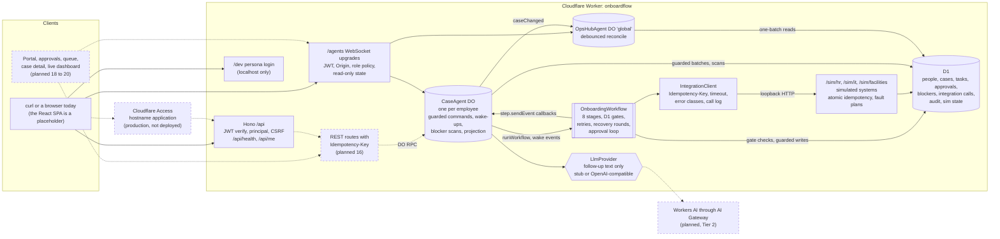
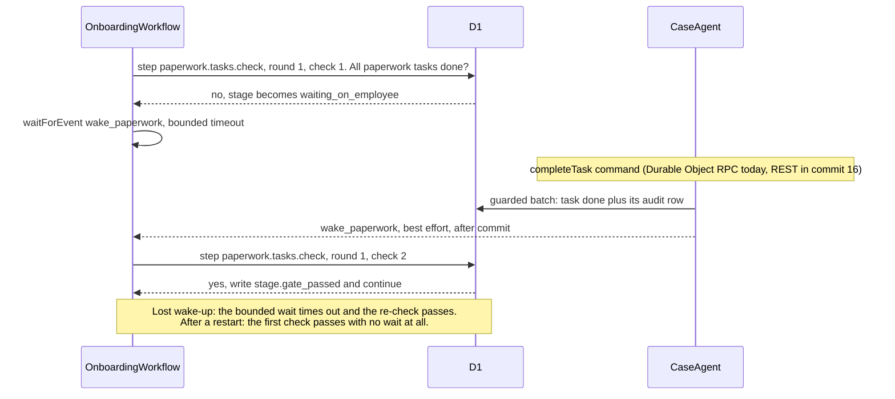

# OnboardFlow

OnboardFlow coordinates a new hire's setup across People Ops, IT and Facilities on Cloudflare Workers: one durable workflow per employee, an Agents SDK Durable Object per case, approval checkpoints, rule-based blocker detection, and idempotent, retried calls to simulated HR, IT and Facilities systems, with every action written to an append-only audit log.

## Why

Onboarding one person touches four parties. People Ops creates the worker record, collects paperwork and runs orientation. IT creates the account, assigns licenses and ships a laptop. Facilities assigns a desk or a remote kit and prints a badge. The hiring manager approves equipment and access. Each team works in its own system, and the failures happen at the handoffs: a device order fails overnight, a badge cannot print because no photo is on file, an approval sits unanswered for a week, a retried request creates a second account.

OnboardFlow treats each hire as one case with a single source of truth. The design rules: every step resumes after a crash or restart, every external call is safe to repeat, every wait is decided by the database rather than by an in-memory event, every state change is audited only if it actually happened, and every blocker has an owning department.

## Status

> **v1 is in active development. Nothing is deployed.** Commits 1 to 15 of the 25-commit Tier 1 plan are done; commit 16 (REST routes with a required `Idempotency-Key`) is next. [PROGRESS.md](PROGRESS.md) records the live position, the last check results and every deviation from the spec, and is updated with each commit.

**Works today**, with tests:

- The eight-stage `OnboardingWorkflow`, end to end against the simulated systems: D1 gates with bounded waits, step retries that honor `Retry-After`, recovery rounds after the retry budget is spent, approval reject and resubmit, restart, terminate, and a new-revision fallback when a restart is refused.
- `CaseAgent` (one Durable Object per employee): guarded commands, best-effort wake-ups after commit, workflow lifecycle callbacks, blocker scans on an interval schedule, and a read-only state projection computed from D1.
- A rule engine for six blocker kinds, each routed to an owning department, with auto-resolution and nudges for lost wake-ups. Follow-up tasks are worded by a deterministic stub or an OpenAI-compatible model server, with a template fallback on any failure.
- `OpsHubAgent`, the dashboard singleton: a debounced reconcile from D1, plus read-only WebSocket subscriptions under `/agents/*` behind Access auth, an origin check and a per-role policy.
- Three simulated systems (HR, IT, Facilities; 14 endpoints) with atomic idempotency and seven injectable fault kinds, called through an `IntegrationClient` that logs and audits every attempt.
- Access-compatible RS256 JWT verification, a dev persona login, CSRF and origin checks, and a four-role permission matrix.
- Guarded mutations, an API idempotency store, an append-only audit log, six D1 migrations, and a deterministic synthetic dataset.
- **Tests:** `npm test` passes **200 tests in 25 files**: 23 worker files that run inside workerd through Miniflare, and 2 Node files. Counted by running the suite for this README at commit 15 (`41cbd73`); it takes under a minute on the development Mac.

**Not built yet:** the REST API beyond `/api/health` and `/api/me` (so a case cannot be started over HTTP yet), the dev eval hooks beyond the simulator's fault and ledger routes, every UI page (the browser shows a placeholder), the evaluation suite, CI, the ADR documents, and the Workers AI provider (Tier 2). See [Roadmap](#roadmap).

## Features

Status key: **Implemented** means code and passing tests are in the repo now. **Planned** means not in the repo yet; the number is the commit in the plan (SPEC.md Section 21).

| Feature | Status | Evidence |
|---|---|---|
| Eight onboarding stages, run as one durable Cloudflare Workflow per employee | Implemented | `stages.test.ts`, `workflow-happy-path.test.ts` |
| Gates checked in D1 before every wait; wake-up events only shorten the wait | Implemented | `workflow-gates.test.ts` |
| Step retries with exponential backoff and `Retry-After`; recovery rounds after the budget is spent | Implemented | `workflow-retries.test.ts`, `workflow-recovery.test.ts` |
| Two approval checkpoints per case (manager, People Ops sign-off) with reject, resubmit and a three-round limit | Implemented | `workflow-approvals.test.ts` |
| Restart, terminate, and a new workflow revision when the platform refuses a restart | Implemented | `workflow-restart.test.ts`, `case-agent.test.ts` |
| `CaseAgent` commands: start, complete task, decide, resubmit, retry stage, fix field, resolve blocker, restart, terminate, scan now | Implemented (reached by Durable Object RPC; HTTP routes are planned for 16) | `case-agent.test.ts` |
| Blocker rules: six kinds with owner department and severity, auto-resolution, nudges for lost wake-ups | Implemented | `blocker-rules.test.ts` |
| Serialized blocker scans on an interval schedule; at most one open blocker and one follow-up task per dedupe key | Implemented | `case-agent.test.ts`, `guarded-mutations.test.ts`, `schema.test.ts` |
| Follow-up wording from a deterministic stub (default) or an OpenAI-compatible server, template fallback on any failure | Implemented | `followups-llm.test.ts` |
| `OpsHubAgent` reconcile: totals, stage rollup, blockers by kind and department, approvals, integration health, system incidents, recent activity | Implemented (no dashboard page or summary route yet) | `ops-hub-agent.test.ts` |
| Read-only WebSocket subscriptions at `/agents/*` with Access auth, origin check, name validation and role policy | Implemented | `live-websocket.test.ts` |
| Simulated HR, IT and Facilities APIs with atomic idempotency | Implemented | `sims-contract.test.ts`, `sims-idempotency.test.ts` |
| Fault injection: 503, 429, timeout, malformed body, 409 conflict, lost response, stalled polling; set through `/sim/admin/faults` | Implemented (dev with `EVAL_HOOKS=on` only) | `sims-faults.test.ts` |
| `IntegrationClient`: timeouts, error classes, one call-log row and one audit row per attempt | Implemented | `integration-client.test.ts` |
| Guarded mutations: audit rows and stored responses commit only when the change took effect | Implemented | `guarded-mutations.test.ts` |
| API idempotency store (claim, replay, in progress, key reuse, release after a 5xx) | Implemented (module); wired to REST routes in 16 | `guarded-mutations.test.ts` |
| Access JWT verification, dev persona login, CSRF and origin checks | Implemented locally; production Access not deployed | `auth-access.test.ts`, `csrf.test.ts`, `dev-mode-guard.test.ts` |
| Four roles and a capability matrix of pure policy functions | Implemented | `auth-roles.test.ts` |
| Append-only audit log enforced by D1 triggers | Implemented | `schema.test.ts` |
| Deterministic synthetic dataset with exact counts | Implemented | `synthetic-generator.test.ts`, `seed-load.test.ts` |
| Workflow step budget (worst case 561 steps, limit 1,024) | Implemented | `step-budget.test.ts` |
| REST API with required `Idempotency-Key` and audit on every mutation | Planned (16) | |
| Dev eval hooks: simulated clock, data corruption, eviction, hub state, snapshots | Planned (17) | |
| UI: login, employee portal, approvals, department queue, cases, case detail with audit timeline | Planned (18, 19) | |
| Live dashboard page | Planned (20) | |
| Evaluation suite: 60 scenarios (20 onboarding, 24 integration failure, 16 recovery), standard and scale modes | Planned (21, 22) | |
| CI, ADRs, recorded eval results in this README | Planned (23 to 25) | |
| Workers AI provider through AI Gateway | Planned (Tier 2). Today `LLM_PROVIDER=workers-ai` falls back to templates | |

## How a case runs

| # | Stage | Owner | Gate | Simulated operations |
|---|---|---|---|---|
| 1 | Pre-boarding intake | People Ops | automatic | create the 10 checklist tasks, `hr.create-worker` |
| 2 | Paperwork and verification | People Ops | employee tasks | `hr.start-document-verification`, poll until verified |
| 3 | Manager approval of equipment and access | Manager | approval | none |
| 4 | IT provisioning | IT | automatic | `it.create-account`, `it.assign-licenses`, `it.order-device`, poll until delivered |
| 5 | Facilities setup | Facilities | automatic | `facilities.assign-workspace` (desk or remote kit), `facilities.issue-badge`, poll until active |
| 6 | Cross-system provisioning check | IT | automatic | `hr.get-worker`, `it.get-account`, `facilities.get-badge` |
| 7 | Orientation and day one | People Ops | employee tasks | `hr.enroll-orientation` |
| 8 | People Ops sign-off | People Ops | approval | `hr.activate-worker` after approval |

Roles: `employee` (own checklist), `manager` (direct reports; decides stage 3), `coordinator` (one of three departments: People Ops, IT, Facilities; works that department's blockers and retries), `admin` (everything, including restart and terminate; may decide approvals on behalf of the approver, recorded as such). Department is an attribute of a coordinator, not a fifth role.

## Architecture

Solid boxes and arrows exist in the repo today. Dashed boxes and dashed arrows are planned.



Every wait in the workflow follows the same pattern. Here it is for the paperwork task gate:



## Key design decisions

The reasoning and the evidence behind each decision are in [SPEC.md, Section 2.3](SPEC.md#23-key-design-decisions-become-adrs-in-docsadr); they become ADRs under `docs/adr/` in commit 24.

**D1 is the source of truth; agent state is a projection.** Domain records live in D1. The `CaseAgent`'s live state is recomputed from D1 in one batch that also reads the latest audit sequence number, and an older snapshot can never overwrite a newer one. Workflow steps write with deterministic ids (`apr:E042:manager_approval:1`, `chk:E042:w4`) and `INSERT OR IGNORE`, so a retried or restarted step never writes twice.

**Gates are D1 predicates; events only wake.** Every wait goes through one primitive, `awaitGate`: check a D1 predicate inside a step; if it is closed, `waitForEvent` with a bounded timeout; then check D1 again. Wake-up payloads are validated but never trusted: only the D1 re-check decides. A lost wake-up costs one bounded wait, a stale one costs one extra check, and after a restart every gate the earlier run passed opens on its first check. This matters because the local Workflows engine deletes delivered events on restart. Decision gates are keyed by approval id and round, so a round 1 manager decision can open neither round 2 nor the closeout checkpoint. Only an exhausted wait budget ends a case, as `failed` with `wait_budget_exhausted`, audited and restartable.

**Guarded mutations: the audit row commits only if the change did.** A D1 batch is one transaction, but a batched audit `INSERT` still commits when the `UPDATE` before it matched zero rows, which would record `approval.approved` for a request that got a 409. So every change that can lose a race is one `UPDATE ... WHERE <guard>` that stamps `last_mutation_id`. The success audit, follow-on rows and the stored API response sit in the same batch behind `EXISTS (row carries this stamp)`; the conflict audit and the 409 sit behind `NOT EXISTS`. Two concurrent decisions on one approval produce exactly one winner and only the winner's audit row.

**Idempotency at both boundaries.**
- *Simulated systems.* Every POST needs an `Idempotency-Key`. The workflow sends `<employee>:<operation>`, which deliberately leaves out the run number and revision, so restarts and new revisions replay instead of re-executing. Execution is one D1 batch: the `sim_idempotency` primary key acts as the lock, next to the resource row and a side-effect ledger row, so a request cancelled mid-flight committed all three rows or none. Five concurrent requests with one key produce one ledger row and four replays. A genuine 422 is never stored, so the corrected request succeeds with the same key. The pipeline order is fixed (auth, key, pre-execution faults, replay, validation, atomic execute, post-execution fault) because it decides what a retry sees.
- *API.* The store claims a key as `pending` per user, returns the stored response for a completed key, reports a claim still in flight and a key reused with a different body, takes over a claim abandoned for 60 seconds, and releases the claim after a 5xx so the retry runs again. The guarded batch stores the final response in the same transaction as the change. Commit 16 maps these outcomes to HTTP on every `/api` mutation: a replay with `Idempotent-Replayed: true`, 409 while in flight, 422 on reuse.

**Retries first, then recovery rounds with a human in the loop.** Integration steps retry up to 4 times with exponential backoff, waiting at least `Retry-After`. The delay travels in the error message because only the message is guaranteed to cross the step boundary. When retries run out, the stage is marked blocked (guarded on its round) and waits on a retry gate that opens when the owning coordinator advances the round; the next round sends the same idempotency key. Step inputs are rebuilt from D1 inside each step, so a field fixed by a coordinator applies to the next attempt. Other 4xx responses skip retries through `NonRetryableError`. Recovery rounds per case are capped (6), and running out ends the case as `recovery_rounds_exhausted`.

**Rules decide; the model only drafts.** `blocker-rules.ts` is a set of pure functions over a D1 snapshot of one case. They open six blocker kinds (integration outage, data issue, stalled provisioning, overdue approval, overdue employee tasks, rejected approval), give each an owning department and a severity, and auto-resolve a blocker only when its condition clears: an integration blocker closes when the blocked operation succeeds after the blocker opened, not when someone ticks off the follow-up. They also pick stages to nudge: a stage whose gate already holds in D1 but whose last wake-up is older than `NUDGE_AFTER_S` gets one more wake-up, which is harmless because gates re-check D1. `CaseAgent.scanBlockers` runs serialized per case on an Agents SDK interval schedule (`BLOCKER_SCAN_INTERVAL_S`, 900 seconds by default). It drafts the follow-up wording first, then writes the blocker, the follow-up task and their audit rows in one batch guarded on the blocker row. A partial unique index admits one open blocker per dedupe key, so a scan that loses that race writes nothing, and running a scan twice opens nothing new.

**The dashboard is reconciled, not accumulated.** `OpsHubAgent` ("global") keeps no running counters. Each `CaseAgent` refresh calls `caseChanged`, which marks the hub dirty and schedules one debounced reconcile (`HUB_DEBOUNCE_S`). The reconcile recomputes totals, the eight-stage rollup, open blockers by kind and department, pending and overdue approvals, integration health, system incidents (3 or more cases blocked on one system within 15 minutes) and recent activity from D1 in one batch, and applies the result only if its audit sequence number is not older than the current state. A scheduled reconcile every 60 seconds covers lost notifications, so out-of-order notifications from many agents cannot skew the numbers.

**Auth: the Worker verifies Access JWTs itself.** Production is designed for a hostname-based Cloudflare Access application. The Worker reads `Cf-Access-Jwt-Assertion` (or the `CF_Authorization` cookie) and verifies it with `jose`: RS256 only, issuer and audience enforced, email required, then mapped to an active row in `app_users`; unknown emails get 403 and an `auth.denied` audit row. Worker-level Access is avoided because it does not support WebSocket upgrades, which the live dashboard needs. In dev and tests, `/dev/login` mints a token with the same claim shape from a locally generated RS256 key, and the same `verifyAccessJwt` function checks it against a local JWKS; only the key source differs. Around it: every non-GET request under `/api` and `/dev` must carry an `Origin` equal to the Worker's own origin and an `X-OnboardFlow: 1` header; dev auth is served only to localhost; configuration fails closed, so placeholder Access values produce a 500 rather than an open endpoint. Route policies are pure functions over (principal, resource), tested against the capability matrix.

**Interfaces at every external seam.**
- `IntegrationClient` is the only path from the workflow to an external system. It sends the key, enforces a timeout with `AbortSignal.timeout`, classifies each response (`ok`, `replayed`, `retryable_error`, `timeout`, `malformed`, `conflict`, `fatal_error`) and writes one `integration_calls` row and one audit row per attempt. The simulators are served by the same Worker under `/sim/*` and called over real HTTP through the loopback `exports.default.fetch`; `SIM_BASE_URL` can point the client at an external system instead.
- `WorkflowControl` wraps the Agents SDK workflow methods with fallbacks: the raw Workflow binding when the SDK's tracking row is missing, and a new workflow revision (`onb-<id>-2`) when the platform refuses a restart.
- `LlmProvider` drafts follow-up wording and nothing else. The deterministic stub is the default everywhere. The OpenAI-compatible provider (for example llama-server on localhost) asks for `json_schema` output with thinking disabled, `temperature: 0` and `seed: 7` under a hard timeout, and strips `<think>` blocks. The reply is validated with zod, and any error, timeout or schema violation falls back to a template. Workers AI through AI Gateway is a Tier 2 step. Rules decide blocker kind, owner and workflow behavior, so workflow completion never depends on model output.

**One mutation path; live state is read-only.** Browsers will change data only through the REST API (commit 16), where auth, CSRF checks, role policy, idempotency and auditing live. Live state goes out over `/agents/*` WebSocket subscriptions behind the same Access middleware as `/api`. Each upgrade must carry a matching `Origin` (upgrades bypass CORS) and name an employee id that exists in D1 or `global`, so no arbitrary Durable Object gets created. The role policy then applies: an employee sees their own case, a manager their direct reports, coordinators and admins any case and the hub. Plain HTTP requests to an agent get 403. There are no `@callable()` methods, `shouldConnectionBeReadonly` returns true, and client state writes are rejected.

**A step budget the tests enforce.** Workflows on Workers Free allow 1,024 steps per instance. `src/shared/step-budget.ts` computes the worst case from the same constants the workflow loops use (561 steps with production settings), and a test fails if the production or eval configuration exceeds 1,000.

## Tech stack

All versions are pinned exactly in `package.json`.

| Layer | Packages |
|---|---|
| Runtime | Cloudflare Workers (compatibility date `2026-10-01`, `nodejs_compat`), D1, Durable Objects with SQLite, Workflows |
| Agents | `agents` 0.27.0 (Cloudflare Agents SDK: `Agent`, `AgentWorkflow`, schedules, WebSocket state sync) |
| API | `hono` 4.13.13, `zod` 4.6.5, `@hono/zod-validator` 0.9.1 (installed for the REST routes) |
| Auth | `jose` 6.2.12 |
| Front end | `react` and `react-dom` 19.3.0; `react-router` 8.4.0 and `@tanstack/react-query` 5.104.1 installed for the UI commits |
| Build | `vite` 8.3.4, `@cloudflare/vite-plugin` 1.63.1, `@vitejs/plugin-react` 6.1.2, `wrangler` 4.149.0, `typescript` 6.0.3 (strict, three projects: worker, web, node) |
| Tests | `vitest` 4.1.11, `@cloudflare/vitest-plugin` 1.4.0 (worker tests run in workerd), `happy-dom` 20.14.5, Testing Library (`@testing-library/react` 16.3.3, `dom` 10.4.2, `user-event` 14.6.7) |
| Peer pins | `@modelcontextprotocol/sdk` 1.30.0, `@modelcontextprotocol/client` and `/server` 2.0.0: required peers of `agents` 0.27.0, pinned for reproducible installs. OnboardFlow does not use MCP. |
| Node | `>=22.18` (scripts are `.ts` run by Node's type stripping); `.nvmrc` pins 24 |

## Getting started

Everything runs on your machine. No Cloudflare account is needed.

```sh
npm ci                      # install the pinned dependencies
npm run dev:keys            # write .dev.vars: an RS256 dev key pair and a random SIM_API_KEY
npm run db:migrate:local    # apply migrations/0001 to 0006 to the local D1 in .wrangler/state
npm run db:seed:local       # load seed/seed.sql: 150 synthetic employees, 26 staff, 176 users
npm run dev                 # Vite + workerd with HMR at http://localhost:5173
```

`.dev.vars.example` documents the three secrets (`SIM_API_KEY`, `DEV_ACCESS_JWKS`, `DEV_ACCESS_SIGNING_JWK`) and the optional `LLM_API_KEY`; do not fill it in by hand, `npm run dev:keys` writes `.dev.vars` (gitignored). `npm run db:reset:local` wipes the local state and re-applies migrations and seed. Vite uses port 5173 by default and prints another if that one is taken.

The UI is a placeholder until commit 18, so try the API with curl:

```sh
curl -s localhost:5173/api/health
curl -s localhost:5173/dev/personas
curl -s -c cookies.txt -X POST localhost:5173/dev/login \
  -H 'Origin: http://localhost:5173' -H 'X-OnboardFlow: 1' -H 'Content-Type: application/json' \
  -d '{"email":"m01.gray.marlow@onboardflow.test"}'
curl -s -b cookies.txt localhost:5173/api/me
# {"email":"m01.gray.marlow@onboardflow.test","role":"manager","displayName":"Gray Marlow","staffId":"M01"}
```

Drop the `Origin` header from the login call to see the CSRF check answer 403 `bad_origin`. There is no HTTP route to start a case until commit 16; until then the workflow, agents, scans and subscriptions run end to end in `npm test`.

Checks and builds:

```sh
npm test                    # all vitest projects; generates its own keys, does not read .dev.vars
npm run typecheck           # tsc over the worker, web and node projects
npm run seed:check          # regenerate the dataset in memory and compare it byte for byte with seed/
npm run typegen:check       # worker-configuration.d.ts matches wrangler.jsonc
npm run build               # vite build, then assert the CaseAgent, OpsHubAgent, OnboardingWorkflow class names survived bundling
npm run serve:local         # wrangler dev on the built output at http://localhost:8787
npm run deploy:dry-run      # build the production configuration and validate it; no credentials needed
```

The `Missing required secrets` warning printed during `npm test` is expected: the worker tests inject per-run secrets as Miniflare bindings. `npm run seed:generate -- --anchor <Monday> --out seed/seed.demo.sql` produces the same people with shifted start dates (gitignored).

`package.json` also defines `eval`, `eval:ci`, `eval:scale`, `results:readme` and `deploy`. The scripts they call land in later commits (the eval harness in 22, the results renderer in 25, the pre-deploy check with the deploy work), so they fail if run today.

## Local versus production

**Nothing is deployed.** Every number and behavior above was produced locally. Deploying needs a Cloudflare login (`npx wrangler login`), a production D1 database, an Access application, and the `SIM_API_KEY` secret; the steps are in [SPEC.md, Section 19](SPEC.md#19-deploy-steps-readme-for-when-nitish-logs-in).

| Cloudflare service | Local stand-in (today) | Production (designed, not deployed) |
|---|---|---|
| Workers | workerd through `vite dev`, `wrangler dev` on the build, and `@cloudflare/vitest-plugin` (Miniflare) | Cloudflare Workers; static assets with SPA fallback |
| D1 | local SQLite under `.wrangler/state` | D1 database `onboardflow-prod` |
| Durable Objects (Agents SDK) | local Durable Objects, including the schedules behind blocker scans and hub reconciles | Durable Objects |
| Workflows | local Workflows engine; a restart wipes delivered events, which the D1 gates make harmless | Cloudflare Workflows |
| Access | `AUTH_MODE=dev`: RS256 JWT minted by `/dev/login` with a locally generated key, verified by the same function against a local JWKS | `AUTH_MODE=access`: hostname Access application; JWT verified against the team's `/cdn-cgi/access/certs` with issuer and audience |
| Workers AI | not used; follow-up text comes from the deterministic stub (default) or an OpenAI-compatible server such as llama-server (`LLM_PROVIDER=openai`, `LLM_BASE_URL`, `LLM_MODEL`) | optional Tier 2 step; the `AI` binding is declared only in `env.production`, and the provider is not written yet (`LLM_PROVIDER=workers-ai` falls back to templates) |
| AI Gateway | not used | optional Tier 2 step, gateway id `onboardflow` reserved in config |
| AI Search | not used | not used |
| Queues | not used | not used |
| R2 | not used | not used |
| HR, IT, Facilities | simulated in the same Worker under `/sim/*` | still simulated, same Worker |
| Secrets | `.dev.vars` from `npm run dev:keys`; tests generate a fresh set per run | `wrangler secret put SIM_API_KEY` |
| Fault injection and eval hooks | simulator fault plans and side-effect ledger at `/sim/admin/*` with `AUTH_MODE=dev` and `EVAL_HOOKS=on` (the tests turn it on; `npm run dev` leaves it off); the other eval hooks are planned (17) | off; the routes return 404 |

## Data

Every person, department and system is synthetic or simulated. No real employee data exists anywhere in the repo, and every email uses the reserved `.test` top-level domain (`first.last.e042@onboardflow.test`). The HR, IT and Facilities systems are simulators inside the same Worker, labeled as such.

`src/shared/synthetic/generate.ts` is a pure function (seed `20261008`, anchor date `2026-11-02`, mulberry32 PRNG, no wall clock). Counts are constructed, not sampled, and tests assert every one:

| What | Exact count |
|---|---|
| Employees | 150 (`E001` to `E150`) |
| Org units | 7: Engineering 54, Sales 24, Customer Support 21, Marketing 15, Finance 12, Operations 12, People 12 |
| Employment type | full-time 120, contractor 18, intern 12 (fixed joint table per org unit) |
| Work mode | onsite 60, hybrid 54, remote 36; sites San Jose HQ 38, Austin 38, New York 38, Remote (US) 36 |
| Start dates | 10 weekly Monday cohorts of 15, 2026-11-02 to 2027-01-04 |
| Equipment profile | engineering 54, design 6, standard 90 |
| License bundle | `ft-engineering` 40, `ft-standard` 80, `contractor-basic` 18, `intern-basic` 12; 21 with privileged access |
| Staff | 26: 18 managers, 6 coordinators (2 each for People Ops, IT, Facilities), 2 admins |
| App users | 176 across exactly 4 roles |
| Cases | 150, with 1,200 case stages (8 each) |
| Checklist | 10 employee tasks per case, created by the workflow at intake |
| Simulated systems | 3 (HR, IT, Facilities), 14 endpoints, 7 fault kinds |

`npm run seed:generate` writes `seed/seed.sql` and `seed/manifest.json` (counts, joint counts and a SHA-256), and `npm run seed:check` fails if the committed files drift.

## Repository layout

```
src/shared/               stage registry, roles and capability matrix, domain vocabularies, ids, step budget, data generator
src/worker/app.ts         Hono app: request id, fail-closed config, localhost guard, /dev, /sim, /api, /agents
src/worker/auth/          Access JWT verification, key sources, dev login, CSRF, role policies
src/worker/agents/        CaseAgent, OpsHubAgent, blocker rules, follow-up drafter, gate predicates, projections, workflow control
src/worker/llm/           LlmProvider interface, deterministic stub, OpenAI-compatible provider
src/worker/routes/        /api/me and the /agents WebSocket route
src/worker/workflows/     OnboardingWorkflow, gates, stage runner, approval loop, retry policy, the eight stage bodies
src/worker/integrations/  IntegrationClient, typed HR, IT and Facilities clients, error classes
src/worker/sims/          simulated systems: request pipeline, idempotency, fault plans, async resources
src/worker/db/            guarded mutations, API idempotency store, blockers, audit, queries, simulated clock
src/web/                  React entry (placeholder page until commit 18)
migrations/               six D1 migrations
seed/                     generated seed.sql and manifest.json, production admin template
scripts/                  data generator, dev key generator, bundle check
test/                     worker tests (workerd via Miniflare) and node tests
SPEC.md                   the v1 build specification
PROGRESS.md               build position, last check results, deviations from the spec
```

## Roadmap

The remaining Tier 1 commits, in order (SPEC.md Section 21):

- **16** REST routes with required `Idempotency-Key` and an audit row on every mutation
- **17** Dev eval hooks for faults, simulated clock, data corruption, eviction, hub state and snapshots
- **18** App shell, dev login, routing, typed API client, employee portal
- **19** Approvals, department queue, cases, case detail with the audit trail
- **20** Live dashboard
- **21** 60-scenario evaluation catalog: 20 onboarding, 24 integration failure, 16 recovery
- **22** Evaluation harness on `wrangler dev` with per-run secrets, standard and scale modes, metrics
- **23** CI: typegen, seed, typecheck, tests, build, eval gate, deploy dry run
- **24** README update, `CONTEXT.md`, ADRs 0001 to 0008
- **25** Record standard and scale eval results, render them into this README from the result files, tag `v1-tier1`

After the Tier 1 tag (Tier 2): chaos mode with seeded fault schedules and policy bots, idempotency and retry ablations, the Workers AI provider with a local-model eval run and LLM metrics, integrations and audit explorer pages, and a demo data driver.
