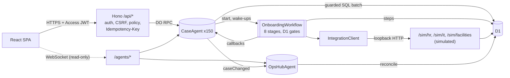

# OnboardFlow

An employee onboarding platform on Cloudflare Workers that coordinates setup across People Operations, IT and Facilities. Employees work a checklist, managers and People Ops approve at two checkpoints, and a durable workflow provisions accounts, devices, workspaces and badges through three **simulated** enterprise systems (HR, IT, Facilities). Coordination agents detect blockers, create follow-up tasks for the owning department, and keep live dashboards current. Every action lands in an append-only audit trail.

All 150 employees are synthetic. The HR, IT and Facilities systems are simulators that run inside the same Worker; nothing here talks to a real HRIS, identity provider, MDM or badge system.

What "agents" means here: `CaseAgent` and `OpsHubAgent` are [Cloudflare Agents SDK](https://developers.cloudflare.com/agents/) classes (Durable Objects with SQLite, schedules, WebSocket state sync and workflow callbacks). Their decisions come from a deterministic rule engine, not from an LLM. An LLM, when one is configured, only drafts the wording of follow-up tasks; the default everywhere, including CI and production, is a deterministic stub ([ADR 0004](docs/adr/0004-rules-decide-llm-drafts.md)).

## What is in the box

- **Portal** (React 19, TypeScript, Vite): employee checklist with an 8-stage stepper, approvals, department queue, cases table, case detail with the audit trail, and a live dashboard. Four roles: employee, manager, coordinator (People Ops, IT or Facilities) and admin.
- **API** (Hono on Workers): every mutation requires `Idempotency-Key`, `X-OnboardFlow: 1` and a same-site `Origin`, is checked against a role policy, and is written as a guarded D1 batch with its audit row ([ADR 0008](docs/adr/0008-guarded-mutations.md)).
- **Workflow** (Cloudflare Workflows): eight stages, retries with exponential backoff and Retry-After, polling of async resources, recovery rounds after a coordinator retries, two approval checkpoints with reject and resubmit, restart and terminate. Every wait is a D1 gate with a bounded timeout, so restarts and lost events cannot strand a case ([ADR 0002](docs/adr/0002-d1-gates-and-wake-up-events.md)).
- **Agents** (Agents SDK): one `CaseAgent` per employee (commands, wake-ups, blocker scans, follow-ups, read-only live state) and one `OpsHubAgent` (debounced reconcile of the dashboard from D1).
- **Simulated systems** under `/sim/*`: HR, IT and Facilities with idempotency keys honored atomically, async state machines, genuine validation errors, and injectable faults (503, 429 with Retry-After, timeout, lost response, malformed body, stall, desk conflict) ([ADR 0005](docs/adr/0005-loopback-simulated-systems.md)).
- **Auth**: Cloudflare Access JWT verification with `jose` (RS256, issuer and audience enforced). Locally, the same verifier runs against a generated key and a persona picker ([ADR 0003](docs/adr/0003-hostname-access-jwt-verification.md)).
- **Eval suite**: 60 scripted scenarios (20 onboarding, 24 integration failures, 16 recovery) and a 150-employee scale run, driven over HTTP as the real personas against `wrangler dev`.

## Architecture



Design decisions are recorded in [docs/adr](docs/adr) and the domain vocabulary in [CONTEXT.md](CONTEXT.md). The full build specification, including every API fact it relies on and how it was verified, is [SPEC.md](SPEC.md).

## Local versus production

| Concern | Local (this machine, CI) | Production (after deploy) |
|---|---|---|
| Worker runtime | workerd via `vite dev`, `wrangler dev` on the build, and `@cloudflare/vitest-plugin` (Miniflare) | Cloudflare Workers |
| Front end | Vite dev server, or `dist/client` served by local assets | Workers static assets with SPA fallback |
| D1 | local SQLite under `.wrangler/state` or a `--persist-to` directory | D1 `onboardflow-prod` |
| Agents (Durable Objects, SQLite) | local Durable Objects | Durable Objects |
| Workflows | local Workflows engine; restart wipes delivered events (D1 gates make this harmless) | Cloudflare Workflows; restarting a terminated instance is unverified, so a new-revision fallback covers it |
| Auth | `AUTH_MODE=dev`: RS256 JWT minted by `/dev/login` with a locally generated key, verified by the same code as production; persona picker | `AUTH_MODE=access`: hostname Access application, `Cf-Access-Jwt-Assertion` verified against the team's JWKS with `iss` and `aud` |
| CSRF defenses | Origin + `X-OnboardFlow` + required `Idempotency-Key`; dev cookie `SameSite=Strict` | same checks; Access cookie set to `SameSite=Lax`, HttpOnly |
| Secrets | `.dev.vars` from `npm run dev:keys`; tests use Miniflare bindings; evals generate a fresh set per run | `wrangler secret put SIM_API_KEY` |
| LLM (follow-up wording only) | deterministic stub (default), or an OpenAI-compatible server such as llama-server | stub by default |
| HR, IT, Facilities | **simulated**, same Worker, `/sim/*` | **still simulated**, same Worker, `/sim/*` |
| Clock | real, or an offset clock with `SIM_CLOCK=on` (evals and tests) | real only |
| Fault injection, eval hooks, eviction route | `EVAL_HOOKS=on` in eval runs | off; the routes answer 404 |
| Eval suite | runs here against `wrangler dev` | not run (it needs the hooks and the simulated clock) |

The deployment to Cloudflare has not been done yet; until it is, everything in this README was run locally (workerd through Miniflare and `wrangler dev`).

## Run it locally

Requirements: Node 24 (22.18 or later works; this repository was built on Node 25), npm.

```sh
npm ci
npm run dev:keys          # writes .dev.vars: a local RS256 key pair and SIM_API_KEY
npm run db:reset:local    # applies the D1 migrations and the committed synthetic seed
npm run dev               # Vite dev server with the Worker in workerd
```

Open the printed URL, pick a persona on the login page (three employees, three managers, one coordinator per department, two admins), start a case from **Cases** as the People Ops coordinator, and follow it through the employee portal, the approvals page and the live dashboard.

To serve the production-like build instead: `npm run build && npm run serve:local` (wrangler dev on the built Worker).

### Checks

```sh
npm run typecheck       # strict TypeScript: worker, web and node projects
npm test                # vitest: worker tests inside workerd, node tests, web tests (happy-dom)
npm run build           # vite build + check that Agent class names survive bundling
npm run seed:check      # the committed seed is byte-identical to the generator
npm run typegen:check   # worker-configuration.d.ts matches wrangler.jsonc
npm run deploy:dry-run  # production bundle without credentials (run `npm run build` again afterwards)
```

### Eval

```sh
npm run build
npm run eval:ci       # 60 scripted scenarios, CI gate
npm run eval:scale    # all 150 synthetic employees, no faults
npm run eval:chaos    # 60 employees x 5 seeds, seeded faults and policy bots (about 20 minutes)
npm run eval:ablate   # the 60 scenarios with Idempotency-Key handling off, then with retries off
```

The harness creates a fresh local D1 per run (migrations and the committed seed), generates fresh secrets into that run's own `.dev.vars`, starts `wrangler dev` (port 8781 by default, `--port` to change), pins the simulated clock to 2026-10-08 (the seed's reference date, so results do not drift with the calendar), and plays each scenario over HTTP as the real personas. Results are written to `eval/results/`.

Read the standard numbers for what they are: every scenario is designed so a correct system finishes the case, with failures recovered automatically (retries, idempotent replay) or by the scripted action a real coordinator would take. Standard mode is therefore a regression suite (CI requires 60/60), not an estimate of completion under uncontrolled conditions.

The two ablations rerun the same scenarios with one mechanism switched off (Idempotency-Key handling in the simulated systems, or step retries), to show that the mechanism, not luck, produces the standard results.

Chaos mode is the informative measurement: `npm run eval:chaos` runs the same 60 employees for 5 seeds, each on a fresh local D1 and server, with no per-scenario script. A seeded injector faults about 30% of (employee, operation) pairs (some beyond the retry budget), opens 0 to 2 sustained outage windows of 10 to 60 s per system, and corrupts validated fields; generic seeded bots play the employees, managers, the three department coordinators and an admin, acting only on what the API shows them, with limited patience. Each case has 180 s. The fault table and policies are in `eval/harness/policies.ts`; decisions taken before the first recorded run, and the trial runs behind them, are logged in `eval/results/CHANGELOG.md`.

## Results

Everything below is rendered by `npm run results:readme` from `eval/results/latest-*.json`, the files the harness wrote; a test fails if this block drifts from them. These are local measurements on `wrangler dev` (Miniflare/workerd) on a laptop, with the simulated systems and the stub LLM provider, not production numbers. Standard mode is the regression suite described above: its completion rate is close to guaranteed by construction and is not a measure of how often onboarding succeeds under uncontrolled failures.

<!-- results:start -->
#### Standard mode (regression suite, scripted recovery)

Command `npm run eval:ci`, run 2026-10-08 (git 1a18873), provider `stub`, local wrangler dev (Miniflare/workerd), concurrency 6.

| Metric | Value |
|---|---|
| Cases started | 60 |
| Completed | 60/60 (100.0%) |
| Passed (completed and every expectation held) | 60/60 |
| onboarding | 20/20 passed |
| integration failure | 24/24 passed |
| recovery | 16/16 passed |
| Integration calls (retried, replayed) | 1284 (60, 28) |
| Duplicate side effects in the simulated systems | 0 |
| Audit coverage (regression check) | 1 |
| Live hub equals D1 reconcile after the run | yes |
| Scenario time p50 / p95, wall time | 4.3 s / 6.0 s, 51 s |

#### Scale mode (all 150 synthetic employees, no faults)

Command `npm run eval:scale`, run 2026-10-08 (git 1a18873), provider `stub`, local wrangler dev (Miniflare/workerd), concurrency 10.

| Metric | Value |
|---|---|
| Cases started | 150 |
| Completed | 150/150 (100.0%) |
| Integration calls (retried, replayed) | 2850 (0, 0) |
| Duplicate side effects in the simulated systems | 0 |
| Audit coverage (regression check) | 1 |
| Live hub equals D1 reconcile after the run | yes |
| Scenario time p50 / p95, wall time | 6.1 s / 15.8 s, 105 s |
<!-- results:end -->

## Deploy (Cloudflare account required)

1. `npx wrangler login`
2. `npx wrangler d1 create onboardflow-prod`, then paste the id into `env.production.d1_databases[0].database_id` in `wrangler.jsonc`.
3. `npx wrangler d1 migrations apply onboardflow-prod --remote -c wrangler.jsonc --env production`
4. Edit `seed/prod-admins.sql` with your Access email(s) (one `staff` row with `kind = 'admin'` and one `app_users` row per email), then run `npx wrangler d1 execute onboardflow-prod --remote --env production --file seed/seed.sql` (or a date-shifted demo seed, below) and the same for `seed/prod-admins.sql`.
5. `npx wrangler secret put SIM_API_KEY --env production`
6. In Zero Trust, create a self-hosted Access application for the Worker's hostname with a policy allowing your email(s). Do not use the Worker-level Access tab: it does not support WebSockets, which the live views need. Copy the team domain and the Application Audience (AUD) tag into `env.production.vars.TEAM_DOMAIN` and `POLICY_AUD`.
7. In the same application's cookie settings, set SameSite to `Lax` and keep HttpOnly on.
8. `npm run deploy`. It refuses to deploy while any production value still contains `REPLACE`.
9. Smoke test: open the site, sign in through Access, check that `/api/me` returns your admin role, start one case from Cases, and watch the dashboard update.

The committed seed is anchored at 2026-11-02. For a live demo after that, generate a date-shifted copy of the same people: `npm run seed:generate -- --anchor <next Monday> --out seed/seed.demo.sql` (gitignored).

## Project layout

```
src/shared/        stages, roles, vocabularies, API schemas, agent state types, synthetic data generator
src/worker/        Hono app, auth, routes, D1 helpers, agents, workflow, integrations, simulators, LLM seam
src/web/           React SPA: pages, components, API client, live hooks
migrations/        D1 schema (6 migrations)
seed/              generated seed.sql and manifest.json (sha256), production admin template
test/              worker (workerd), node and web test projects
eval/              scenario catalog, harness, recorded results
docs/adr/          architecture decision records 0001 to 0008
```

## Not built in this version

From the specification's Tier 2: the llama eval run and LLM quality metrics, the Workers AI provider, the Integrations and Audit explorer pages, and the demo driver. The OpenAI-compatible provider exists and is unit tested, but no eval run with a real model has been recorded.

## Troubleshooting

Worker test runs print `uncaught exception` lines such as `Aborting engine: User called restart`, `broken.outputGateBroken`, `eval-evict` and occasional "Worker's code had hung" messages. They come from steps that fail on purpose, restarts, terminations and evictions; tests assert outcomes, not log silence. The "Missing required secrets" warning during tests and builds is expected: tests pass secrets as Miniflare bindings.
