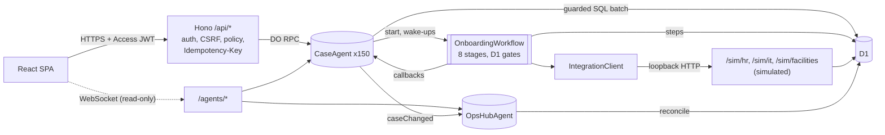

# OnboardFlow

An employee onboarding platform on Cloudflare Workers that coordinates setup across People Operations, IT and Facilities. Employees work a checklist, managers and People Ops approve at two checkpoints, and a durable workflow provisions accounts, devices, workspaces and badges through three **simulated** enterprise systems (HR, IT, Facilities). Coordination agents detect blockers, create follow-up tasks for the owning department, and keep live dashboards current. Every action lands in an append-only audit trail.

All 150 employees are synthetic. The HR, IT and Facilities systems are simulators that run inside the same Worker; nothing here talks to a real HRIS, identity provider, MDM or badge system.

What "agents" means here: `CaseAgent` and `OpsHubAgent` are [Cloudflare Agents SDK](https://developers.cloudflare.com/agents/) classes (Durable Objects with SQLite, schedules, WebSocket state sync and workflow callbacks). Their decisions come from a deterministic rule engine, not from an LLM. An LLM, when one is configured, only drafts the wording of follow-up tasks; the default everywhere, including CI and production, is a deterministic stub ([ADR 0004](docs/adr/0004-rules-decide-llm-drafts.md)).

## What is in the box

- **Portal** (React 19, TypeScript, Vite): employee checklist with an 8-stage stepper, approvals, department queue, cases table, case detail with the audit trail, a live dashboard, integration health with per-case call logs, and an admin audit explorer. Four roles: employee, manager, coordinator (People Ops, IT or Facilities) and admin.
- **API** (Hono on Workers): every mutation requires `Idempotency-Key`, `X-OnboardFlow: 1` and a same-site `Origin`, is checked against a role policy, and is written as a guarded D1 batch with its audit row ([ADR 0008](docs/adr/0008-guarded-mutations.md)).
- **Workflow** (Cloudflare Workflows): eight stages, retries with exponential backoff and Retry-After, polling of async resources, recovery rounds after a coordinator retries, two approval checkpoints with reject and resubmit, restart and terminate. Every wait is a D1 gate with a bounded timeout, so restarts and lost events cannot strand a case ([ADR 0002](docs/adr/0002-d1-gates-and-wake-up-events.md)).
- **Agents** (Agents SDK): one `CaseAgent` per employee (commands, wake-ups, blocker scans, follow-ups, read-only live state) and one `OpsHubAgent` (debounced reconcile of the dashboard from D1).
- **Simulated systems** under `/sim/*`: HR, IT and Facilities with idempotency keys honored atomically, async state machines, genuine validation errors, and injectable faults (503, 429 with Retry-After, timeout, lost response, malformed body, stall, desk conflict) ([ADR 0005](docs/adr/0005-loopback-simulated-systems.md)).
- **Auth**: Cloudflare Access JWT verification with `jose` (RS256, issuer and audience enforced). Locally, the same verifier runs against a generated key and a persona picker ([ADR 0003](docs/adr/0003-hostname-access-jwt-verification.md)).
- **Eval suite**: 60 scripted scenarios (20 onboarding, 24 integration failures, 16 recovery), a 150-employee scale run, a chaos mode (5 seeds of seeded faults and outages worked by generic policy bots), two ablations and an optional local-LLM run, all driven over HTTP as the real personas against `wrangler dev`.

## Architecture



Design decisions are recorded in [docs/adr](docs/adr) and the domain vocabulary in [CONTEXT.md](CONTEXT.md). The full build specification, including every API fact it relies on and how it was verified, is [SPEC.md](SPEC.md).

## Local versus production

| Concern | Local (this machine, CI) | Production (after deploy) |
|---|---|---|
| Worker runtime | workerd via `vite dev`, `wrangler dev` on the build, and `@cloudflare/vitest-plugin` (Miniflare) | Cloudflare Workers |
| Front end | Vite dev server, or `dist/client` served by local assets | Workers static assets with SPA fallback |
| D1 | local SQLite under `.wrangler/state` or a `--persist-to` directory | D1 `onboardflow-prod` |
| Agents (Durable Objects, SQLite) | local Durable Objects | Durable Objects |
| Workflows | local Workflows engine; restart wipes delivered events (D1 gates make this harmless) | Cloudflare Workflows; restarting a terminated instance is unverified, so a new-revision fallback covers it |
| Auth | `AUTH_MODE=dev`: RS256 JWT minted by `/dev/login` with a locally generated key, verified by the same code as production; persona picker | `AUTH_MODE=access`: hostname Access application, `Cf-Access-Jwt-Assertion` verified against the team's JWKS with `iss` and `aud` |
| CSRF defenses | Origin + `X-OnboardFlow` + required `Idempotency-Key`; dev cookie `SameSite=Strict` | same checks; Access cookie set to `SameSite=Lax`, HttpOnly |
| Secrets | `.dev.vars` from `npm run dev:keys`; tests use Miniflare bindings; evals generate a fresh set per run | `wrangler secret put SIM_API_KEY` |
| LLM (follow-up wording only) | deterministic stub (default), or an OpenAI-compatible server such as llama-server with Qwen3-1.7B Q4_0 | stub by default; optionally Workers AI `@cf/qwen/qwen3-30b-a3b-fp8` through AI Gateway (built, never run) |
| HR, IT, Facilities | **simulated**, same Worker, `/sim/*` | **still simulated**, same Worker, `/sim/*` |
| Clock | real, or an offset clock with `SIM_CLOCK=on` (evals and tests) | real only |
| Fault injection, eval hooks, eviction route | `EVAL_HOOKS=on` in eval runs | off; the routes answer 404 |
| Eval suite | runs here against `wrangler dev` | not run (it needs the hooks and the simulated clock) |

The deployment to Cloudflare has not been done yet; until it is, everything in this README was run locally (workerd through Miniflare and `wrangler dev`).

## Run it locally

Requirements: Node 24 (22.18 or later works; this repository was built on Node 25), npm.

```sh
npm ci
npm run dev:keys          # writes .dev.vars: a local RS256 key pair and SIM_API_KEY
npm run db:reset:local    # applies the D1 migrations and the committed synthetic seed
npm run dev               # Vite dev server with the Worker in workerd
```

Open the printed URL, pick a persona on the login page (three employees, three managers, one coordinator per department, two admins), start a case from **Cases** as the People Ops coordinator, and follow it through the employee portal, the approvals page and the live dashboard.

To serve the production-like build instead: `npm run build && npm run serve:local` (wrangler dev on the built Worker).

To see the dashboards with something on them, the demo driver fills the local state with a seeded mix of cases: it resets `.wrangler/state`, applies the migrations and the seed, starts `wrangler dev` on the build, pins the simulated clock, and drives all 150 employees over HTTP as the personas. 42 cases complete and the rest are held in each of the eight stages: 24 each at the four human checkpoints (paperwork, manager approval, orientation, closeout approval), and 3 each at intake, IT, Facilities and provisioning verification, where only a simulated outage (a sustained 503 for that one employee) can hold a case, so those 12 show real integration blockers. Then `npm run serve:local` serves that state (on the real clock, without the eval hooks).

```sh
npm run build && npm run dev:keys
npm run demo:drive            # --port and --inspector-port if 8787/9229 are taken, --seed to reshuffle
npm run serve:local
```

### Checks

```sh
npm run typecheck       # strict TypeScript: worker, web and node projects
npm test                # vitest: worker tests inside workerd, node tests, web tests (happy-dom)
npm run build           # vite build + check that Agent class names survive bundling
npm run seed:check      # the committed seed is byte-identical to the generator
npm run typegen:check   # worker-configuration.d.ts matches wrangler.jsonc
npm run deploy:dry-run  # production bundle without credentials (run `npm run build` again afterwards)
```

### Eval

```sh
npm run build
npm run eval:ci       # 60 scripted scenarios, CI gate
npm run eval:scale    # all 150 synthetic employees, no faults
npm run eval:chaos    # 60 employees x 5 seeds, seeded faults and policy bots (about 20 minutes)
npm run eval:ablate   # the 60 scenarios with Idempotency-Key handling off, then with retries off
npm run eval:llama    # standard mode with llama-server (Qwen3-1.7B Q4_0, port 8110) drafting follow-up wording
npm run llm:smoke     # one structured-output request against the local llama-server
```

The harness creates a fresh local D1 per run (migrations and the committed seed), generates fresh secrets into that run's own `.dev.vars`, starts `wrangler dev` (port 8781 by default, `--port` to change), pins the simulated clock to 2026-10-08 (the seed's reference date, so results do not drift with the calendar), and plays each scenario over HTTP as the real personas. Results are written to `eval/results/`.

Read the standard numbers for what they are: every scenario is designed so a correct system finishes the case, with failures recovered automatically (retries, idempotent replay) or by the scripted action a real coordinator would take. Standard mode is therefore a regression suite (CI requires 60/60), not an estimate of completion under uncontrolled conditions.

The two ablations rerun the same scenarios with one mechanism switched off (Idempotency-Key handling in the simulated systems, or step retries), to show that the mechanism, not luck, produces the standard results.

Chaos mode is the informative measurement: `npm run eval:chaos` runs the same 60 employees for 5 seeds, each on a fresh local D1 and server, with no per-scenario script. A seeded injector faults about 30% of (employee, operation) pairs (some beyond the retry budget), opens 0 to 2 sustained outage windows of 10 to 60 s per system, and corrupts validated fields; generic seeded bots play the employees, managers, the three department coordinators and an admin, acting only on what the API shows them, with limited patience. Each case has 180 s. The fault table and policies are in `eval/harness/policies.ts`; decisions taken before the first recorded run, and the trial runs behind them, are logged in `eval/results/CHANGELOG.md`.

## Results

Everything below is rendered by `npm run results:readme` from `eval/results/latest-*.json`, the files the harness wrote; a test fails if this block drifts from them. These are local measurements on `wrangler dev` (Miniflare/workerd) on a laptop, with the simulated systems and the stub LLM provider (except the one run labeled as using a local LLM), not production numbers. Standard mode is the regression suite described above: its completion rate is close to guaranteed by construction and is not a measure of how often onboarding succeeds under uncontrolled failures.

<!-- results:start -->
#### Standard mode (regression suite, scripted recovery)

Command `node eval/harness/run.ts --mode standard --llm stub --gate ci` (via `npm run eval:ci`), run 2026-10-09 (git 35ebbec at start, clean tree), provider `stub`, local wrangler dev (Miniflare/workerd), concurrency 6.

| Metric | Value |
|---|---|
| Cases started | 60 |
| Completed | 60/60 (100.0%) |
| Passed (completed and every expectation held) | 60/60 |
| onboarding | 20/20 passed |
| integration failure | 24/24 passed |
| recovery | 16/16 passed |
| Integration calls (retried, replayed) | 1284 (60, 28) |
| Duplicate side effects in the simulated systems | 0 |
| Harness requests retried after a dropped local proxy connection (still failed) | 0 (0) |
| Audit coverage (regression check) | 1 |
| Live hub equals D1 reconcile after the run | yes |
| Scenario time p50 / p95, wall time | 3.0 s / 4.5 s, 40 s |
| Host stalls over 5 s (system sleep or a frozen harness) | none |

#### Standard mode with a local LLM drafting follow-up wording

Command `npm run eval:llama` (inferred from the mode; this run predates recorded commands), run 2026-10-09 (git 697c8fc, read when the run ended), provider `llama (openai:qwen3-1.7b, Qwen3-1.7B Q4_0)`, local wrangler dev (Miniflare/workerd), concurrency 6.

| Metric | Value |
|---|---|
| Cases started | 60 |
| Completed | 60/60 (100.0%) |
| Passed (completed and every expectation held) | 60/60 |
| onboarding | 20/20 passed |
| integration failure | 24/24 passed |
| recovery | 16/16 passed |
| Integration calls (retried, replayed) | 1280 (60, 27) |
| Follow-ups drafted by the LLM (schema-valid / attempted) | 20 created, 100.0% valid, category agrees with the rules 100.0%, p50 2874 ms |
| Duplicate side effects in the simulated systems | 0 |
| Harness requests retried after a dropped local proxy connection (still failed) | 0 (0) |
| Audit coverage (regression check) | 1 |
| Live hub equals D1 reconcile after the run | yes |
| Scenario time p50 / p95, wall time | 3.5 s / 9.2 s, 56 s |
| Host stalls over 5 s (system sleep or a frozen harness) | none |

#### Chaos mode (seeded faults and policy bots, 5 seeds)

Command `node eval/harness/run.ts --mode chaos --llm stub --seeds 5` (via `npm run eval:chaos`), run 2026-10-09 (git 6248014 at start, clean tree), provider `stub`, local wrangler dev (Miniflare/workerd), concurrency 10.

| Metric | Value |
|---|---|
| Cases started | 300 |
| Completed | 289/300 (96.3%) |
| Completion per seed (mean, min, max) | 96.3%, 93.3%, 100.0% |
| Seed 1 | 57/60; not completed: 0 failed, 0 bot patience, 3 deadline; harness: 0 transport retries, 0 control retries, 0 bot request errors |
| Seed 2 | 58/60; not completed: 0 failed, 0 bot patience, 2 deadline; harness: 0 transport retries, 0 control retries, 0 bot request errors |
| Seed 3 | 60/60; not completed: 0 failed, 0 bot patience, 0 deadline; harness: 0 transport retries, 0 control retries, 0 bot request errors |
| Seed 4 | 58/60; not completed: 0 failed, 0 bot patience, 2 deadline; harness: 0 transport retries, 0 control retries, 0 bot request errors |
| Seed 5 | 56/60; not completed: 0 failed, 0 bot patience, 4 deadline; harness: 0 transport retries, 0 control retries, 0 bot request errors |
| Integration calls (retried, replayed) | 9966 (4138, 98) |
| Duplicate side effects in the simulated systems | 0 |
| Harness requests retried after a dropped local proxy connection (still failed) | 0 (0) |
| Audit coverage (regression check) | 1 |
| Live hub equals D1 reconcile after the run | yes |
| Scenario time p50 / p95, wall time | 103.2 s / 168.0 s, 945 s |
| Host stalls over 5 s (system sleep or a frozen harness) | none |

#### Scale mode (all 150 synthetic employees, no faults)

Command `npm run eval:scale` (inferred from the mode; this run predates recorded commands), run 2026-10-09 (git f5c8cfb, read when the run ended), provider `stub`, local wrangler dev (Miniflare/workerd), concurrency 10.

| Metric | Value |
|---|---|
| Cases started | 150 |
| Completed | 150/150 (100.0%) |
| Integration calls (retried, replayed) | 2850 (0, 0) |
| Duplicate side effects in the simulated systems | 0 |
| Audit coverage (regression check) | 1 |
| Live hub equals D1 reconcile after the run | yes |
| Scenario time p50 / p95, wall time | 4.7 s / 6.2 s, 76 s |

#### Ablation: Idempotency-Key handling switched off in the simulated systems

Command `node eval/harness/run.ts --mode ablation-idempotency` (inferred from the mode; this run predates recorded commands), run 2026-10-09 (git e082bc2, read when the run ended), provider `stub`, local wrangler dev (Miniflare/workerd), concurrency 6.

| Metric | Value |
|---|---|
| Cases started | 60 |
| Completed | 60/60 (100.0%) |
| Passed (completed and every expectation held) | 50/60 |
| onboarding | 20/20 passed |
| integration failure | 18/24 passed |
| recovery | 12/16 passed |
| Integration calls (retried, replayed) | 1300 (60, 0) |
| Duplicate side effects in the simulated systems | 28 |
| Harness requests retried after a dropped local proxy connection (still failed) | 0 (0) |
| Audit coverage (regression check) | 1 |
| Live hub equals D1 reconcile after the run | yes |
| Scenario time p50 / p95, wall time | 3.1 s / 4.2 s, 39 s |
| Host stalls over 5 s (system sleep or a frozen harness) | none |

#### Ablation: step retries switched off (RETRY_LIMIT=0)

Command `node eval/harness/run.ts --mode ablation-retries` (inferred from the mode; this run predates recorded commands), run 2026-10-09 (git e082bc2, read when the run ended), provider `stub`, local wrangler dev (Miniflare/workerd), concurrency 6.

| Metric | Value |
|---|---|
| Cases started | 60 |
| Completed | 44/60 (73.3%) |
| Passed (completed and every expectation held) | 43/60 |
| onboarding | 19/20 passed |
| integration failure | 9/24 passed |
| recovery | 15/16 passed |
| Integration calls (retried, replayed) | 1017 (25, 24) |
| Duplicate side effects in the simulated systems | 0 |
| Harness requests retried after a dropped local proxy connection (still failed) | 0 (0) |
| Audit coverage (regression check) | 1 |
| Live hub equals D1 reconcile after the run | yes |
| Scenario time p50 / p95, wall time | 3.1 s / 62.1 s, 205 s |
| Host stalls over 5 s (system sleep or a frozen harness) | none |
<!-- results:end -->

**Reading these results.** Dates in the block are UTC. Every run above was made on the evening of 2026-10-08 Pacific time except the standard run, which was made on 2026-10-09 at 11:27 PDT; all ran on one laptop that was also running other repositories' test suites. All files, including the runs not shown, are committed in `eval/results/`, and every change between runs is logged in [eval/results/CHANGELOG.md](eval/results/CHANGELOG.md).

- **Standard** (git 35ebbec, on AC power with the lid open, no host stall) is the first recorded run that includes every review fix, the live subscription re-check (9c55e58) among them. All five committed standard runs, one of them with the local LLM, completed and passed 60 of 60 with 0 duplicate side effects.
- **Chaos** is the informative number. The run shown (git 6248014, started 21:30 PDT on AC power with the lid open, no host stall) is the first one recorded under the completion rule SPEC 12.4 defines: a case counts only if a poll saw it `complete` within its 180 s deadline, and the bots stop working a case once its deadline passes. It completed 289 of 300 cases across the 5 seeds: per-seed mean 96.3%, min 93.3%, max 100%, with 0 duplicate side effects, no transport or control retries, no failed case and no bot giving up. All 11 misses are deadlines (none of those cases had completed by the end of its seed; the slowest case that counted took 170.5 s). It is also the first chaos run whose stall watch starts once the server is healthy, and it found no stall. The run predates the last review fix (9c55e58, which re-checks live subscriptions before every state push); the harness opens no live subscription. Chaos runs in real time, so machine load moves it.
- **Earlier chaos runs** on the same seeds are committed and not hidden, but they counted completion differently: the harness read it from a snapshot taken after the whole seed finished, and the bots kept working cases past their deadline, so a case that completed after its deadline was counted. An independent review found this; the fix and what each old run counted are in the CHANGELOG. The fourth run (git c04aeb7) reported 287 of 300 (per-seed mean 95.7%, min 93.3%); two of its counted cases were closed 180.4 and 180.5 s after their start, so under the deadline rule it is between 285 (mean 95.0%) and 287. It also had the first failed case of any run (seed 3's E059 used up the workflow's bounded recovery rounds at Facilities, as designed). The third (git 5e2635b) reported 280 of 300, counting four late cases, one of them in seed 5, which overlapped a system sleep (its longest case lasted 1077 s). The first (git 6f9a11d) reported 230 of 300, but in seed 3 the harness failed to end a Facilities outage window after a local runtime error (0/60 in that seed). The second (git a510536) reported 210 of 300, with 248 bot requests in seeds 3 and 4 lost to dropped connections in `wrangler dev`'s local proxy, and counted 36 late cases. Each of the first two led to a harness fix (the orchestrator retries its own control calls; the harness retries a dropped request with the same Idempotency-Key, which the API is designed for). Fault tables, seeds and bot policies did not change in any of these runs.
- **Scale** also ran a first time at the same commit and completed 148 of 150: two harness requests got a plain-text 500 from the local runtime and the harness stopped driving those two cases. The 150/150 run is shown because it is the latest run, not because it is the better one.
- **Ablations** show what each mechanism buys. The runs shown were re-recorded at 20:14 PDT with the lid open and no host stall. With Idempotency-Key handling off in the simulated systems, retried and replayed calls produced 28 duplicate side effects (0 in standard mode): all 60 cases completed, but 10 failed their exactly-once expectations. With step retries off, 16 cases stayed blocked where a fault needed a step retry (44/60 completed), with 0 duplicates. The first ablation runs (git 5e2635b) ran while the machine slept between brief wakes and are committed too. Retries off gave the same 44/60 completed and 43/60 passed. Keys off gave 59/60 completed and 27 duplicates: R05 timed out during a stall (it completes in the clean run), and R06 counted one duplicate fewer. R06 restarts a case while its old workflow instance is still running, so how far that instance gets before it is terminated varies by a step between runs.
- **Local LLM** (`npm run eval:llama`, git 697c8fc): the same 60 scenarios with llama-server running Qwen3-1.7B Q4_0 on the laptop's GPU drafting the wording of every follow-up. It was recorded later the same evening (20:09 PDT, lid open, no host stall), because the first attempt was due while the machine slept. All 20 follow-ups were drafted by the model rather than the template, with a p50 of 2.9 s per draft, and the workflow results match the stub run (60/60 passed, 0 duplicates). Read the 100% schema-valid and 100% category-agreement figures as "the drafting path works end to end", not as model quality: llama-server constrains the output to the JSON schema, whose category field is an enum, and the prompt names the blocker kind the rules already decided. The model never decides anything ([ADR 0004](docs/adr/0004-rules-decide-llm-drafts.md)), and the run does not measure whether its wording is better than the template's.

## Deploy (Cloudflare account required)

1. `npx wrangler login`
2. `npx wrangler d1 create onboardflow-prod`, then paste the id into `env.production.d1_databases[0].database_id` in `wrangler.jsonc`.
3. `npx wrangler d1 migrations apply onboardflow-prod --remote -c wrangler.jsonc --env production`
4. Edit `seed/prod-admins.sql` with your Access email(s) (one `staff` row with `kind = 'admin'` and one `app_users` row per email), then run `npx wrangler d1 execute onboardflow-prod --remote --env production --file seed/seed.sql` (or a date-shifted demo seed, below) and the same for `seed/prod-admins.sql`.
5. `npx wrangler secret put SIM_API_KEY --env production`
6. In Zero Trust, create a self-hosted Access application for the Worker's hostname with a policy allowing your email(s). Do not use the Worker-level Access tab: it does not support WebSockets, which the live views need. Copy the team domain and the Application Audience (AUD) tag into `env.production.vars.TEAM_DOMAIN` and `POLICY_AUD`.
7. In the same application's cookie settings, set SameSite to `Lax` and keep HttpOnly on.
8. `npm run deploy`. It refuses to deploy while any production value still contains `REPLACE`.
9. Smoke test: open the site, sign in through Access, check that `/api/me` returns your admin role, start one case from Cases, and watch the dashboard update.

The committed seed is anchored at 2026-11-02. For a live demo after that, generate a date-shifted copy of the same people: `npm run seed:generate -- --anchor <next Monday> --out seed/seed.demo.sql` (gitignored).

## Project layout

```
src/shared/        stages, roles, vocabularies, API schemas, agent state types, synthetic data generator
src/worker/        Hono app, auth, routes, D1 helpers, agents, workflow, integrations, simulators, LLM seam
src/web/           React SPA: pages, components, API client, live hooks
migrations/        D1 schema (6 migrations)
seed/              generated seed.sql and manifest.json (sha256), production admin template
test/              worker (workerd), node and web test projects
eval/              scenario catalog, harness, recorded results
docs/adr/          architecture decision records 0001 to 0008
```

## Not built in this version

Every feature in the specification's Tier 1 and Tier 2 scope is built. The Workers AI provider exists and is unit tested against a fake binding, but it has never run against Cloudflare (it needs an account and the production AI binding).

## Troubleshooting

Worker test runs print `uncaught exception` lines such as `Aborting engine: User called restart`, `broken.outputGateBroken`, `eval-evict` and occasional "Worker's code had hung" messages. They come from steps that fail on purpose, restarts, terminations and evictions; tests assert outcomes, not log silence. The "Missing required secrets" warning during tests and builds is expected: tests pass secrets as Miniflare bindings.

Under load, `wrangler dev`'s local ProxyWorker can drop its connection to the Worker. It retries a GET itself ("recovered on attempt 2 after a dropped connection to the UserWorker") and answers a POST with a plain-text 500, `Error: Network connection lost.` The eval harness retries such a request with the same Idempotency-Key and counts it in the results. A browser user would see the request fail and could repeat the action. Eval timeouts and chaos deadlines are wall-clock: run evals with the machine awake (lid open, on power), since every run records host stalls and the Results block flags them. Kept eval logs (`--keep`) also show "Worker's code had hung" errors that belong to no request; the passing 150/150 scale run logged 150 of them.
