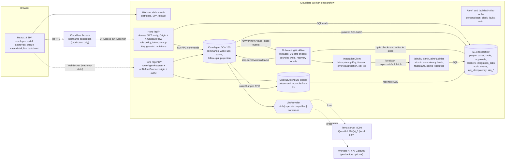
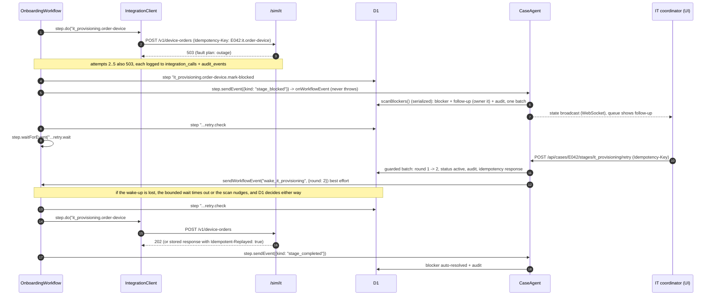

# OnboardFlow v1: Build Specification

Agentic employee onboarding platform on Cloudflare Workers. This document is the contract for the v1 build. Revision 1 was written on 2026-10-08 after installing the exact package versions into a scratch directory, reading their type definitions and bundled docs, fetching the Cloudflare docs, and running a throwaway prototype (Agents SDK + Workflows + D1 + Hono + jose + Vite build) under `vitest` and `wrangler dev` on this Mac. Revision 2 (same day) answers a skeptical design review: it fixes three blocking defects and twelve important ones, re-verifying each API fact in package sources, in a second prototype and in the docs. Section 15 lists every verified API and how it was verified. Section 23 is the review log.

Repo: `~/Developer/projects/onboardflow`, to be pushed as `github.com/nitishsjsucs/onboardflow`. Built from scratch. No code from any earlier OnboardFlow implementation is read or reused.

---

## 0. Acceptance criteria (the resume text)

The v1 must make this text true. Every number and mechanism maps to a test or an eval in Sections 11 and 12.

> Built a full-stack onboarding platform that coordinated employee setup across People Operations, IT, and Facilities. Combined an employee-facing checklist with an administrative dashboard, durable approval workflows, and agents that identified blockers, created follow-up tasks, and tracked provisioning through simulated enterprise integrations.
> * Built a React/TypeScript onboarding portal backed by Cloudflare Workers, Hono, D1, and Access, supporting approximately 150 synthetic employee profiles, eight onboarding stages, and four permission roles.
> * Built coordination agents using the Cloudflare Agents SDK and Workflows, integrating three simulated HR, IT, and Facilities APIs with approval checkpoints, idempotency keys, retries, and persistent task state.
> * Built live progress dashboards and an evaluation suite covering approximately 60 onboarding, integration-failure, and recovery scenarios, targeting 95% successful workflow completion with a visible audit trail for each action.

Exact counts the build must produce (the word "approximately" in the resume is satisfied by exact numbers):

| Claim | Exact v1 value | Where it is enforced |
|---|---|---|
| ~150 synthetic employee profiles | 150 rows in `employees` | `test/node/synthetic-generator.test.ts`, `test/worker/seed-load.test.ts`, `npm run eval:scale` |
| Eight onboarding stages | 8 rows in `stages`, 8 entries in `STAGES` | `test/worker/stages.test.ts` |
| Four permission roles | `employee`, `manager`, `coordinator`, `admin` | `test/worker/auth-roles.test.ts` |
| Three simulated APIs | `hr`, `it`, `facilities` under `/sim/*` | `test/worker/sims-contract.test.ts` |
| ~60 scenarios | 60 scenarios: 20 onboarding, 24 integration-failure, 16 recovery | `test/node/eval-catalog.test.ts` |
| Targeting 95% completion | Measured, never targeted. Two numbers exist. (a) Standard mode runs the 60 scripted scenarios with scripted recovery. It is a regression gate and must be 60/60 completed and 60/60 passed in CI. (b) Chaos mode (Tier 2) runs the same 60 cases for K = 5 seeds with seeded faults, some beyond the retry budget, and sustained outages, worked by a generic policy bot with no per-scenario script. Its mean completion is the informative number. The resume reports what was measured, worded as in Section 20 | `eval/harness/run.ts`, `.github/workflows/ci.yml` |

---

## 1. Goals and non-goals

### Goals
1. One repo: React 19 + strict TypeScript SPA built by Vite and served as Workers static assets, a Hono API on the same Worker, D1 migrations, two Agents SDK classes (Durable Objects), one Cloudflare Workflow class, three simulated enterprise systems, an LLM provider seam, and an eval harness.
2. Runs fully offline on this Mac and in GitHub Actions: `vite dev`, `wrangler dev` on the built output, and `vitest` with `@cloudflare/vitest-plugin`. No Cloudflare login is needed for anything except deploy.
3. Real mechanisms, not mocks of mechanisms: durable steps with retries, approval checkpoints that pause a workflow until a human decides, idempotency keys honored atomically by the simulated systems and by the API, guarded mutations whose audit row commits only when the change took effect, append-only audit log, WebSocket live state.
4. Workflows survive restart, termination, Durable Object eviction and lost events. Gates are D1 predicates checked before every wait; events only wake the workflow early (ADR 0002).
5. Every resume number is produced by code in the repo and checked by a test or by the eval harness. The README Results section is generated from eval output files, and a test fails if the README numbers drift from those files.
6. The README says exactly what runs where (Section 13). Local stand-ins are never presented as the production service.
7. A cut line (Section 21) separates claim-critical Tier 1 work from Tier 2 work, so an unfinished build is never everywhere half done.

### Non-goals
1. Real HRIS, IdP, MDM, or badge systems. The three systems are simulators living in the same Worker under `/sim/*`, and the README and UI label them "simulated".
2. Real employee data. All people are synthetic, deterministic, and use the reserved `.test` TLD for email.
3. Payroll, benefits enrollment, e-signature, document storage (no R2), email delivery, Queues, AI Search. None are needed for the claims; they are explicitly out of scope.
4. Multi-tenant SaaS concerns (org signup, billing).
5. LLM decision making. Rules decide blocker kind, owner, and workflow behavior. The LLM only drafts follow-up task text (ADR 0004), so workflow completion never depends on model quality. The default provider everywhere, including CI and production, is the deterministic stub.
6. Running the eval suite against production. Evals require fault injection and a simulated clock, which are disabled in production (Section 13).

---

## 2. Architecture

### 2.1 Component diagram



### 2.2 Sequence: integration failure, blocker, follow-up, recovery



### 2.3 Key design decisions (become ADRs in `docs/adr/`)

| ADR | Decision | Why (with evidence) |
|---|---|---|
| 0001 | D1 is the source of truth for domain records. Agent state is a projection recomputed from D1. | Projections are idempotent, so non-durable callbacks (`reportProgress`) that may repeat are harmless. Workflow steps write D1 with deterministic primary keys and `INSERT OR IGNORE`, so retried or restarted steps never double-write (verified: `INSERT OR IGNORE` and partial unique indexes behave in local D1). |
| 0002 | Gates are D1 predicates that the workflow checks in a step before every wait. Events (`wake_<stage>`) are wake-ups, never data. Every `waitForEvent` has a bounded timeout, and the workflow re-checks D1 after it. The SDK's `approveWorkflow` / `waitForApproval` are not used. | The local Workflows engine deletes every buffered and delivered event on restart (`wipeRestartState` in miniflare 5.20261006.1-alpha). A prototype gate that treated the event as data deadlocked after restart, while a check-then-wait gate passed on its first D1 check. A bounded wait whose timeout was caught re-checked D1 and passed with no event at all (Section 15.5). `waitForApproval` reports a durable error to the Agent on rejection, but a rejection in OnboardFlow is a normal branch (revise and resubmit). |
| 0003 | Production uses a hostname-based Cloudflare Access application and the Worker verifies `Cf-Access-Jwt-Assertion` itself with `jose`. Worker-level Access (`ctx.access`) is not used. | Cloudflare docs: worker-level Access "do[es] not currently support WebSocket connections" and upgrades fail with 403. The live dashboards are WebSockets. Verifying the JWT ourselves also lets dev and test exercise the identical verification code with a local RS256 key. |
| 0004 | Rules decide; the LLM drafts. | Blocker kind, owner department, and workflow branching come from deterministic rules. The LLM writes follow-up title and description and suggests a category that is only compared, never acted on. Smoke test on 2026-10-08: Qwen3-1.7B Q4_0 classified a 422 validation error as `provisioning_stall` (wrong), which is exactly why it must not drive behavior. |
| 0005 | Simulated systems are served by the same Worker under `/sim/*` and called over HTTP through the loopback `exports.default.fetch`. | Keeps one deployable unit and one local process while still exercising real HTTP semantics (status codes, headers, `Idempotency-Key`, `Retry-After`, timeouts). `enable_ctx_exports` is default since compatibility date 2025-11-17 and the loopback call was verified in both `vitest` and `wrangler dev`. A `SIM_BASE_URL` override allows pointing at an external simulator later. |
| 0006 | No `@callable()` decorators. Browsers mutate only through the Hono REST API; WebSocket connections are read-only state subscriptions. | Avoids the TC39 decorator transform (Vite 8 Oxc does not support it; the SDK needs the `agents/vite` Babel plugin) and keeps Access auth, CSRF checks, role policy, Idempotency-Key handling, and auditing in one place. Agents mark every connection read-only (`shouldConnectionBeReadonly`) and reject client state writes in `validateStateChange`. |
| 0007 | Tests use `@cloudflare/vitest-plugin@1.4.0`, not `@cloudflare/vitest-pool-workers@0.23.0`. This departs from the stated portfolio standard. | `npm view`: vitest-pool-workers 0.23.0 is deprecated ("renamed to @cloudflare/vitest-plugin ... will not receive future updates") and pins wrangler 4.124.0 and miniflare 5.20260815.0-alpha. The plugin pins wrangler 4.149.0 and miniflare 5.20261006.1-alpha, matching the toolchain, and allows vitest `^4.1.0 \|\| ^5.0.0`. The same prototype suite passed under both with only the import specifier changed. |
| 0008 | Guarded mutations. Every state change that can lose a race is one `UPDATE ... WHERE <guard>` that stamps a per-request `last_mutation_id`. The success audit, the stored API response, and follow-on rows sit in the same `DB.batch` with an `EXISTS` (or `NOT EXISTS`) on that stamp. Side effects outside D1 (workflow wake-ups) run after commit, are best effort, and are safe to lose because gates re-check D1. | A batched audit `INSERT` commits even when the guarded `UPDATE` changed 0 rows. That would record `approval.approved` for a request that got 409. The stamp-gated form was verified in local D1: only the winner's audit row exists, and an `EXISTS`-guarded follow-up for an ignored blocker inserts nothing and raises no foreign key error (Section 15.5). |

---

## 3. Toolchain and pinned versions

All versions pinned exactly in `package.json` (no carets). Verified with `npm view` on 2026-10-08 and installed together in the prototype. `package.json` has `"type": "module"`: the vitest plugin failed to load from a CommonJS-resolved config in the reviewer's check, so every config file is ESM.

| Package | Version | Note |
|---|---|---|
| node (engines) | `>=22.18` | Type stripping of `.ts` scripts is on by default from 22.18. CI runs Node 24 LTS (required) plus Node 25 to match this Mac (allowed to fail). `.nvmrc` = `24` |
| hono | 4.13.13 | |
| @hono/zod-validator | 0.9.1 | peer `zod ^3.25 \|\| ^4`, `hono >=4.11.2` |
| zod | 4.6.5 | agents peer `^4` |
| agents | 0.27.0 | pre-1.0, pin exactly |
| @modelcontextprotocol/sdk | 1.30.0 | agents peer requires exactly 1.30.0 |
| @modelcontextprotocol/client, @modelcontextprotocol/server | 2.0.0, 2.0.0 | non-optional peers of agents 0.27.0 (absent from its `peerDependenciesMeta`); npm would auto-install them, pinned for reproducibility |
| jose | 6.2.12 | RS256 sign/verify verified inside workerd |
| react, react-dom | 19.3.0 | |
| react-router | 8.4.0 | `createBrowserRouter`, `createMemoryRouter`, `RouterProvider` verified in a happy-dom test |
| @tanstack/react-query | 5.104.1 | |
| wrangler | 4.149.0 | |
| @cloudflare/vite-plugin | 1.63.1 | |
| vite | 8.3.4 | agents peer allows `<9` |
| @vitejs/plugin-react | 6.1.2 | |
| @cloudflare/vitest-plugin | 1.4.0 | ADR 0007 |
| vitest | 4.1.11 | inside the plugin's `^4.1.0 \|\| ^5.0.0` peer range |
| typescript | 6.0.3 | TS 7.0.2 also typechecked the prototype cleanly; 6.0.3 chosen for JS-API tooling compatibility |
| happy-dom | 20.14.5 | web test environment |
| @testing-library/react / dom / user-event | 16.3.3 / 10.4.2 / 14.6.7 | |
| jsonc-parser | 3.3.1 | config guard test parses `wrangler.jsonc` |
| @types/react, @types/react-dom, @types/node | latest 19.x, 19.x, 24.x at install | |

Not used: `@cloudflare/workers-types`. Runtime and binding types come from `wrangler types` (generates `worker-configuration.d.ts` with `Cloudflare.Env`, runtime types for workerd 1.20261006.1). `@cloudflare/workers-types@5.20261008.1` was installed only to read declarations during research.

Compatibility settings: `compatibility_date: "2026-10-01"`, `compatibility_flags: ["nodejs_compat"]` (the Agents SDK uses Node built-ins such as `AsyncLocalStorage`).

---

## 4. Exact file tree

Everything below is created during the build phase. Today only `SPEC.md` exists. Items marked (T2) belong to Tier 2 (Section 21) and are built only after the Tier 1 tag.

```
onboardflow/
  SPEC.md
  README.md
  CONTEXT.md                          domain glossary (Case, Stage, Gate, Wake-up, Checkpoint, Round, Blocker, Follow-up, Provisioning item, Simulated system)
  docs/adr/
    0001-d1-source-of-truth.md
    0002-d1-gates-and-wake-up-events.md
    0003-hostname-access-jwt-verification.md
    0004-rules-decide-llm-drafts.md
    0005-loopback-simulated-systems.md
    0006-read-only-agent-connections.md
    0007-vitest-plugin-over-pool-workers.md
    0008-guarded-mutations.md
  package.json                        "type": "module", engines node >=22.18
  package-lock.json
  .nvmrc                              24
  .gitignore                          node_modules, dist, .wrangler, .dev.vars, eval/.state, coverage, seed/seed.demo.sql
  .dev.vars.example                   documents every dev secret; real .dev.vars is generated by npm run dev:keys
  wrangler.jsonc
  worker-configuration.d.ts           generated by `npm run typegen`, committed, checked in CI
  index.html
  vite.config.ts
  vitest.config.ts                    three projects: worker, node, web; passWithNoTests
  tsconfig.json                       files: [], references to the three below (editor convenience)
  tsconfig.worker.json                src/worker, src/shared, test/worker, test/helpers, test/setup, worker-configuration.d.ts
  tsconfig.web.json                   src/web, src/shared, test/web (DOM lib, vite/client types)
  tsconfig.node.json                  scripts, eval, seed, test/node, vite.config.ts, vitest.config.ts (node types)
  .github/workflows/ci.yml
  migrations/
    0001_reference.sql
    0002_people.sql
    0003_cases.sql
    0004_audit.sql
    0005_sim.sql
    0006_dev.sql
  seed/
    seed.sql                          generated, committed
    manifest.json                     generated, committed: seed, anchor, counts, joint counts, sha256 of seed.sql
    prod-admins.sql                   template: one staff row + one app_users row per admin email
  src/
    shared/                           pure TS, no runtime-specific types; relative imports use .ts extensions
      stages.ts                       STAGES (8), StageId, gate kinds, owners, sim operations per stage
      roles.ts                        ROLES (4), Department, permission matrix
      domain.ts                       CaseStatus, StageStatus, BlockerKind (6), FailureReason, SystemId, ResourceType, AuditAction, WakeReason
      api.ts                          zod request schemas + response DTO types for every route
      agent-state.ts                  CaseState, HubState (shared with web for useAgent<T>)
      ids.ts                          deterministic id builders (approval, task, blocker, audit, idempotency key, instance id)
      step-budget.ts                  worstCaseSteps(config): pure, used by the workflow guard and a test
      synthetic/
        prng.ts                       mulberry32 + deterministic shuffle
        pools.ts                      name pools, org units, titles, sites, cost centers, joint tables
        generate.ts                   generateDataset(seed, anchor) -> Dataset (pure)
        to-sql.ts                     Dataset -> seed.sql text (chunked multi-row INSERTs)
    worker/
      index.ts                        default export { fetch }, exports CaseAgent, OpsHubAgent, OnboardingWorkflow
      app.ts                          Hono app composition and middleware order
      config.ts                       parse env into AppConfig (auth mode, retry/poll/gate timings, LLM, hooks, placeholder guard)
      auth/
        access.ts                     verifyAccessJwt(token, keySource, {issuer, audience})
        key-source.ts                 remote JWKS (prod) | local JWKS (dev/test)
        middleware.ts                 requireUser, requireRole, loadPrincipal
        csrf.ts                       requireSameOrigin (Origin + X-OnboardFlow on non-GET), dev cookie attributes
        policy.ts                     canViewCase, canCompleteTask, canDecideApproval, canResubmit, canRetryStage, canSubscribe
        dev.ts                        /dev/personas, /dev/login, /dev/logout (dev only, localhost only)
      routes/
        me.ts  employees.ts  cases.ts  tasks.ts  approvals.ts  blockers.ts  followups.ts
        dashboard.ts  audit.ts  integrations.ts  agents.ts  eval-hooks.ts
      db/
        repo.ts                       typed D1 queries
        guarded.ts                    runGuarded({ mutation, stamp, onApplied, onConflict, idempotency }) -> { applied }
        audit.ts                      audit statement builders (stamp-gated INSERT ... SELECT ... WHERE EXISTS)
        api-idempotency.ts            claim (pending row), replay, in-progress 409, release on 5xx
        clock.ts                      Clock interface: SystemClock | OffsetClock (SIM_CLOCK=on only)
      agents/
        case-agent.ts
        ops-hub-agent.ts
        serial.ts                     promise-chain mutex used by scan, refresh, reconcile
        workflow-control.ts           ensureInstance, restart, terminate, status: SDK first, raw binding fallback, new-revision fallback
        projection.ts                 D1 -> CaseState, D1 -> HubState (both carry asOfSeq)
        gate-predicates.ts            D1 predicates shared by the workflow gates and the scan's nudge rule
        blocker-rules.ts              detectBlockers(snapshot, now) -> BlockerCandidate[] (pure, 6 kinds)
        followups.ts                  FollowUpDrafter: LlmProvider + template fallback
      workflows/
        onboarding-workflow.ts
        gates.ts                      awaitGate: check step, bounded waitForEvent, re-check, wait budget
        retry-policy.ts               step configs from AppConfig, Retry-After aware delay function
        stage-runner.ts               runOp: step.do with retries, catch -> blocked -> recovery gate -> next round
        approval-loop.ts              request -> decision gate -> rejected -> resubmit gate -> next round
        stages/
          intake.ts  paperwork.ts  manager-approval.ts  it-provisioning.ts
          facilities-setup.ts  provisioning-verification.ts  orientation.ts  closeout.ts
      integrations/
        client.ts                     IntegrationClient (fetch, keys, timeout, classify, log)
        errors.ts                     RetryableIntegrationError, NonRetryable mapping, ConflictError, isEngineAbort
        hr.ts  it.ts  facilities.ts   typed operations
      sims/
        app.ts                        mounts /sim/hr, /sim/it, /sim/facilities, /sim/admin
        pipeline.ts                   fixed order: auth, key, pre-faults, replay, validate, atomic batch, post-faults
        idempotency.ts                fingerprinting, replay lookup, PK-conflict replay
        faults.ts                     fault plan lookup and consumption (pre and post phases)
        resources.ts                  async resource state machines (poll advances state)
        hr.ts  it.ts  facilities.ts
      llm/
        provider.ts                   LlmProvider interface, factory from AppConfig
        stub.ts  openai-compatible.ts  workers-ai.ts (T2)
    web/
      main.tsx  App.tsx  router.tsx
      api/client.ts                   typed fetch wrapper: Idempotency-Key per action, X-OnboardFlow header, error mapping
      api/queries.ts                  TanStack Query hooks
      auth/session.tsx                /api/me provider, role helpers
      live/useCaseLive.ts             useAgent<CaseState>({agent: "case-agent", name})
      live/useHubLive.ts              useAgent<HubState>({agent: "ops-hub-agent", name: "global"})
      pages/
        LoginPage.tsx  EmployeePortalPage.tsx  ApprovalsPage.tsx  QueuePage.tsx  CasesPage.tsx
        CaseDetailPage.tsx  DashboardPage.tsx  NotFoundPage.tsx
        IntegrationsPage.tsx (T2)  AuditPage.tsx (T2)
      components/
        AppShell.tsx  RoleGate.tsx  StageStepper.tsx  StatusBadge.tsx  KpiTile.tsx
        StageFunnelChart.tsx  BlockerList.tsx  ApprovalCard.tsx  TaskList.tsx  AuditTimeline.tsx
        ProvisioningTracker.tsx  LiveIndicator.tsx  EmptyState.tsx  IntegrationHealthTable.tsx (T2)
      styles/tokens.css  styles/app.css
  test/
    setup/apply-migrations.ts         applyD1Migrations + seed statements (from bindings), runs once per test file
    helpers/auth.ts                   mintAccessToken(email, overrides) with DEV_ACCESS_SIGNING_JWK from env
    helpers/api.ts                    call(path, {as, method, body, idempotencyKey}); adds Origin http://localhost and X-OnboardFlow
    helpers/workflow.ts               fastWorkflows() (disableSleeps + disableRetryDelays), startCase, completeEmployeeTasks, decide, waitForCase
    helpers/sims.ts                   setFault, clearFaults, ledger
    worker/   (Section 11.1)
    node/     (Section 11.2)
    web/      (Section 11.3)
  eval/
    scenarios/onboarding.ts  integration-failures.ts  recovery.ts  index.ts  types.ts
    harness/run.ts  server.ts  secrets.ts  actions.ts  assertions.ts  metrics.ts  report.ts
    harness/chaos.ts (T2)  policies.ts (T2)  llama.ts (T2)
    results/                          committed JSON + Markdown from real runs; CHANGELOG.md records any change to scenarios or fault tables
  scripts/
    dev-keys.ts  seed.ts  results-to-readme.ts  check-bundle.ts  predeploy-check.ts
    llm-smoke.ts (T2)  demo-drive.ts (T2)
```

---

## 5. Configuration

### 5.1 `wrangler.jsonc` (shape; the build writes it exactly like this)

```jsonc
{
  "$schema": "node_modules/wrangler/config-schema.json",
  "name": "onboardflow",
  "main": "src/worker/index.ts",
  "compatibility_date": "2026-10-01",
  "compatibility_flags": ["nodejs_compat"],
  "assets": {
    "not_found_handling": "single-page-application",
    "run_worker_first": ["/api/*", "/agents/*", "/sim/*", "/dev/*"]
  },
  "durable_objects": {
    "bindings": [
      { "name": "CASE_AGENT", "class_name": "CaseAgent" },
      { "name": "OPS_HUB_AGENT", "class_name": "OpsHubAgent" }
    ]
  },
  "migrations": [{ "tag": "v1", "new_sqlite_classes": ["CaseAgent", "OpsHubAgent"] }],
  "workflows": [
    { "name": "onboardflow-onboarding", "binding": "ONBOARDING_WORKFLOW", "class_name": "OnboardingWorkflow" }
  ],
  "d1_databases": [
    { "binding": "DB", "database_name": "onboardflow", "database_id": "00000000-0000-4000-8000-0000000000d1", "migrations_dir": "migrations" }
  ],
  "secrets": { "required": ["SIM_API_KEY", "DEV_ACCESS_JWKS", "DEV_ACCESS_SIGNING_JWK"] },
  "vars": {
    "AUTH_MODE": "dev",
    "DEV_ISSUER": "http://localhost/dev-access",
    "DEV_AUDIENCE": "onboardflow-dev",
    "SIM_CLOCK": "off",
    "EVAL_HOOKS": "off",
    "LLM_PROVIDER": "stub",
    "LLM_BASE_URL": "http://127.0.0.1:8080/v1",
    "LLM_MODEL": "qwen3-1.7b",
    "RETRY_LIMIT": "4",
    "RETRY_BASE_DELAY_MS": "2000",
    "POLL_INTERVAL_MS": "30000",
    "POLL_MAX": "12",
    "INTEGRATION_TIMEOUT_MS": "10000",
    "GATE_WAIT_TIMEOUT_MS": "86400000",
    "WAIT_BUDGET": "120",
    "MAX_STAGE_ROUNDS": "4",
    "MAX_RECOVERY_ROUNDS": "6",
    "MAX_APPROVAL_ROUNDS": "3",
    "BLOCKER_SCAN_INTERVAL_S": "900",
    "NUDGE_AFTER_S": "60",
    "HUB_DEBOUNCE_S": "2",
    "APPROVAL_SLA_HOURS": "48",
    "IDEMPOTENCY_KEYS": "on"
  },
  "env": {
    "production": {
      "secrets": { "required": ["SIM_API_KEY"] },
      "vars": {
        "AUTH_MODE": "access",
        "TEAM_DOMAIN": "https://REPLACE-team.cloudflareaccess.com",
        "POLICY_AUD": "REPLACE-with-access-aud-tag",
        "SIM_CLOCK": "off",
        "EVAL_HOOKS": "off",
        "LLM_PROVIDER": "stub",
        "LLM_MODEL": "@cf/qwen/qwen3-30b-a3b-fp8",
        "AI_GATEWAY_ID": "onboardflow",
        "RETRY_LIMIT": "4", "RETRY_BASE_DELAY_MS": "2000", "POLL_INTERVAL_MS": "30000", "POLL_MAX": "12",
        "INTEGRATION_TIMEOUT_MS": "10000", "GATE_WAIT_TIMEOUT_MS": "86400000", "WAIT_BUDGET": "120",
        "MAX_STAGE_ROUNDS": "4", "MAX_RECOVERY_ROUNDS": "6", "MAX_APPROVAL_ROUNDS": "3",
        "BLOCKER_SCAN_INTERVAL_S": "900", "NUDGE_AFTER_S": "60", "HUB_DEBOUNCE_S": "2",
        "APPROVAL_SLA_HOURS": "48", "IDEMPOTENCY_KEYS": "on"
      },
      "ai": { "binding": "AI" },
      "durable_objects": { "bindings": [
        { "name": "CASE_AGENT", "class_name": "CaseAgent" },
        { "name": "OPS_HUB_AGENT", "class_name": "OpsHubAgent" }
      ] },
      "workflows": [
        { "name": "onboardflow-onboarding-prod", "binding": "ONBOARDING_WORKFLOW", "class_name": "OnboardingWorkflow" }
      ],
      "d1_databases": [
        { "binding": "DB", "database_name": "onboardflow-prod", "database_id": "REPLACE-after-wrangler-d1-create", "migrations_dir": "migrations" }
      ]
    }
  }
}
```

Facts verified in the prototypes that shape this file:
* Binding names map to Agent URL segments in kebab case. `ONBOARDING_AGENT` resolved at `/agents/onboarding-agent/<name>`; the raw binding name returned 400. Bindings here are chosen so binding and class kebab to the same string (`CASE_AGENT`/`CaseAgent` -> `case-agent`, `OPS_HUB_AGENT`/`OpsHubAgent` -> `ops-hub-agent`). Inside `onBeforeConnect`, however, `route.className` is the binding name (`CASE_AGENT`), per the `AgentRouteMatch` type.
* With `@cloudflare/vite-plugin`, the root `assets` block has no `directory`. Plain `wrangler dev` on the source config fails ("missing the required `directory`"). After `vite build`, wrangler picks up `.wrangler/deploy/config.json` and serves `dist/onboardflow/wrangler.json` ("Using redirected Wrangler configuration"). So local production-like serving is `npm run build && npm run serve:local`.
* `CLOUDFLARE_ENV=production vite build` flattens `env.production` into `dist/onboardflow/wrangler.json`; `wrangler deploy --dry-run` then validates and bundles without login (verified: 1937 KiB total upload, 439 KiB gzip for the prototype, which already includes the Agents SDK). The flattened production output kept the top-level `assets`, Durable Object `migrations`, and compatibility settings, so those are not repeated under `env.production`; bindings, vars and secrets are not inherited and are repeated.
* `secrets.required` replaces `.dev.vars` inference in `wrangler types` (wrangler 4.149.0, verified). Without it, `wrangler types` copies every secret name found in a local `.dev.vars` into `Env`, so a `worker-configuration.d.ts` generated on a Mac that has run `npm run dev:keys` would not match the one CI regenerates. With it, the output was byte-identical with and without `.dev.vars` (an extra `SECRET_X` in `.dev.vars` did not appear), given an identical command line. The generated header embeds the command line, so `typegen` and `typegen:check` use identical arguments and the check only appends `--check`.
* Generated types: `SIM_API_KEY: string`, `DEV_ACCESS_JWKS?: string`, `DEV_ACCESS_SIGNING_JWK?: string`, `TEAM_DOMAIN?: string` and `AI?: Ai` (present only in production); `Cloudflare.ProductionEnv` has `SIM_API_KEY: string` only. `LLM_API_KEY` is optional and deliberately not listed; code reads it through a local cast `(env as Env & { LLM_API_KEY?: string })`.
* `wrangler dev` warns, but does not fail, when a required secret is missing ("Missing required secrets: ..."); `wrangler deploy --dry-run --env production` passed with `secrets.required` set.
* Secrets (never in vars): `SIM_API_KEY` (all envs), `LLM_API_KEY` (optional), `DEV_ACCESS_JWKS` and `DEV_ACCESS_SIGNING_JWK` (dev only). Locally `npm run dev:keys` writes them to `.dev.vars`; the eval harness generates its own per run (Section 12.1); tests pass them as Miniflare bindings (Section 11).

### 5.2 `AppConfig` (src/worker/config.ts)

Parsed once per request from `env` with zod; invalid config fails closed with HTTP 500 and a clear message.

```ts
type AppConfig = {
  authMode: "access" | "dev";
  access?: { teamDomain: string; audience: string };          // required when authMode = access
  dev?: { issuer: string; audience: string; jwks: JWKS; signingJwk?: JWK }; // jwks required when authMode = dev; signingJwk only for /dev/login
  simClock: boolean; evalHooks: boolean; idempotencyKeys: boolean;
  retry: { limit: number; baseDelayMs: number };
  poll: { intervalMs: number; max: number };
  integrationTimeoutMs: number;
  gates: { waitTimeoutMs: number; waitBudget: number; maxStageRounds: number; maxRecoveryRounds: number; maxApprovalRounds: number; nudgeAfterS: number };
  blockerScanIntervalS: number;
  hubDebounceS: number;
  approvalSlaHours: number;
  llm: { provider: "stub" | "openai" | "workers-ai"; baseUrl?: string; model: string; apiKey?: string; gatewayId?: string };
  simApiKey: string;
  simBaseUrl: string;                                          // default "http://localhost" (loopback exports.default.fetch)
};
```

Guards (each has a test in `test/worker/dev-mode-guard.test.ts`, `test/worker/csrf.test.ts` or `test/node/config-guards.test.ts`):
1. With `authMode = dev`, requests under `/api/*`, `/agents/*` and `/dev/*` are served only when the request URL hostname is `localhost`, `127.0.0.1` or `[::1]`; any other host gets 500 `dev_auth_on_public_host`. Static assets and `/sim/*` are not covered by this guard (`/sim/*` is protected by `SIM_API_KEY`). The IntegrationClient and every test helper use `http://localhost` as their base URL.
2. `/dev/*`, `/api/dev/*`, `/sim/admin/*` return 404 unless `authMode = dev` (and `EVAL_HOOKS = on` for fault, clock, corrupt, evict and snapshot routes).
3. `env.production` in `wrangler.jsonc` must have `AUTH_MODE=access`, `SIM_CLOCK=off`, `EVAL_HOOKS=off`, `IDEMPOTENCY_KEYS=on`, `secrets.required` containing `SIM_API_KEY`, and no `DEV_*` keys.
4. Placeholders fail closed. `AppConfig` rejects `TEAM_DOMAIN` or `POLICY_AUD` values containing `REPLACE` with 500 `config_placeholder` ("set TEAM_DOMAIN and POLICY_AUD from the Access application"). `npm run deploy` runs `scripts/predeploy-check.ts` first, which fails if any value under `env.production` in `wrangler.jsonc` contains `REPLACE` (this catches the D1 `database_id`, which `wrangler deploy --dry-run` accepts).
5. `/dev/login` needs `DEV_ACCESS_SIGNING_JWK` and returns 500 `dev_signing_key_missing` without it. Every other dev-mode route needs only `DEV_ACCESS_JWKS`.

---

## 6. Domain model

### 6.1 Eight stages (`src/shared/stages.ts`, mirrored by migration 0001)

| # | id | Name | Owner | Gate | Simulated operations |
|---|---|---|---|---|---|
| 1 | `intake` | Pre-boarding intake | people_ops | auto | create checklist tasks (D1), `hr.create-worker` |
| 2 | `paperwork` | Paperwork and verification | people_ops | employee tasks | after the gate: `hr.start-document-verification`, poll `hr.get-document-verification` |
| 3 | `manager_approval` | Manager approval of equipment and access | manager | approval checkpoint | none |
| 4 | `it_provisioning` | IT provisioning | it | auto | `it.create-account`, `it.assign-licenses`, `it.order-device`, poll `it.get-device-order` |
| 5 | `facilities_setup` | Facilities setup | facilities | auto | `facilities.assign-workspace` (desk or remote kit), `facilities.issue-badge`, poll `facilities.get-badge` |
| 6 | `provisioning_verification` | Cross-system provisioning check | it | auto | `hr.get-worker`, `it.get-account`, `facilities.get-badge` |
| 7 | `orientation` | Orientation and day one | people_ops | employee tasks | `hr.enroll-orientation`, then the gate |
| 8 | `closeout` | People Ops sign-off | people_ops | approval checkpoint | after approval: `hr.activate-worker` |

Gates. Every wait in the workflow is a gate: a D1 predicate (`src/worker/agents/gate-predicates.ts`) that the workflow checks in a step before it waits and again after every wake-up or bounded timeout (Section 8.3). There are four gate kinds:

| Gate | Satisfied when (D1) | Opened by |
|---|---|---|
| `tasks` (stages 2 and 7) | every employee checklist task of the stage is `done` | employee completes tasks |
| `decision` (stages 3 and 8, per round) | approval `apr:<employee>:<checkpoint>:<round>` is `approved` or `rejected` | approver decides |
| `resubmit` (stages 3 and 8, per round) | `case_stages.round > round` for the checkpoint stage | People Ops resubmits |
| `retry` (any stage with operations, per round) | `case_stages.round > round` for the blocked stage | owning coordinator retries |

Wake-ups. After a command commits, the CaseAgent sends `wake_<stage>` with payload `{ round: number; reason: "tasks_done" | "approval_decided" | "resubmitted" | "retry_requested" | "nudge"; ref?: string }`. The workflow validates the payload with zod and logs it, but never acts on it; only the D1 re-check decides. A lost, duplicated, early, stale or (after restart) wiped wake-up therefore costs at most one extra check or one bounded wait. The CaseAgent's scan also nudges any stage whose gate is satisfied in D1 while the stage still shows a waiting status and whose `last_wake_at` is older than `NUDGE_AFTER_S`.

Approval checkpoints: exactly two per case (stage 3 by the employee's manager, stage 8 by any People Ops coordinator). Admin may decide either "on behalf of"; this is recorded in `approvals.decided_on_behalf_of` and in the audit event. A rejection moves the stage to `revision_requested`. The scan opens an `approval_rejected` blocker owned by People Ops with a "Revise and resubmit" follow-up. `POST /api/approvals/:id/resubmit` advances the round, and the workflow requests a new approval (`apr:...:<round+1>`). At most `MAX_APPROVAL_ROUNDS` (3) rounds exist per checkpoint; a third rejection ends the case as `failed` with reason `approval_rejected_final`, audited, which an admin may restart.

Employee checklist templates (10 per employee): paperwork: `offer_docs`, `i9_section1`, `w4`, `direct_deposit`, `emergency_contact`, `badge_photo` (sets `employees.photo_on_file = 1`); orientation: `attend_orientation`, `enroll_mfa`, `security_training`, `meet_buddy`.

### 6.2 Four roles (`src/shared/roles.ts`)

| Capability | employee | manager | coordinator (dept: people_ops / it / facilities) | admin |
|---|---|---|---|---|
| View own checklist and case | yes | n/a | n/a | n/a |
| View a case | own only | direct reports | all | all |
| Complete checklist task | own | no | no | yes (audited as admin) |
| Start a case | no | no | people_ops | yes |
| Decide `manager_approval` | no | if approver | no | yes, on behalf |
| Decide `closeout` | no | no | people_ops | yes, on behalf |
| Resubmit a rejected approval | no | no | people_ops | yes |
| Work follow-ups and blockers | no | no | own department | all |
| Retry a blocked stage | no | no | department that owns the stage's open blocker (`blockers.owner_department`) | yes |
| Fix employee profile fields (data issues) | no | no | field owner department | yes |
| Restart or terminate a workflow | no | no | no | yes |
| Subscribe to `CASE_AGENT` `<id>` | own id | direct reports | all | all |
| Subscribe to `OPS_HUB_AGENT` `global` | no | no | yes | yes |
| Live dashboard; integrations and audit explorer (T2) | no | no | dashboard + integrations | all |

Department is an attribute of the coordinator principal, not a fifth role. Field ownership for data fixes: `cost_center` -> people_ops, `license_bundle` -> it, `photo_on_file` -> facilities. Blocker ownership: integration blockers go to the system's owning department (hr -> people_ops, it -> it, facilities -> facilities); `data_issue` goes to the field owner; `approval_overdue`, `employee_task_overdue` and `approval_rejected` go to people_ops.

### 6.3 Status vocabularies

* `CaseStatus`: `not_started | in_progress | blocked | awaiting_approval | complete | failed`
* `FailureReason` (`cases.failure_reason`, set only with `failed`): `terminated | approval_rejected_final | recovery_rounds_exhausted | wait_budget_exhausted | workflow_error`
* `StageStatus`: `pending | active | waiting_on_employee | awaiting_approval | revision_requested | blocked | complete | failed`
* `BlockerKind`: `integration_outage | data_issue | provisioning_stalled | approval_overdue | employee_task_overdue | approval_rejected`
* `SystemId`: `hr | it | facilities`
* `ResourceType`: `hr_worker | hr_documents | hr_orientation | it_account | it_licenses | it_device | fac_workspace | fac_badge`

---

## 7. D1 schema and migrations

D1 enforces foreign keys; tables are created in dependency order. All timestamps are ISO-8601 UTC strings. Every mutation of a domain table is issued in the same `DB.batch([...])` as its audit row, and the audit row is conditioned on the mutation having taken effect (Section 7.1, ADR 0008).

### `migrations/0001_reference.sql`

```sql
CREATE TABLE stages (
  id TEXT PRIMARY KEY,
  ordinal INTEGER NOT NULL UNIQUE CHECK (ordinal BETWEEN 1 AND 8),
  name TEXT NOT NULL,
  owner TEXT NOT NULL CHECK (owner IN ('people_ops','it','facilities','manager')),
  gate TEXT NOT NULL CHECK (gate IN ('auto','employee_tasks','approval'))
);
INSERT INTO stages (id, ordinal, name, owner, gate) VALUES
  ('intake',1,'Pre-boarding intake','people_ops','auto'),
  ('paperwork',2,'Paperwork and verification','people_ops','employee_tasks'),
  ('manager_approval',3,'Manager approval of equipment and access','manager','approval'),
  ('it_provisioning',4,'IT provisioning','it','auto'),
  ('facilities_setup',5,'Facilities setup','facilities','auto'),
  ('provisioning_verification',6,'Cross-system provisioning check','it','auto'),
  ('orientation',7,'Orientation and day one','people_ops','employee_tasks'),
  ('closeout',8,'People Ops sign-off','people_ops','approval');

CREATE TABLE task_templates (
  key TEXT PRIMARY KEY,
  stage_id TEXT NOT NULL REFERENCES stages(id),
  assignee TEXT NOT NULL CHECK (assignee IN ('employee','people_ops','it','facilities','manager')),
  title TEXT NOT NULL,
  description TEXT NOT NULL,
  due_offset_days INTEGER NOT NULL,          -- relative to employees.start_date
  sort INTEGER NOT NULL
);
-- 10 INSERTs for the templates listed in 6.1
```

### `migrations/0002_people.sql`

```sql
CREATE TABLE staff (
  id TEXT PRIMARY KEY,                       -- M01..M18, C01..C06, A01..A02 (production admins: P01..)
  email TEXT NOT NULL UNIQUE,
  display_name TEXT NOT NULL,
  kind TEXT NOT NULL CHECK (kind IN ('manager','coordinator','admin')),
  department TEXT CHECK (department IN ('people_ops','it','facilities')),
  org_unit TEXT,
  CHECK ((kind = 'coordinator') = (department IS NOT NULL))
);
CREATE TABLE employees (
  id TEXT PRIMARY KEY,                       -- E001..E150
  email TEXT NOT NULL UNIQUE,
  first_name TEXT NOT NULL,
  last_name TEXT NOT NULL,
  job_title TEXT NOT NULL,
  org_unit TEXT NOT NULL,
  employment_type TEXT NOT NULL CHECK (employment_type IN ('full_time','contractor','intern')),
  work_mode TEXT NOT NULL CHECK (work_mode IN ('onsite','hybrid','remote')),
  site TEXT NOT NULL,
  start_date TEXT NOT NULL,
  manager_id TEXT NOT NULL REFERENCES staff(id),
  equipment_profile TEXT NOT NULL CHECK (equipment_profile IN ('standard','engineering','design')),
  license_bundle TEXT NOT NULL CHECK (license_bundle IN ('ft-standard','ft-engineering','contractor-basic','intern-basic')),
  needs_privileged_access INTEGER NOT NULL CHECK (needs_privileged_access IN (0,1)),
  cost_center TEXT NOT NULL,
  photo_on_file INTEGER NOT NULL DEFAULT 0 CHECK (photo_on_file IN (0,1)),
  seed_version TEXT NOT NULL,
  last_mutation_id TEXT,
  updated_at TEXT NOT NULL
);
CREATE INDEX employees_manager ON employees(manager_id);
CREATE TABLE app_users (
  email TEXT PRIMARY KEY,
  role TEXT NOT NULL CHECK (role IN ('employee','manager','coordinator','admin')),
  employee_id TEXT REFERENCES employees(id),
  staff_id TEXT REFERENCES staff(id),
  active INTEGER NOT NULL DEFAULT 1,
  CHECK ((role = 'employee') = (employee_id IS NOT NULL)),
  CHECK ((role <> 'employee') = (staff_id IS NOT NULL))
);
```

`cost_center` and `license_bundle` carry no CHECK on purpose: the simulated systems validate them (HR: `^CC-\d{4}$`; IT: bundle allowed for the employment type), which is what produces genuine 422 data issues in scenarios. Because `license_bundle` has a CHECK on its enum, the `license_bundle` corruption scenario uses a valid but disallowed bundle (for example `ft-engineering` for a contractor).

### `migrations/0003_cases.sql`

```sql
CREATE TABLE cases (
  employee_id TEXT PRIMARY KEY REFERENCES employees(id),
  revision INTEGER NOT NULL DEFAULT 1,       -- bumped only by the new-instance fallback (8.4)
  workflow_instance_id TEXT UNIQUE,          -- onb-E042-1 (pattern ^[a-zA-Z0-9_][a-zA-Z0-9-_]*$, <=100 chars); claimed before create
  status TEXT NOT NULL CHECK (status IN ('not_started','in_progress','blocked','awaiting_approval','complete','failed')),
  failure_reason TEXT CHECK (failure_reason IN ('terminated','approval_rejected_final','recovery_rounds_exhausted','wait_budget_exhausted','workflow_error')),
  current_stage TEXT REFERENCES stages(id),
  run_no INTEGER NOT NULL DEFAULT 1,         -- increments on restart
  started_at TEXT, completed_at TEXT,
  last_mutation_id TEXT,
  updated_at TEXT NOT NULL
);
CREATE TABLE case_stages (
  employee_id TEXT NOT NULL REFERENCES cases(employee_id),
  stage_id TEXT NOT NULL REFERENCES stages(id),
  status TEXT NOT NULL CHECK (status IN ('pending','active','waiting_on_employee','awaiting_approval','revision_requested','blocked','complete','failed')),
  round INTEGER NOT NULL DEFAULT 1,          -- recovery round (operation stages) or approval round (checkpoint stages)
  blocked_reason_json TEXT,                  -- {class, system, operation, httpStatus, field?, message}
  last_wake_at TEXT,                         -- last wake-up sent by the CaseAgent (nudge rate limit)
  last_mutation_id TEXT,
  started_at TEXT, completed_at TEXT, updated_at TEXT NOT NULL,
  PRIMARY KEY (employee_id, stage_id)
);
CREATE TABLE blockers (
  id TEXT PRIMARY KEY,                       -- blk:{dedupe_key}:{opened_at_ms}
  employee_id TEXT NOT NULL REFERENCES employees(id),
  stage_id TEXT NOT NULL REFERENCES stages(id),
  kind TEXT NOT NULL CHECK (kind IN ('integration_outage','data_issue','provisioning_stalled','approval_overdue','employee_task_overdue','approval_rejected')),
  severity TEXT NOT NULL CHECK (severity IN ('low','medium','high')),
  owner_department TEXT NOT NULL CHECK (owner_department IN ('people_ops','it','facilities')),
  subject TEXT NOT NULL,                     -- operation id, approval id, or task id
  dedupe_key TEXT NOT NULL,                  -- {employee}:{kind}:{stage}:{subject}
  status TEXT NOT NULL CHECK (status IN ('open','resolved')),
  detail_json TEXT NOT NULL,
  detected_at TEXT NOT NULL, resolved_at TEXT, resolved_by TEXT, resolution TEXT,
  last_mutation_id TEXT
);
CREATE UNIQUE INDEX blockers_open_dedupe ON blockers(dedupe_key) WHERE status = 'open';
CREATE INDEX blockers_status_dept ON blockers(status, owner_department);
CREATE TABLE tasks (
  id TEXT PRIMARY KEY,                       -- chk:{employee}:{template} | fu:{blocker_id}
  employee_id TEXT NOT NULL REFERENCES employees(id),
  stage_id TEXT NOT NULL REFERENCES stages(id),
  kind TEXT NOT NULL CHECK (kind IN ('checklist','followup')),
  template_key TEXT REFERENCES task_templates(key),
  assignee TEXT NOT NULL CHECK (assignee IN ('employee','people_ops','it','facilities','manager')),
  title TEXT NOT NULL,
  description TEXT NOT NULL,
  status TEXT NOT NULL CHECK (status IN ('open','done','cancelled')),
  due_at TEXT,
  blocker_id TEXT REFERENCES blockers(id),   -- every follow-up has a blocker, including approval_rejected
  drafted_by TEXT,                           -- template | llm:<provider id>
  llm_suggested_category TEXT,
  last_mutation_id TEXT,
  created_at TEXT NOT NULL, completed_at TEXT, completed_by TEXT
);
CREATE INDEX tasks_employee_stage ON tasks(employee_id, stage_id);
CREATE INDEX tasks_assignee_status ON tasks(assignee, status);
CREATE TABLE approvals (
  id TEXT PRIMARY KEY,                       -- apr:{employee}:{checkpoint}:{round}
  employee_id TEXT NOT NULL REFERENCES employees(id),
  stage_id TEXT NOT NULL REFERENCES stages(id),
  checkpoint TEXT NOT NULL CHECK (checkpoint IN ('manager_approval','closeout')),
  round INTEGER NOT NULL,
  approver_role TEXT NOT NULL CHECK (approver_role IN ('manager','coordinator')),
  approver_staff_id TEXT REFERENCES staff(id),   -- set for manager_approval
  status TEXT NOT NULL CHECK (status IN ('pending','approved','rejected')),
  request_json TEXT NOT NULL,                -- equipment profile, license bundle, privileged access
  privileged_access_approved INTEGER CHECK (privileged_access_approved IN (0,1)),
  requested_at TEXT NOT NULL, due_at TEXT NOT NULL,
  decided_at TEXT, decided_by TEXT, decided_on_behalf_of TEXT, reason TEXT,
  last_mutation_id TEXT
);
CREATE UNIQUE INDEX approvals_one_pending ON approvals(employee_id, checkpoint) WHERE status = 'pending';
CREATE TABLE provisioning_items (
  employee_id TEXT NOT NULL REFERENCES employees(id),
  system TEXT NOT NULL CHECK (system IN ('hr','it','facilities')),
  resource TEXT NOT NULL CHECK (resource IN ('hr_worker','hr_documents','hr_orientation','it_account','it_licenses','it_device','fac_workspace','fac_badge')),
  external_id TEXT,
  status TEXT NOT NULL,
  polls INTEGER NOT NULL DEFAULT 0,
  detail_json TEXT NOT NULL DEFAULT '{}',
  updated_at TEXT NOT NULL,
  PRIMARY KEY (employee_id, resource)
);
CREATE TABLE integration_calls (
  id TEXT PRIMARY KEY,                       -- {instance}:{run_no}:{step_name}:{attempt}
  employee_id TEXT NOT NULL REFERENCES employees(id),
  workflow_instance_id TEXT NOT NULL,
  run_no INTEGER NOT NULL,
  step_name TEXT NOT NULL,
  system TEXT NOT NULL CHECK (system IN ('hr','it','facilities')),
  operation TEXT NOT NULL,
  method TEXT NOT NULL, path TEXT NOT NULL,
  idempotency_key TEXT,
  attempt INTEGER NOT NULL,                  -- WorkflowStepContext.attempt (1-based, verified)
  http_status INTEGER,
  outcome TEXT NOT NULL CHECK (outcome IN ('ok','replayed','retryable_error','fatal_error','timeout','malformed','conflict')),
  retry_after_ms INTEGER,
  latency_ms INTEGER NOT NULL,
  error TEXT,
  created_at TEXT NOT NULL
);
CREATE INDEX integration_calls_employee ON integration_calls(employee_id, created_at);
CREATE INDEX integration_calls_system ON integration_calls(system, outcome);
```

### `migrations/0004_audit.sql`

```sql
CREATE TABLE audit_events (
  seq INTEGER PRIMARY KEY AUTOINCREMENT,
  id TEXT NOT NULL UNIQUE,                   -- see id scheme below
  occurred_at TEXT NOT NULL,
  actor_type TEXT NOT NULL CHECK (actor_type IN ('user','agent','workflow','system')),
  actor_id TEXT NOT NULL,                    -- email, agent name, or workflow instance id
  actor_role TEXT,
  action TEXT NOT NULL,                      -- see AuditAction catalog
  entity_type TEXT NOT NULL,
  entity_id TEXT NOT NULL,
  employee_id TEXT,
  stage_id TEXT,
  run_no INTEGER,
  round INTEGER,
  request_id TEXT,
  detail_json TEXT NOT NULL DEFAULT '{}'
);
CREATE INDEX audit_employee ON audit_events(employee_id, seq);
CREATE INDEX audit_entity ON audit_events(entity_type, entity_id);
CREATE INDEX audit_action ON audit_events(action, seq);
CREATE TRIGGER audit_no_update BEFORE UPDATE ON audit_events
  BEGIN SELECT RAISE(ABORT, 'audit_events is append-only'); END;
CREATE TRIGGER audit_no_delete BEFORE DELETE ON audit_events
  BEGIN SELECT RAISE(ABORT, 'audit_events is append-only'); END;

CREATE TABLE api_idempotency (
  actor_email TEXT NOT NULL,
  key TEXT NOT NULL,
  route TEXT NOT NULL,
  request_hash TEXT NOT NULL,
  state TEXT NOT NULL CHECK (state IN ('pending','complete')),
  status INTEGER,                            -- set when complete
  response_json TEXT,                        -- set when complete
  created_at TEXT NOT NULL,
  PRIMARY KEY (actor_email, key)
);
```

Audit id scheme (deterministic where an action can be re-executed, so `INSERT OR IGNORE` never drops a legitimately new action):
* User requests: `usr:<requestId>:<action>` (`requestId` is a fresh UUID per HTTP request).
* Workflow steps: `wf:<instanceId>:<run_no>:<stepName>:<action>`. Step names already carry the round and the gate iteration (`#r2.3`), and `run_no` separates actions re-executed after a restart.
* Agent actions: `ag:<employeeId>:<action>:<entityId>` (blocker ids already carry `opened_at_ms`).
* Integration calls: `ic:<integration_calls.id>` (which includes `run_no` and attempt).

Verified locally with `wrangler d1 execute --local`: the trigger aborts an UPDATE with `audit_events is append-only: SQLITE_CONSTRAINT_TRIGGER`; `INSERT OR IGNORE` with a duplicate id inserts one row; the partial unique index admits one open row per dedupe key.

`AuditAction` catalog (closed set in `src/shared/domain.ts`): `case.started`, `case.restarted`, `case.terminated`, `case.revision_created`, `case.completed`, `case.failed`, `stage.started`, `stage.gate_passed`, `stage.waiting_on_employee`, `stage.awaiting_approval`, `stage.revision_requested`, `stage.blocked`, `stage.retry_requested`, `stage.retry_rejected`, `stage.completed`, `task.created`, `task.completed`, `task.completion_conflict`, `approval.requested`, `approval.approved`, `approval.rejected`, `approval.resubmitted`, `approval.resubmit_rejected`, `approval.decision_conflict`, `integration.call`, `provisioning.updated`, `blocker.opened`, `blocker.auto_resolved`, `blocker.resolved`, `followup.created`, `followup.completed`, `employee.field_corrected`, `auth.denied`, `dev.login`, `eval.fault_set`, `eval.clock_advanced`, `eval.agent_evicted`.

### 7.1 Guarded mutation pattern (`src/worker/db/guarded.ts`, ADR 0008)

Every command that can lose a race (decide, resubmit, retry, complete task, resolve blocker, fix field, start, terminate) is one batch shaped like this. `?stamp` is the request's mutation id (`usr:<requestId>`); the batch is a single D1 transaction, so nothing interleaves between the `UPDATE` and the `EXISTS` checks.

```sql
-- 1. the guarded change, stamped
UPDATE approvals SET status = ?status, decided_at = ?now, decided_by = ?actor, decided_on_behalf_of = ?onBehalf,
       reason = ?reason, privileged_access_approved = ?priv, last_mutation_id = ?stamp
 WHERE id = ?approvalId AND status = 'pending';
-- 2. success audit, only if step 1 took effect
INSERT INTO audit_events (id, occurred_at, actor_type, actor_id, actor_role, action, entity_type, entity_id, employee_id, stage_id, round, request_id, detail_json)
SELECT ?auditId, ?now, 'user', ?actor, ?role, ?action, 'approval', ?approvalId, ?employeeId, ?stageId, ?round, ?requestId, ?detail
 WHERE EXISTS (SELECT 1 FROM approvals WHERE id = ?approvalId AND last_mutation_id = ?stamp);
-- 3. conflict audit, only if it did not
INSERT INTO audit_events (...) SELECT ..., 'approval.decision_conflict', ...
 WHERE NOT EXISTS (SELECT 1 FROM approvals WHERE id = ?approvalId AND last_mutation_id = ?stamp);
-- 4. store the API response that matches what happened (Section 9)
UPDATE api_idempotency SET state = 'complete', status = 200, response_json = ?okJson
 WHERE actor_email = ?actor AND key = ?key AND EXISTS (SELECT 1 FROM approvals WHERE id = ?approvalId AND last_mutation_id = ?stamp);
UPDATE api_idempotency SET state = 'complete', status = 409, response_json = ?conflictJson
 WHERE actor_email = ?actor AND key = ?key AND NOT EXISTS (SELECT 1 FROM approvals WHERE id = ?approvalId AND last_mutation_id = ?stamp);
```

The handler reads `results[0].meta.changes` to choose the response, which by construction equals the stored one. Follow-on rows use the same `EXISTS` form. For example, the follow-up for a blocker is `INSERT OR IGNORE INTO tasks (...) SELECT ... WHERE EXISTS (SELECT 1 FROM blockers WHERE id = ?blockerId)`, so a blocker `INSERT OR IGNORE` that lost to the open-dedupe index cannot produce a foreign key failure. All of this was verified in local D1 (Section 15.5): the winner's `UPDATE ... RETURNING` returned its row and the loser's returned none; only the winner's audit row existed; the guarded follow-up for an ignored blocker inserted nothing and raised no error.

Workflow steps use the same pattern with stamp `wf:<instanceId>:<run_no>:<stepName>`. For example, `stage.started` is audited only when the step actually moved the stage from `pending` to `active`, so a restarted run does not claim it started a stage that was already complete.

### `migrations/0005_sim.sql` (state owned by the simulated systems, prefixed `sim_`)

```sql
CREATE TABLE sim_idempotency (
  system TEXT NOT NULL, idempotency_key TEXT NOT NULL,
  request_fingerprint TEXT NOT NULL,         -- sha256(method + path + canonical JSON body)
  status_code INTEGER NOT NULL, response_json TEXT NOT NULL, created_at TEXT NOT NULL,
  PRIMARY KEY (system, idempotency_key)      -- the PK is the lock: written in the same batch as the side effect
);
CREATE TABLE sim_resources (
  system TEXT NOT NULL, id TEXT NOT NULL,
  resource_type TEXT NOT NULL, employee_ref TEXT NOT NULL,
  status TEXT NOT NULL, polls INTEGER NOT NULL DEFAULT 0, data_json TEXT NOT NULL,
  created_at TEXT NOT NULL, updated_at TEXT NOT NULL,
  PRIMARY KEY (system, id)
);
CREATE INDEX sim_resources_employee ON sim_resources(employee_ref, resource_type);
CREATE TABLE sim_side_effects (               -- ledger used to prove "no duplicate side effects"
  seq INTEGER PRIMARY KEY AUTOINCREMENT,
  system TEXT NOT NULL, operation TEXT NOT NULL, employee_ref TEXT NOT NULL,
  resource_id TEXT NOT NULL, idempotency_key TEXT, created_at TEXT NOT NULL
);
CREATE TABLE sim_fault_plans (
  id INTEGER PRIMARY KEY AUTOINCREMENT,
  system TEXT NOT NULL CHECK (system IN ('hr','it','facilities')),
  operation TEXT NOT NULL,
  employee_ref TEXT,                         -- NULL = any employee
  fault TEXT NOT NULL CHECK (fault IN ('fail_503','rate_limit_429','timeout','lost_response','malformed','stall','conflict_409')),
  remaining INTEGER,                         -- NULL = until cleared (outage)
  param_json TEXT NOT NULL DEFAULT '{}',     -- e.g. {"retryAfterMs": 300}
  created_at TEXT NOT NULL, cleared_at TEXT
);
```

Device orders, badges, and orientation enrollments have no uniqueness on `employee_ref`, as in real systems where ordering twice ships two laptops. Only the idempotency store prevents duplicates, which is what makes the duplicate metric meaningful.

### `migrations/0006_dev.sql`

```sql
CREATE TABLE sim_clock (id INTEGER PRIMARY KEY CHECK (id = 1), offset_ms INTEGER NOT NULL);
INSERT INTO sim_clock (id, offset_ms) VALUES (1, 0);
```

Read only when `SIM_CLOCK=on`. Production ignores it.

### Seed (`seed/seed.sql`, generated)

Inserts `staff` (26), `employees` (150), `app_users` (176), and `cases` (150 rows, `not_started`) plus their `case_stages` (1,200 rows, `pending`). Chunked multi-row INSERTs of at most 50 rows. Applied locally with `npm run db:seed:local`, in tests through a binding (Section 11), and in production by Nitish with `wrangler d1 execute onboardflow-prod --remote --file seed/seed.sql` plus `seed/prod-admins.sql`. That template inserts one `staff` row (`kind = 'admin'`, id `P01`) and one `app_users` row (`role = 'admin'`, `staff_id = 'P01'`) per admin email, because the `app_users` CHECK requires `staff_id` for every non-employee role. The values are supplied by him.

---

## 8. Agents and Workflow

What "agents" means here, stated plainly (also in the README and Section 20): `CaseAgent` and `OpsHubAgent` are Cloudflare Agents SDK classes (Durable Objects with SQLite, schedules, WebSocket state sync, and workflow callbacks). Their decisions come from a deterministic rule engine (`blocker-rules.ts`), not from an LLM. The LLM, when enabled, only drafts follow-up text.

### 8.1 `CaseAgent extends Agent<Env, CaseState>` (one instance per employee, name = employee id)

```ts
type CaseState = {
  employeeId: string;
  displayName: string;
  status: CaseStatus;
  failureReason: FailureReason | null;
  currentStage: StageId | null;
  stages: Array<{ id: StageId; ordinal: number; status: StageStatus; round: number; startedAt: string | null; completedAt: string | null }>; // always 8
  openTasks: { employee: number; departments: Record<Department, number> };
  pendingApproval: { id: string; checkpoint: "manager_approval" | "closeout"; round: number; dueAt: string } | null;
  provisioning: Array<{ system: SystemId; resource: ResourceType; status: string; externalId: string | null; polls: number }>;
  openBlockers: Array<{ id: string; kind: BlockerKind; stageId: StageId; ownerDepartment: Department; detectedAt: string }>;
  workflow: { instanceId: string | null; runNo: number; revision: number; status: string | null };
  asOfSeq: number;                         // max(audit_events.seq) read in the same D1 batch as the projection
  projectedAt: string;
};
```

Agent-local SQLite (`this.sql`): the SDK's `cf_agents_workflows` tracking table (created by the SDK), plus `scan_runs(id, started_at, finished_at, candidates, opened, resolved, nudged, wake_failures)` for blocker-scan observability. Domain truth stays in D1.

Concurrency rules:
* Commands (the methods called from Hono) are safe under interleaving because each is a guarded D1 batch (Section 7.1). Durable Object input gates do not block outbound I/O, so two commands for one case can interleave across a D1 await; the guards make the loser a clean conflict.
* `scanBlockers`, `refresh` and `confirmWorkflowFailure` run through `serial.ts`, a promise-chain mutex (`chain = chain.then(fn, fn)`), so a scheduled scan and an event-triggered scan never interleave across the follow-up drafter's LLM await (scenario R12).
* `setState` from `refresh` is applied only if the new projection's `asOfSeq` is greater than or equal to the current one, so a slow, older read never overwrites a newer one.
* Wake-ups (`wake(stage, reason)`) and hub notifications run after commit, inside try/catch, and never throw. A failed send increments `scan_runs.wake_failures`; the gate's bounded wait and the scan's nudge rule recover from it.

Commands (DO RPC from Hono; each takes `cmd = { actor: Principal; requestId: string; idem: { actorEmail: string; key: string } }`; none are `@callable`):

| Method | Route | Guarded batch (one D1 transaction) | After commit |
|---|---|---|---|
| `startCase(cmd)` | `POST /api/cases/:id/start` | Claim: `UPDATE cases SET workflow_instance_id = 'onb-<id>-<revision>', status = 'in_progress', started_at = ?, last_mutation_id = ?stamp WHERE employee_id = ? AND workflow_instance_id IS NULL`; `case.started` audit stamp-gated; idempotency response. A lost claim is not an error: the response is `{ instanceId, created: false }` | `workflowControl.ensureInstance(instanceId)`: `runWorkflow("ONBOARDING_WORKFLOW", { employeeId }, { id: instanceId, metadata: { employeeId } })`; an error containing `already_exists` counts as success. Then `scheduleEvery(BLOCKER_SCAN_INTERVAL_S, "scheduledScan")` (idempotent per the SDK docs) and `refresh`. Every call converges, so a client retry after a failed create creates the instance |
| `completeTask(taskId, cmd)` | `POST /api/tasks/:taskId/complete` | `UPDATE tasks SET status='done', ... WHERE id = ? AND status = 'open'`; for `badge_photo` also `UPDATE employees SET photo_on_file = 1 ... WHERE EXISTS(stamp)`; `task.completed` or `task.completion_conflict` audit; idempotency response | if every employee task of the stage is done: `wake(stage, "tasks_done")`; `refresh` |
| `decideApproval(approvalId, decision, cmd)` | `POST /api/approvals/:id/decision` | as in Section 7.1 (`WHERE status = 'pending'`) | `wake(stage, "approval_decided")`; `refresh` |
| `resubmitApproval(approvalId, cmd)` | `POST /api/approvals/:id/resubmit` | `UPDATE case_stages SET status = 'awaiting_approval', round = round + 1 ... WHERE stage_id = <checkpoint> AND status = 'revision_requested' AND round = <approval.round>`; `approval.resubmitted` or `approval.resubmit_rejected` audit | `wake(stage, "resubmitted")`; `refresh` |
| `retryStage(stageId, cmd)` | `POST /api/cases/:id/stages/:stage/retry` | `UPDATE case_stages SET status = 'active', round = round + 1 ... WHERE status = 'blocked'`; `stage.retry_requested` or (409) `stage.retry_rejected` audit | `wake(stage, "retry_requested")`; `refresh` |
| `fixField(field, value, cmd)` | `PATCH /api/employees/:id` | guarded update of the one field with before/after in the `employee.field_corrected` audit | `refresh` (the coordinator retries the stage as a separate action) |
| `resolveBlocker(blockerId, resolution, cmd)` | `POST /api/blockers/:id/resolve` | `WHERE status = 'open'`; `blocker.resolved` audit | `refresh` |
| `restartCase(reason, cmd)` | `POST /api/cases/:id/restart` (admin) | `UPDATE cases SET run_no = run_no + 1, status = 'in_progress', failure_reason = NULL ...`; `case.restarted` audit | `workflowControl.restart(instanceId)` (Section 8.4), re-arm `scheduleEvery`, `refresh` |
| `terminateCase(reason, cmd)` | `POST /api/cases/:id/terminate` (admin) | `UPDATE cases SET status = 'failed', failure_reason = 'terminated' WHERE status NOT IN ('complete','failed')`; `case.terminated` audit | `workflowControl.terminate(instanceId)`; `refresh` |
| `scanNow(cmd)` | `POST /api/cases/:id/scan` | none directly | `scanBlockers()` |

Internal methods:

| Method | Called by | Behavior |
|---|---|---|
| `scanBlockers(now?)` | schedule, workflow events, `scanNow` (serialized) | Load a snapshot from D1, `detectBlockers(snapshot, now)`. For each new candidate: draft the follow-up first (LLM or template), then one batch with `INSERT OR IGNORE` blocker, an `EXISTS`-guarded follow-up task, and stamp-gated `blocker.opened` and `followup.created` audits. Auto-resolve blockers whose condition cleared (guarded `WHERE status = 'open'`). Run the nudge rule. Refresh. Idempotent |
| nudge rule (inside the scan) | scan | For each stage in `waiting_on_employee`, `awaiting_approval`, `revision_requested` or `blocked` whose gate predicate (`gate-predicates.ts`, shared with the workflow) holds in D1 and whose `last_wake_at` is older than `NUDGE_AFTER_S`: `wake(stage, "nudge")` |
| `wake(stage, reason)` | commands, nudge rule | `sendWorkflowEvent("ONBOARDING_WORKFLOW", instanceId, { type: "wake_" + stage, payload: { round, reason, ref } })` (the SDK retries it 3 times internally), then `UPDATE case_stages SET last_wake_at = ?`. Never throws |
| `scheduledScan()` | `scheduleEvery` callback | `scanBlockers()`; cancels its own schedule (`cancelSchedule`) when the case is `complete` or `failed`. `restartCase` re-arms it |
| `refresh()` | internal (serialized) | Recompute `CaseState` from D1 (`projection.ts`), apply if `asOfSeq` is not older, then `OpsHubAgent.caseChanged(employeeId, asOfSeq)` best effort |
| `getSnapshot()` | tests, harness | Returns the current state |
| `devEvict()` | `POST /api/dev/agents/case/:name/evict` (EVAL_HOOKS) | `this.ctx.abort("eval-evict")`. Verified: the RPC caller receives `Error: eval-evict`, the next call re-wakes the object, and persisted state is intact |
| `onWorkflowEvent(name, id, event)` | SDK callback from `step.sendEvent` (a durable `step.do` named `__agent_sendEvent_N`) | Ignore if `id` is not the case's current instance. `stage_started`, `stage_completed`, `stage_blocked`, `awaiting_approval`, `waiting_on_employee`, `revision_requested`: refresh, and scan on blocked, completed and revision requested. The whole body is in try/catch and never throws: on error it logs, records `scan_runs`, and `schedule(1, "scheduledScan")`. Reason: an exception here fails the SDK's internal step, which runs under the platform default retry policy (5 retries, 10 s exponential), unreachable from our config |
| `onWorkflowProgress(...)` | SDK callback from `reportProgress` (non-durable) | Poll progress for provisioning; refresh only; never throws |
| `onWorkflowComplete(name, id)` | SDK callback | Ignore stale ids; refresh; cancel the schedule (the workflow already wrote `complete` in its last step) |
| `onWorkflowError(name, id, error)` | SDK callback | Ignore stale ids. Ignore any `error` starting with `Aborting engine:` (the local engine aborts with that prefix on restart, terminate, pause and delete; `AgentWorkflow._autoReportError` forwards any error that escapes `run()` without filtering). Otherwise `schedule(5, "confirmWorkflowFailure", { instanceId, error })` |
| `confirmWorkflowFailure({ instanceId, error })` | schedule (serialized) | `workflowControl.status(instanceId)`; only if it is `errored` and D1 `cases.status` is not `complete` or `failed`: guarded `UPDATE cases SET status = 'failed', failure_reason = 'workflow_error'` + `case.failed` audit, refresh. If the status is `running`, `queued` or `waiting` (a restart in flight), do nothing |
| `shouldConnectionBeReadonly()` | SDK | Always `true` |
| `validateStateChange(next, source)` | SDK | Throw unless `source === "server"` |

The prototype observed zero `onWorkflowError` calls across two restarts and one terminate (Section 15.5), so the filter guards a production path rather than a locally reproduced one. `test/worker/workflow-restart.test.ts` asserts that a restart writes no `case.failed` audit row.

### 8.2 `OpsHubAgent extends Agent<Env, HubState>` (singleton name `global`)

```ts
type HubState = {
  totals: Record<CaseStatus, number>;                 // sums to 150 after seed
  byStage: Array<{ stage: StageId; active: number; waiting: number; blocked: number; awaitingApproval: number; complete: number }>; // 8 rows
  blockersOpen: { byKind: Record<BlockerKind, number>; byDepartment: Record<Department, number> };
  approvalsPending: { count: number; overdue: number };
  integrationHealth: Record<SystemId, { calls: number; ok: number; retried: number; replayed: number; lastErrorAt: string | null }>;
  systemIncidents: Array<{ system: SystemId; openedAt: string; casesAffected: number }>; // >= 3 cases blocked on one system within 15 min
  recentActivity: Array<{ seq: number; occurredAt: string; action: string; employeeId: string | null; actorId: string }>; // last 50
  asOfSeq: number; reconciledAt: string; version: number;
};
```

The hub is reconcile-only. It keeps no incremental arithmetic, because integration health, incidents and recent activity cannot be derived from case summaries, and summaries arrive out of order from 150 agents.
* `caseChanged(employeeId, asOfSeq)`: marks the hub dirty in agent SQLite (`hub_meta(dirty, debounce_pending)`); if no debounce is pending, `schedule(HUB_DEBOUNCE_S, "reconcile")` and set `debounce_pending = 1`.
* `reconcile()` (serialized): clear the flags, read every aggregate from D1 in one `DB.batch` of SELECTs that also returns `max(audit_events.seq)`, and `setState` only if that `asOfSeq` is not older than the current one. `version` increments.
* `onStart`: `scheduleEvery(60, "reconcile")` as a safety net (idempotent).
* `getSnapshot()`, `devEvict()` (as on CaseAgent).

Consistency check (a regression check, not a headline metric): after the harness observes quiescence (no new audit rows for `2 x HUB_DEBOUNCE_S`), the hub's domain fields (everything except `asOfSeq`, `reconciledAt`, `version`) must equal `/api/dashboard/summary`, which recomputes from D1 on request. This proves that every case change reached the live dashboard. Subscribers: coordinator and admin only.

### 8.3 `OnboardingWorkflow extends AgentWorkflow<CaseAgent, OnboardingParams, StageProgress>`

```ts
type OnboardingParams = { employeeId: string };
type StageProgress = { stage: StageId; kind: "poll"; resource: ResourceType; status: string; poll: number };
```

Control flow outside steps is deterministic: it depends only on step results (cached on replay) and on local counters derived from them. The SDK's `step.sendEvent`, `step.reportComplete` and `step.mergeAgentState` are durable `step.do` calls with counter-based names (`__agent_sendEvent_N`, verified in `agents/dist/workflows.js`), which also requires deterministic control flow.

`run(event, step)`:
1. `step.do("run.begin")` reads `cases.run_no`, `revision`, the employee profile, and each stage's D1 `round` and `status` into a plain object. After a restart this is a fresh read, because the engine wipes step history.
2. Local counters: `waitsLeft = WAIT_BUDGET` (120), `recoveriesLeft = MAX_RECOVERY_ROUNDS` (6).
3. For each of the 8 stages in `STAGES` order: `step.do("<stage>.start")` (guarded: `pending -> active`, stamp-gated `stage.started` audit), `step.sendEvent({ kind: "stage_started" })`, the stage body, `step.do("<stage>.complete")` (guarded: `-> complete`), `step.sendEvent({ kind: "stage_completed" })`.
4. `step.do("case.complete")`, `step.reportComplete({ employeeId, stages: 8 })`.

Gate primitive (`gates.ts`), used for every wait:

```ts
async function awaitGate<T>(ctx: RunCtx, g: { stage: StageId; label: string; round: number; predicate: GatePredicate<T> }): Promise<T> {
  for (let k = 1; ; k++) {
    // D1 read; when satisfied, the same step writes stage.gate_passed with detail { checks: k }
    const r = await ctx.step.do(`${g.stage}.${g.label}.check#r${g.round}.${k}`, CHECK_STEP, () => checkAndRecord(g, k));
    if (r.satisfied) return r.value;
    if (ctx.waitsLeft-- <= 0) {
      await ctx.step.do(`${g.stage}.${g.label}.budget-exhausted#r${g.round}`, () => failCase("wait_budget_exhausted"));
      throw new NonRetryableError(`wait budget exhausted at ${g.stage}.${g.label}`);
    }
    try {
      await ctx.step.waitForEvent(`${g.stage}.${g.label}.wait#r${g.round}.${k}`, { type: `wake_${g.stage}`, timeout: ctx.cfg.gates.waitTimeoutMs });
    } catch (err) {
      if (isEngineAbort(err)) throw err;     // "Aborting engine: ..." must propagate
      // timeout (or any other wait error): fall through to the re-check; the budget bounds the loop
    }
  }
}
```

Properties, each with a test in `test/worker/workflow-gates.test.ts`:
* A gate already satisfied in D1 passes on the first check with no wait (`checks: 1`). This is what makes restart safe: after `restartCase`, the run re-executes from the top and every gate that a previous run passed passes again immediately, even though the engine deleted all delivered events.
* A satisfied gate whose wake-up was lost passes after one bounded wait (prototype: a 2000 ms timeout was caught as `Error: Execution timed out after 2000ms` and the re-check passed).
* A stale buffered wake-up costs one extra check (prototype: observed `k = 3` with one stale wake).
* No timeout ever fails the case on its own. In production a gate re-checks once per `GATE_WAIT_TIMEOUT_MS` (24 h) and the scan nudges every 15 minutes, so a lost wake-up delays a case by at most one scan interval. Overdue approvals and tasks surface as `approval_overdue` and `employee_task_overdue` blockers (the escalation path). Only an exhausted wait budget (about 120 days of waiting in production) ends a case, as `failed` with `wait_budget_exhausted`, audited and restartable.

Stage operation runner (`stage-runner.ts`), used by every integration call:

```ts
async function runOp(ctx: RunCtx, stage: StageId, op: OperationId): Promise<OpResult> {
  let round = ctx.stageRound[stage];                       // D1 round from run.begin
  for (;;) {
    try {
      // input is rebuilt from D1 inside the step, so a field fix applies to the next attempt
      return await ctx.step.do(`${stage}.${op}#r${round}`, retryPolicy(ctx.cfg), (s) => callOperation(ctx, stage, op, s.attempt));
    } catch (err) {
      if (isEngineAbort(err)) throw err;
      if (round >= ctx.cfg.gates.maxStageRounds || ctx.recoveriesLeft-- <= 0) {
        await ctx.step.do(`${stage}.${op}.exhausted#r${round}`, () => failCase("recovery_rounds_exhausted"));
        throw new NonRetryableError(`stage ${stage} exhausted recovery rounds`);
      }
      await ctx.step.do(`${stage}.${op}.mark-blocked#r${round}`, () => markBlocked(stage, round, classify(err))); // guarded WHERE round = ?
      await ctx.step.sendEvent({ kind: "stage_blocked", stage, round });
      round = await awaitGate(ctx, { stage, label: `${op}.retry`, round, predicate: roundAdvanced(stage, round) });
    }
  }
}
```

Polling (stages 2, 4, 5): `step.do("<stage>.poll-<resource>#r<round>.<n>")` then `step.sleep("<stage>.poll-wait#r<round>.<n>", POLL_INTERVAL_MS)` until the resource reaches its terminal status or `POLL_MAX` polls. Not reaching it raises a `stalled` error into the same runner, so the recovery round re-runs the order operation (replayed by its idempotency key, ledger unchanged) and polls again.

Approval loop (`approval-loop.ts`, stages 3 and 8):
1. `step.do("<stage>.request-approval#r<round>")`: `INSERT OR IGNORE` approval `apr:<employee>:<checkpoint>:<round>` with `due_at = now + APPROVAL_SLA_HOURS`, stage `awaiting_approval` (guarded), stamp-gated `approval.requested` audit.
2. `step.sendEvent({ kind: "awaiting_approval" })`.
3. `decision = awaitGate(ctx, { stage, label: "decision", round, predicate: approvalDecided(approvalId) })`. Because the predicate is keyed by the approval id, a decision on checkpoint 1 can never satisfy checkpoint 2, and a decision from round 1 can never satisfy round 2.
4. Approved: continue. `privileged_access_approved` is read from D1 inside the IT license step, not carried in workflow memory.
5. Rejected: `step.do("<stage>.rejected#r<round>")` sets `revision_requested` (guarded) and audits; `step.sendEvent({ kind: "revision_requested" })` (the scan opens the `approval_rejected` blocker and follow-up). If `round = MAX_APPROVAL_ROUNDS`, fail the case with `approval_rejected_final`. Otherwise `round = awaitGate(ctx, { stage, label: "resubmit", round, predicate: roundAdvanced(stage, round) })` and loop.

Retry policy (`retry-policy.ts`): `{ retries: { limit: RETRY_LIMIT (4), backoff: "exponential", delay: ({ ctx, error }) => max(RETRY_BASE_DELAY_MS * 2^(ctx.attempt-1), retryAfterFrom(error.message)) capped at 5 minutes }, timeout: "2 minutes" }`. `Retry-After` travels in the error message (`retry-after-ms=NNN`) because only the message is guaranteed to cross the step boundary. The dynamic delay function form was verified locally: two 429s carrying `retry-after-ms=300` produced 637 ms of total delay before the third attempt succeeded. Gate check steps use `CHECK_STEP = { retries: { limit: 3, delay: 200, backoff: "constant" }, timeout: "30 seconds" }`.

Step budget (`src/shared/step-budget.ts`, asserted by `test/node/step-budget.test.ts`). The Workflows limit is 1,024 steps per instance on Workers Free and 10,000 by default on Paid (docs). `worstCaseSteps(config)` must be at most 1,000 for both the production and the eval configuration:

| Component | Steps (worst case, defaults) |
|---|---|
| run.begin, case.complete, reportComplete | 3 |
| 8 stages x (start, sendEvent, complete, sendEvent) | 32 |
| intake checklist creation | 1 |
| 12 operations, first round | 12 |
| 3 polled resources x POLL_MAX (12) x (poll + sleep) | 72 |
| 4 first-round gate passes (2 task gates, 2 decisions) + 2 x (request, sendEvent) | 8 |
| extra approval rounds: 2 checkpoints x 2 x (rejected, sendEvent, resubmit pass, request, sendEvent, decision pass) | 24 |
| recovery rounds: MAX_RECOVERY_ROUNDS (6) x (mark-blocked, sendEvent, retry pass, re-run op, 24 poll steps) | 168 |
| terminal failure step | 1 |
| wait iterations: WAIT_BUDGET (120) x (wait + re-check) | 240 |
| Total | 561 |

Error classification (`integrations/errors.ts`):

| Response | Class | Workflow effect |
|---|---|---|
| 2xx, body passes zod schema | `ok` (or `replayed` when `Idempotent-Replayed: true`) | return |
| 2xx, body fails schema | `malformed` | throw retryable |
| 408, 425, 429, 500, 502, 503, 504, network error | `retryable_error` (429 records `retry_after_ms`) | throw retryable |
| client abort after `INTEGRATION_TIMEOUT_MS` (`AbortSignal.timeout`) | `timeout` | throw retryable |
| 409 on `facilities.assign-workspace` | `conflict` | handled in step: retry same step with next site preference (max 3) |
| other 4xx | `fatal_error` | throw `NonRetryableError` (from `cloudflare:workflows`) -> blocked as `data_issue` |
| message starting `Aborting engine:` | engine abort | rethrown untouched, never classified |

Verified locally: a `NonRetryableError` thrown inside `step.do` skips remaining retries (20 ms) and is catchable in `run`; the caught value stringifies as `Error: NonRetryableError: <message>`, so classification uses the message prefix, not `instanceof`.

Restart safety (scenarios R05, R06, R16): after a restart the run re-executes from the top. Every step is business-idempotent. D1 writes use deterministic ids, `INSERT OR IGNORE`, and stamp-gated audits. Simulated POSTs reuse the same `Idempotency-Key` (`<employee>:<operation>`) and are replayed. Gates already satisfied in D1 pass on the first check. Resources already in terminal status skip polling. `integration_calls.id` and workflow audit ids include `run_no`, so the new run's attempts are logged rather than ignored.

### 8.4 Workflow control (`workflow-control.ts`)

| Operation | Primary | Fallback |
|---|---|---|
| `ensureInstance(id)` | `this.runWorkflow(...)` | error containing `already_exists`: success (`created: false`) |
| `restart(id)` | `this.restartWorkflow(id)` | If the SDK tracking row is missing (`runWorkflow` creates the instance before inserting the tracking row, so a crash between them leaves none), call `env.ONBOARDING_WORKFLOW.get(id).restart()` directly. If the platform refuses to restart (for example, a terminated instance in production, which is unverified; the local engine has no status check and the prototype restarted a terminated instance successfully), create a new revision: guarded `UPDATE cases SET revision = revision + 1, workflow_instance_id = 'onb-<id>-<rev+1>' WHERE workflow_instance_id = <old>`, `case.revision_created` audit, `ensureInstance` with the new id. Idempotency keys do not include the revision, so the new instance replays every completed operation |
| `terminate(id)` | `this.terminateWorkflow(id)` | raw binding `terminate()`; `instance.cannot_terminate` (already finished) counts as success |
| `status(id)` | `env.ONBOARDING_WORKFLOW.get(id).status()` | none |

The revision fallback is unit-tested by injecting a control whose `restart` throws (`workflow-restart.test.ts`).

---

## 9. HTTP API

All `/api/*` routes: Access middleware (Section 10) -> principal from `app_users` -> same-origin check on non-GET (Section 10.4) -> route policy -> zod validation (`@hono/zod-validator`) -> handler. Errors: `{ error: { code: string; message: string; requestId: string } }`. Lists are cursor-paginated: `Page<T> = { items: T[]; nextCursor: string | null }`, default limit 50, max 100.

Mutating routes (every non-GET under `/api`):
* Required headers: `Idempotency-Key` (400 `idempotency_key_required`), `X-OnboardFlow: 1` (403 `csrf_header_missing`), and `Origin` equal to the request's own origin (403 `bad_origin`). The SPA client always sends all three.
* Idempotency claim: `INSERT INTO api_idempotency (..., state) VALUES (..., 'pending')`. On a primary key conflict, read the row. If it is `pending` and younger than 60 s, return 409 `idempotency_in_progress` with `Retry-After: 1`. If it is `complete` with the same request hash, return the stored status and body with `Idempotent-Replayed: true`. A different hash gets 422 `idempotency_key_reuse`. A `pending` row older than 60 s is treated as abandoned and re-claimed with a guarded `UPDATE`.
* The final response (success or 409 conflict) is written in the same batch as the mutation (Section 7.1), so a client retry after any later failure, including a failed wake-up, gets a replay rather than a fresh 409.
* If the handler throws before its batch commits (5xx), the pending row is deleted, so a retry re-executes. Every command converges, so re-execution is safe.

| Method | Path | Roles | Request | Response |
|---|---|---|---|---|
| GET | `/api/health` | public | none | `{ ok: true, authMode, version }` |
| GET | `/api/me` | any | none | `Me = { email, role, displayName, employeeId?, staffId?, department? }` |
| GET | `/api/me/checklist` | employee | none | `{ caseStatus, stages: StageView[8], tasks: TaskView[] }` |
| GET | `/api/employees` | manager (reports), coordinator, admin | query `stage?, status?, orgUnit?, q?, cursor?, limit?` | `Page<EmployeeSummary>` |
| GET | `/api/employees/:id` | policy `canViewCase` | none | `EmployeeProfile` |
| PATCH | `/api/employees/:id` | coordinator (field owner), admin | `{ costCenter?, licenseBundle?, photoOnFile? }` | `EmployeeProfile` (audit `employee.field_corrected` with before/after) |
| POST | `/api/cases/:id/start` | coordinator(people_ops), admin | `{}` | 202 `{ instanceId, created }` |
| GET | `/api/cases/:id` | `canViewCase` | none | `CaseDetail = { employee, case, stages[8], tasks, approvals, blockers, provisioning, integrationSummary }` |
| GET | `/api/cases/:id/audit` | `canViewCase` | `cursor?, limit?` | `Page<AuditEventView>` ordered by `seq` |
| GET | `/api/cases/:id/integrations` | coordinator, admin | `cursor?` | `Page<IntegrationCallView>` |
| POST | `/api/cases/:id/stages/:stage/retry` | coordinator (owning dept), admin | `{ note?: string }` | 202 `{ round }` or 409 |
| POST | `/api/cases/:id/scan` | coordinator, admin | `{}` | `{ opened: number, autoResolved: number, nudged: number }` |
| POST | `/api/cases/:id/restart` | admin | `{ reason: string }` | 202 `{ runNo, instanceId }` |
| POST | `/api/cases/:id/terminate` | admin | `{ reason: string }` | 202 `{ status: "failed", failureReason: "terminated" }` or 409 if already finished |
| POST | `/api/tasks/:taskId/complete` | assignee policy (`canCompleteTask`) | `{ note?: string }` | `TaskView` or 409 |
| GET | `/api/approvals` | manager (own), coordinator(people_ops), admin | `status?=pending, cursor?` | `Page<ApprovalView>` |
| POST | `/api/approvals/:id/decision` | `canDecideApproval` | `{ decision: "approve" \| "reject", reason?: string, privilegedAccessApproved?: boolean }` | `ApprovalView` or 409 |
| POST | `/api/approvals/:id/resubmit` | coordinator(people_ops), admin (`canResubmit`) | `{ note: string }` | 202 `{ round }` or 409 if the stage is not `revision_requested` for that round |
| GET | `/api/blockers` | coordinator (dept), admin | `status?, department?, kind?, cursor?` | `Page<BlockerView>` |
| POST | `/api/blockers/:id/resolve` | coordinator (owner dept), admin | `{ resolution: string }` | `BlockerView` or 409 |
| GET | `/api/followups` | coordinator (dept), admin | `status?, department?, cursor?` | `Page<TaskView>` |
| GET | `/api/dashboard/summary` | coordinator, admin | none | `HubState` (fresh D1 reconcile; same shape as the live agent state) |
| GET | `/api/integrations/health` | coordinator, admin | `window?=24h` | `Record<SystemId, IntegrationHealth>` |
| GET | `/api/audit` | admin | `action?, actor?, employeeId?, cursor?` | `Page<AuditEventView>` |
| GET | `/agents/*` | WebSocket upgrade only; Origin + `canSubscribe` in `onBeforeConnect`; `onBeforeRequest` returns 403 for non-upgrade requests | Upgrade | 101 or 403 |
| GET | `/dev/personas` | dev only | none | `Array<{ email, role, label }>` (3 per role) |
| POST | `/dev/login` | dev only; Origin + `X-OnboardFlow` | `{ email }` | sets `CF_Authorization` cookie (Section 10.4), returns `{ token }` |
| POST | `/dev/logout` | dev only; Origin + `X-OnboardFlow` | none | clears cookie |
| POST | `/api/dev/clock/advance` | admin, `SIM_CLOCK=on` | `{ ms: number }` | `{ offsetMs }` |
| POST | `/api/dev/faults` | admin, `EVAL_HOOKS=on` | `FaultPlanInput` | `{ id }` |
| DELETE | `/api/dev/faults` | admin, `EVAL_HOOKS=on` | `?employeeRef=` | `{ cleared }` |
| PATCH | `/api/dev/employees/:id/corrupt` | admin, `EVAL_HOOKS=on` | `{ field, value }` | `EmployeeProfile` (used by 422 scenarios) |
| POST | `/api/dev/agents/:kind/:name/evict` | admin, `EVAL_HOOKS=on`; `kind` is `case` or `hub` | `{}` | 202 `{ evicted: true }` (calls `devEvict()`, which runs `this.ctx.abort("eval-evict")`; the expected RPC error is caught) |
| GET | `/api/dev/eval/hub` | admin, `EVAL_HOOKS=on` | none | the OpsHubAgent's current state via `getSnapshot()` (the harness compares it with `/api/dashboard/summary`) |
| GET | `/api/dev/eval/snapshot/:id` | admin, `EVAL_HOOKS=on` | none | full dump: case, stages, tasks, approvals, blockers, provisioning, integration_calls, audit, sim ledger |

`/agents/*` is routed through Hono so the same Access middleware runs, then `routeAgentRequest(c.req.raw, c.env, { onBeforeConnect, onBeforeRequest })`.

### 9.1 Simulated systems (`/sim/*`)

Every request goes through one fixed pipeline (`sims/pipeline.ts`). The order is specified because it decides what a retry sees:

1. Auth: header `X-Sim-Api-Key` must equal `SIM_API_KEY` (401).
2. Key: every POST requires `Idempotency-Key` (400 `idempotency_key_required`) unless `IDEMPOTENCY_KEYS=off` (ablation only).
3. Pre-execution faults: `fail_503`, `rate_limit_429`, `timeout`, `malformed` and `conflict_409` are matched and consumed before the replay lookup. They model failures in front of the application, and they fire whether or not the key is already stored.
4. Replay: stored key with the same fingerprint returns the stored status and body with `Idempotent-Replayed: true`; a different fingerprint returns 422 `idempotency_key_reuse`.
5. Validation: genuine 422s (table below). Never stored, so a fixed request succeeds with the same key.
6. Atomic execute: one `DB.batch` containing a plain `INSERT INTO sim_idempotency` (its primary key is the lock), the resource row, and the `sim_side_effects` ledger row. If the batch fails on the idempotency primary key, a concurrent request with the same key won; go to step 4 and replay its stored response. D1 batches are atomic, so a request cancelled mid-flight (the client's `AbortSignal.timeout` cancels the loopback callee) either committed all three rows or none.
7. Post-execution fault: `lost_response` is consumed only here. It is reachable only on first execution, after the commit, and returns 500.

`stall` applies to GET polling of async resources: the resource does not advance while the fault is active.

| System | Method + path | Request | Success | Genuine validation |
|---|---|---|---|---|
| hr | POST `/sim/hr/v1/workers` | `{ employeeRef, legalName, email, startDate, costCenter, orgUnit, employmentType }` | 201 `{ id, status: "preboarding" }` | 422 if `costCenter !~ ^CC-\d{4}$` |
| hr | POST `/sim/hr/v1/workers/:id/document-verifications` | `{ documents: string[] }` | 202 `{ id, status: "pending" }` | 404 unknown worker |
| hr | GET `/sim/hr/v1/document-verifications/:id` | none | `{ status: "pending" \| "verified" }` (verified on 2nd poll) | |
| hr | POST `/sim/hr/v1/orientation-enrollments` | `{ workerId, sessionDate }` | 201 `{ id, sessionDate }` | 422 if session before start date |
| hr | POST `/sim/hr/v1/workers/:id/activation` | `{}` | 200 `{ status: "active" }` | 409 if documents not verified |
| hr | GET `/sim/hr/v1/workers/:id` | none | worker | |
| it | POST `/sim/it/v1/accounts` | `{ employeeRef, upn, displayName }` | 201 `{ id, upn, status: "active" }` | |
| it | POST `/sim/it/v1/accounts/:id/licenses` | `{ bundle, privileged: boolean }` | 201 `{ assigned: string[] }` | 422 if bundle not allowed for employment type, or privileged without approval flag |
| it | POST `/sim/it/v1/device-orders` | `{ accountId, profile, shipTo }` | 202 `{ id, status: "ordered" }` | |
| it | GET `/sim/it/v1/device-orders/:id` | none | `ordered -> processing -> shipped -> delivered` (one transition per poll) | |
| it | GET `/sim/it/v1/accounts/:id` | none | account + licenses | |
| facilities | POST `/sim/facilities/v1/workspace-assignments` | `{ employeeRef, workMode, site, preference }` | 201 `{ id, kind: "desk" \| "remote_kit", deskId? }` | 409 on fault `conflict_409` |
| facilities | POST `/sim/facilities/v1/badges` | `{ employeeRef, photoOnFile, accessLevel }` | 202 `{ id, status: "requested" }` | 422 if `photoOnFile` is false |
| facilities | GET `/sim/facilities/v1/badges/:id` | none | `requested -> printed -> active` | |
| admin | POST/DELETE `/sim/admin/faults`, GET `/sim/admin/ledger` | dev + `EVAL_HOOKS=on` only | | |

Fault semantics (consumed per matching call, `remaining` decremented; `NULL` means until cleared):

| Fault | Phase | Behavior |
|---|---|---|
| `fail_503` | pre | 503, no side effect. With `remaining = NULL` this is a sustained outage. |
| `rate_limit_429` | pre | 429 with `Retry-After` (ms precision in `retry-after-ms` header for sub-second eval runs), no side effect |
| `timeout` | pre | waits `2 x INTEGRATION_TIMEOUT_MS` before responding, no side effect |
| `malformed` | pre | 200 with a body that fails the client schema, no side effect |
| `conflict_409` | pre | 409 `desk_conflict` for the requested preference |
| `lost_response` | post | after the atomic commit on first execution, returns 500; later attempts replay |
| `stall` | poll | async resource never advances on poll |

---

## 10. Auth model

### 10.1 Production (`AUTH_MODE=access`)

1. A hostname-based (self-hosted) Cloudflare Access application protects the Worker's hostname (workers.dev or custom domain). Not worker-level Access (ADR 0003).
2. Middleware reads the JWT from `Cf-Access-Jwt-Assertion`; if absent, from the `CF_Authorization` cookie.
3. `jwtVerify(token, createRemoteJWKSet(new URL(`${TEAM_DOMAIN}/cdn-cgi/access/certs`)), { issuer: TEAM_DOMAIN, audience: POLICY_AUD, algorithms: ["RS256"] })`. The JWKS resolver is created once per isolate and cached by jose.
4. `payload.email` (required, lowercased) is looked up in `app_users` where `active = 1`. Unknown email: 403 `not_provisioned` and `auth.denied` audit. Verification failure or missing token: 401.
5. The principal (`email`, `role`, `employeeId | staffId`, `department`) is set on the Hono context. Route policies in `policy.ts` are pure functions over (principal, resource) and are unit tested as a matrix.

### 10.2 Dev and test (`AUTH_MODE=dev`)

1. `npm run dev:keys` generates an RS256 key pair with jose (`generateKeyPair("RS256", { extractable: true })`, `exportJWK`) and writes `.dev.vars` with `DEV_ACCESS_JWKS` (public, `kid: "dev-1"`) and `DEV_ACCESS_SIGNING_JWK` (private), plus `SIM_API_KEY`.
2. `/dev/login` (localhost only) mints a JWT with the same claim shape Access uses (`email`, `sub`, `iss = DEV_ISSUER`, `aud = DEV_AUDIENCE`, `iat`, `exp = +8h`, header `kid: "dev-1"`, `alg: RS256`) and sets `CF_Authorization`. The SPA login page lists personas from `/dev/personas`.
3. Verification is the same `verifyAccessJwt` function with a local JWKS (`createLocalJWKSet`) and the dev issuer and audience. Only the key source differs. Verified in the prototype: sign with `SignJWT` and verify with `createLocalJWKSet` + `jwtVerify` inside workerd.
4. Tests generate a fresh key pair in `vitest.config.ts` (Node) and pass both `DEV_ACCESS_JWKS` and `DEV_ACCESS_SIGNING_JWK` as Miniflare bindings; `test/helpers/auth.ts` signs tokens with the private key read from `env`.
5. The eval harness generates its own key pair and `SIM_API_KEY` per run and passes them to `wrangler dev --env-file` (Section 12.1).

Wrangler's `access.dev` block (simulated `ctx.access` identity) was considered and rejected: it fixes one identity per `wrangler dev` restart, exercises no JWT verification, and the feature it simulates does not support WebSockets.

### 10.3 WebSocket authorization

`onBeforeConnect(request, route)` receives the request after Hono's Access middleware has attached the principal. `route.className` is the env binding name (`CASE_AGENT`, `OPS_HUB_AGENT`), per the `AgentRouteMatch` type in agents 0.27.0. It returns 403 unless all of these hold:
1. `Origin` equals the request's own origin (WebSocket upgrades bypass CORS, so without this any site could open a subscription with the user's cookie).
2. The name is valid: for `CASE_AGENT`, `^E\d{3}$` and present in `employees`; for `OPS_HUB_AGENT`, exactly `global`. A user can therefore never cause an arbitrary Durable Object to be created.
3. `canSubscribe(principal, route.className, route.name)`: `CASE_AGENT/<id>` for self, manager of `<id>`, coordinator, admin; `OPS_HUB_AGENT/global` for coordinator and admin.

`onBeforeRequest` returns 403 for any non-upgrade request, so lifecycle components can never serve HTTP on these paths. Verified in the prototype: returning a Response from `onBeforeConnect` produced 403, and an allowed upgrade returned 101 followed by `cf_agent_identity` and `cf_agent_state` messages.

### 10.4 CSRF and cross-site requests

Auth falls back to the `CF_Authorization` cookie, and Access's cookie SameSite attribute is a per-application setting, so the Worker does not rely on the browser to withhold it.
* `requireSameOrigin` (`auth/csrf.ts`) runs on every non-GET, non-HEAD request under `/api` and `/dev`. `Origin` must be present and equal `new URL(c.req.url).origin`, and `X-OnboardFlow: 1` must be present. A plain HTML form cannot set a custom header, and a cross-origin `fetch` with one triggers a preflight that fails, because the Worker never sends CORS headers.
* `Idempotency-Key` is mandatory on `/api` mutations (Section 9), which is a second custom header.
* Dev cookie: `CF_Authorization=<jwt>; HttpOnly; SameSite=Strict; Path=/; Max-Age=28800`, plus `Secure` when the request is https.
* Production: deploy step 7 sets the Access application's cookie settings to SameSite `Lax` with HttpOnly on.
* Tests (`test/worker/csrf.test.ts`): a POST without `Origin`, with a foreign `Origin`, or without `X-OnboardFlow` returns 403 and changes nothing; a body-less `POST /api/cases/:id/start` from a foreign origin is rejected; a WebSocket upgrade with a foreign `Origin` returns 403; the dev cookie carries the attributes above.

---

## 11. Test plan

Three vitest projects in one ESM `vitest.config.ts` (verified: a `cloudflareTest` worker project and a `happy-dom` web project ran side by side, 12 tests passing). `passWithNoTests: true` lets the first commits stay green before each project has tests.

```ts
// vitest.config.ts (shape)
export default defineConfig(async () => {
  const migrations = await readD1Migrations("./migrations");
  const seedStatements = splitSql(readFileSync("seed/seed.sql", "utf8"));
  const { publicJwks, privateJwk } = await makeTestKeys();          // jose in Node, fresh per run
  return { test: { passWithNoTests: true, projects: [
    { plugins: [cloudflareTest({ wrangler: { configPath: "./wrangler.jsonc" },
        miniflare: { bindings: {
          TEST_MIGRATIONS: migrations, TEST_SEED: seedStatements,
          DEV_ACCESS_JWKS: JSON.stringify(publicJwks), DEV_ACCESS_SIGNING_JWK: JSON.stringify(privateJwk),
          SIM_API_KEY: "test-sim-key", EVAL_HOOKS: "on", SIM_CLOCK: "on",
          RETRY_BASE_DELAY_MS: "10", POLL_INTERVAL_MS: "10", INTEGRATION_TIMEOUT_MS: "2000",
          GATE_WAIT_TIMEOUT_MS: "1000", NUDGE_AFTER_S: "1", HUB_DEBOUNCE_S: "1", BLOCKER_SCAN_INTERVAL_S: "3600" } } })],
      test: { name: "worker", include: ["test/worker/**/*.test.ts"], setupFiles: ["test/setup/apply-migrations.ts"],
              fileParallelism: false, testTimeout: 60_000 } },
    { test: { name: "node", include: ["test/node/**/*.test.ts"], environment: "node" } },
    { plugins: [react()], test: { name: "web", include: ["test/web/**/*.test.tsx"], environment: "happy-dom" } },
  ] } };
});
```

Testing rules (from both prototypes and the docs):
* Timing: the bindings above replace every production timing (2 s retry base, 30 s polls, 10 s integration timeout, 24 h gate wait). Every test file that runs a workflow calls `fastWorkflows()` from `test/helpers/workflow.ts`, which opens `introspectWorkflow(env.ONBOARDING_WORKFLOW)` and applies `disableSleeps()` and `disableRetryDelays()` through `modifyAll`. This also covers the SDK's internal `__agent_*` steps, which otherwise run under the platform default retry policy (5 retries, 10 s exponential). The only exception is the one `workflow-retries` case that measures the Retry-After delay. `CaseAgent.onWorkflowEvent` never throws, so a callback bug cannot stall a test in hidden retries either.
* Storage isolation is per test file (Cloudflare docs): files never see each other's writes. The setup file therefore migrates and seeds once per file. Tests inside one file use distinct employee ids, and nothing builds on cross-file state. `reset()` is never called.
* Only one Workflow introspection session can be active per binding (`Workflow "..." already has an active introspection session`). Worker tests run with `fileParallelism: false`, and each test uses `await using intro = ...` sequentially.
* Locally, `instance.status()` reports `running` while a workflow waits for an event (it never showed `waiting` within 5 s). Tests and the eval harness never key off `waiting`; they read D1 (`case_stages.status`, `approvals.status`, `stage.gate_passed` audit rows).
* Do not augment `Cloudflare.Env` with test-only bindings (it breaks `Agent<Env>` assignability for source files). Read `TEST_*` bindings with a local cast in setup files.
* Every request in tests uses `http://localhost` and, for mutations, the `Origin` and `X-OnboardFlow` headers (the `call()` helper adds them).
* Expect noisy `uncaught exception` log lines (`Aborting engine: User called restart`, `broken.outputGateBroken`) from intentionally failing steps, restarts and evictions; they are not failures.
* Tests that need a different configuration (for example `AUTH_MODE=access` in `dev-mode-guard.test.ts`) call the Hono app directly with an overridden env object, `app.fetch(request, { ...env, AUTH_MODE: "access", TEAM_DOMAIN, POLICY_AUD }, createExecutionContext())`, instead of a second Miniflare configuration.

### 11.1 Worker project (`test/worker/`, runs inside workerd via Miniflare)

All files are Tier 1 unless marked (T2).

| File | Proves | Resume link |
|---|---|---|
| `schema.test.ts` | migrations apply cleanly; append-only triggers abort UPDATE/DELETE; partial unique indexes dedupe open blockers and pending approvals | audit trail, persistent state |
| `seed-load.test.ts` | after seeding: `employees` = 150, `staff` = 26, `app_users` = 176, `cases` = 150 all `not_started`, `case_stages` = 1,200 all `pending`; every employee has a manager; distinct `app_users.role` set = exactly the 4 roles | ~150 profiles, 4 roles |
| `stages.test.ts` | `STAGES.length === 8`, ordinals 1..8, D1 `stages` equals `STAGES`; a full run emits `stage.started` and `stage.completed` for all 8 in ordinal order | eight stages |
| `auth-access.test.ts` | valid token 200; missing 401; expired 401; wrong `aud` 401; wrong `iss` 401; `alg: HS256` or `none` 401; unknown `kid` 401; cookie fallback works; unknown email 403 + `auth.denied`; production key source fetches `${TEAM_DOMAIN}/cdn-cgi/access/certs` (spy on `globalThis.fetch` returning a JWKS) and enforces `POLICY_AUD`; a `REPLACE` placeholder fails closed with `config_placeholder` | Access |
| `auth-roles.test.ts` | table-driven matrix: every route in the registry x 4 roles (plus department and ownership variants) returns the expected status; exactly 4 roles exist in `ROLES`, the D1 CHECK, and the policy matrix | four roles |
| `csrf.test.ts` | Section 10.4 cases: missing or foreign `Origin`, missing `X-OnboardFlow`, body-less cross-site start, foreign-origin WebSocket upgrade all 403 with no state change; dev cookie attributes | Access, portal |
| `dev-mode-guard.test.ts` | `/dev/*` and eval hooks 404 when `AUTH_MODE=access`; dev auth on a non-localhost host returns 500 for `/api`, `/agents`, `/dev` only; `/dev/login` without `DEV_ACCESS_SIGNING_JWK` returns `dev_signing_key_missing` while `/api/me` still works | Access honesty |
| `sims-contract.test.ts` | each of the 3 systems implements its routes, schemas, async state machines, and genuine validation | three simulated APIs |
| `sims-idempotency.test.ts` | per system: POST without key 400; replay returns identical body + `Idempotent-Replayed: true`; ledger count stays 1; different body with same key 422; a 422 is not cached and the fixed request succeeds with the same key; 5 concurrent requests with one key produce 1 ledger row and 4 replays; a request aborted by `AbortSignal.timeout` leaves either all three rows or none | idempotency keys |
| `sims-faults.test.ts` | each of the 7 fault types behaves as in 9.1; pre-faults fire on an already-stored key; `lost_response` commits exactly one side effect and fires only on first execution | integration failures |
| `integration-client.test.ts` | classification table; engine-abort messages are rethrown; `Retry-After` parsing; timeout via `AbortSignal.timeout`; one `integration_calls` row and one `integration.call` audit row per attempt | retries, audit |
| `guarded-mutations.test.ts` | a guarded update that changes 0 rows writes the conflict audit and the 409 response, never the success audit; two concurrent decisions produce exactly one `approval.approved` or `approval.rejected` row; an `INSERT OR IGNORE` blocker that loses to the open-dedupe index produces no follow-up and no error | audit trail for each action |
| `workflow-gates.test.ts` | gate satisfied before the wait passes with `checks: 1`; lost wake-up passes after one bounded wait; stale wake-up costs one extra check; invalid wake payload is ignored; a decision for `manager_approval` round 1 cannot satisfy `closeout` or round 2; wait budget exhaustion fails the case with `wait_budget_exhausted` | durable approval workflows |
| `workflow-happy-path.test.ts` | full 8-stage run reaches `complete`, driven first through CaseAgent RPC (commit 12) and, once the REST routes land (commit 16), through the real API: employee tasks, manager approval, closeout approval; one side effect per operation; every action audited | durable workflow, checkpoints |
| `workflow-retries.test.ts` | 503 x2 -> attempts = 3, completes; 429 path uses the delay function (real delays, no `disableRetryDelays`); retries exhausted -> blocked | retries |
| `workflow-approvals.test.ts` | workflow pauses at both checkpoints; approve via API resumes; reject -> `revision_requested` + `approval_rejected` blocker + follow-up -> resubmit -> round 2 approved; third rejection fails the case with `approval_rejected_final`; duplicate decision 409 + `approval.decision_conflict`; admin on-behalf decision recorded | approval checkpoints |
| `workflow-recovery.test.ts` | outage beyond budget -> blocker + follow-up -> retry -> completes; 422 -> `data_issue` -> field fix -> retry -> completes; stall -> `provisioning_stalled` -> retry (order replayed, ledger 1) -> completes; recovery rounds exhausted -> `recovery_rounds_exhausted` | recovery |
| `workflow-restart.test.ts` | restart mid-IT stage: no new ledger rows, `run_no` increments, attempts logged under the new run, completes; restart after both task gates and approval 1: each passes with `checks: 1` in run 2 (no wait); restart writes no `case.failed` audit and the scan schedule is re-armed; terminate then restart completes without duplicates; injected restart refusal triggers the new-revision fallback (`onb-<id>-2`) with zero new ledger rows | idempotency, persistent state |
| `case-agent.test.ts` | projection equals D1; two concurrent `startCase` calls create one instance and one `case.started` row, and both callers get the same `instanceId`; a failed create followed by a retry converges; `scanBlockers` twice opens nothing new; interleaved scans (forced via a slow stub drafter) create no duplicate and throw nothing; follow-up routed to the owning department; a stale (older `asOfSeq`) refresh does not overwrite state; `onWorkflowError("Aborting engine: ...")` changes nothing; schedule created on start and cancelled on completion (`runDurableObjectAlarm`); state survives `evictDurableObject` | persistent task state, agents |
| `blocker-rules.test.ts` | pure `detectBlockers` table tests for all 6 kinds, auto-resolution conditions, the nudge predicate, and the simulated clock | identified blockers |
| `followups-llm.test.ts` | stub provider deterministic; OpenAI-compatible provider request shape (spy `fetch`): `response_format.json_schema`, `chat_template_kwargs.enable_thinking = false`, strips `<think>` blocks; invalid JSON or timeout falls back to template and records `drafted_by = template`; (T2) Workers AI provider calls `env.AI.run(model, { messages, response_format }, { gateway: { id } })` on a fake binding | created follow-up tasks |
| `ops-hub-agent.test.ts` | after a mixed, out-of-order burst of `caseChanged` calls, the debounced reconcile's domain fields equal `/api/dashboard/summary`; totals sum to 150; incident detection at 3 blocked cases on one system; state after eviction equals a fresh reconcile | live dashboards |
| `live-websocket.test.ts` | upgrade to `/agents/case-agent/E0xx` as the employee: 101 then `cf_agent_identity` and `cf_agent_state`; another employee 403; manager of that employee 101; employee to `ops-hub-agent` 403; invalid name (`E999x`, unknown id) 403; non-upgrade GET 403; a task completion pushes a new state frame; a client `cf_agent_state` write is rejected | live dashboards |
| `api-idempotency.test.ts` | same `Idempotency-Key` on start, task complete, decision, resubmit, retry: identical response, single side effect, single audit row; concurrent duplicate gets `idempotency_in_progress` or the replay, never a second execution; a 5xx releases the key | idempotency keys |
| `audit.test.ts` | every mutating route in the registry writes exactly one primary audit event with actor, role, entity, request id; workflow and agent actions write deterministic ids including `run_no` and round; per-case audit endpoint orders by `seq` | audit trail for each action |
| `api-routes.test.ts` | request and response validation for every route against `src/shared/api.ts` schemas | portal |
| `eval-hooks.test.ts` | evict route for `case` and `hub` returns 202 and the agent re-wakes with state intact; terminate route; snapshot shape; all hooks 404 when `EVAL_HOOKS=off` | persistent state |

### 11.2 Node project (`test/node/`)

| File | Proves |
|---|---|
| `synthetic-generator.test.ts` | `generateDataset(20261008)` yields exactly 150 employees, 18 managers, 6 coordinators (2 per department), 2 admins, 176 users, 4 roles; exact marginal distributions and every joint constraint in Section 16 (org unit x employment table, design only in Marketing, privileged only full-time Engineering, remote iff `Remote (US)`); unique emails on `onboardflow.test`; two runs produce byte-identical SQL whose sha256 equals `seed/manifest.json`; `--anchor` shifts dates only |
| `step-budget.test.ts` | `worstCaseSteps` is at most 1,000 for the production and eval configurations; the workflow's loop bounds read the same constants |
| `eval-catalog.test.ts` | exactly 60 scenarios; 20 / 24 / 16 by category; unique ids; integration-failure set covers all 8 fault classes x 3 systems exactly once; each scenario's employee exists in the seed, matches its archetype predicate, and is unique across scenarios |
| `eval-actions.test.ts` | the action interpreter is exhaustive over the `Action` union (compile-time `never` check) and a scenario containing an unknown action fails with `unknown_action` instead of being skipped |
| `eval-metrics.test.ts` | metric math on fixture results (completion rate, pass rate, precision and recall, audit coverage, duplicate count, chaos aggregates) |
| `readme-results.test.ts` | the README block between `<!-- results:start -->` and `<!-- results:end -->` equals `renderResults(eval/results/latest-*.json)`; a hand-edited number fails the test |
| `config-guards.test.ts` | parses `wrangler.jsonc` (jsonc-parser): production env has `AUTH_MODE=access`, hooks off, idempotency on, `secrets.required` includes `SIM_API_KEY`, no `DEV_*`; top-level `secrets.required` lists the three dev secrets; compatibility date >= 2025-11-17 (ctx exports default); `typegen` and `typegen:check` scripts share identical arguments; `predeploy-check` rejects `REPLACE` values |
| `chaos-policy.test.ts` (T2) | the coordinator bot's decisions are pure functions of API-visible data; patience limits; seeded fault schedule is deterministic per seed |

### 11.3 Web project (`test/web/`, happy-dom + Testing Library + `createMemoryRouter`)

| File | Proves |
|---|---|
| `role-nav.test.tsx` | `AppShell` shows the correct nav for each of the 4 roles; `RoleGate` hides admin pages |
| `employee-portal.test.tsx` | checklist grouped by the 8 stages; completing a task sends `POST /api/tasks/:id/complete` with `Idempotency-Key` and `X-OnboardFlow` and updates optimistically |
| `approvals.test.tsx` | approve and reject with reason for a manager; resubmit visible only to People Ops and admin on `revision_requested` |
| `case-detail.test.tsx` | `StageStepper` renders 8 steps with statuses from `CaseState`; blocked stage shows the blocker and the Retry button only for permitted roles; admin sees restart and terminate |
| `dashboard-live.test.tsx` | a mocked `useHubLive` state renders KPI tiles, the 8-bar funnel, blockers by kind, approvals pending and overdue |
| `audit-timeline.test.tsx` | audit events render with actor, action, entity, time, and paginate (the case detail's visible audit trail) |

### 11.4 Resume claim to verification map

| Claim fragment | Test(s) | Eval |
|---|---|---|
| React/TypeScript portal | `npm run typecheck` (strict), web tests | none |
| Cloudflare Workers, Hono, D1 | all worker tests run in workerd with local D1 | all modes run on `wrangler dev` |
| Access | `auth-access`, `csrf`, `dev-mode-guard`, `config-guards` | none locally (production needs Nitish) |
| ~150 profiles | `synthetic-generator`, `seed-load` | `eval:scale` drives all 150 cases to completion |
| eight stages | `stages` | stage trail check per completed case |
| four roles | `auth-roles`, `seed-load` | harness acts as all 4 roles |
| coordination agents (Agents SDK) | `case-agent`, `ops-hub-agent`, `live-websocket` | blocker detection precision/recall (regression check) |
| Workflows | `workflow-*` | completion |
| three simulated APIs | `sims-*` | 24 fault scenarios (8 x 3) |
| approval checkpoints | `workflow-approvals`, `workflow-gates` | R01, R02, R04, O09 to O12, O18 |
| idempotency keys | `sims-idempotency`, `api-idempotency`, `workflow-restart` | duplicate side effects = 0; (T2) ablation shows > 0 without keys |
| retries | `workflow-retries`, `integration-client` | retry stats; (T2) ablation with `RETRY_LIMIT=0` |
| persistent task state | `case-agent` (eviction), `workflow-restart`, `eval-hooks` | R05 to R08, R16 |
| identified blockers, follow-up tasks | `blocker-rules`, `case-agent`, `followups-llm` | precision, recall, correct-department rate (regression checks) |
| tracked provisioning | `workflow-happy-path` (provisioning_items), `case-detail` | provisioning items terminal for completed cases |
| live progress dashboards | `ops-hub-agent`, `live-websocket`, `dashboard-live` | hub equals reconcile after each run |
| ~60 scenarios | `eval-catalog` | 60 executed; `startedCases = 60` asserted in CI |
| 95% completion target | `eval-metrics` (math) | standard: 60/60 regression gate; (T2) chaos mean over K seeds is the reported measurement |
| audit trail for each action | `audit`, `guarded-mutations`, `schema`, `audit-timeline` | audit coverage (regression check) |

---

## 12. Eval harness

### 12.1 How it runs

`node eval/harness/run.ts [--mode standard|scale|chaos|ablation-idempotency|ablation-retries] [--llm stub|llama] [--seeds N] [--concurrency 6] [--gate ci]`

1. Requires a fresh `npm run build` (the dev build, not a production-flattened one). For each run, and for each seed in chaos mode, the harness creates a fresh `eval/.state/<runId>/<seed>/` persist directory (scenarios reuse the same employee ids, so state must never carry over between seeds). It then runs `wrangler d1 migrations apply onboardflow --local --persist-to <dir> -c wrangler.jsonc` and `wrangler d1 execute ... --file seed/seed.sql`.
2. Secrets (`eval/harness/secrets.ts`): generates a fresh RS256 key pair with jose and a random `SIM_API_KEY`, and writes them as `DEV_ACCESS_JWKS`, `DEV_ACCESS_SIGNING_JWK` and `SIM_API_KEY` to `<dir>/.dev.vars`. Verified with wrangler 4.149.0: `--env-file <path>` loads that file, and a root `.dev.vars` is not read.
3. Spawns `wrangler dev --port <free port> --persist-to <dir> --env-file <dir>/.dev.vars --show-interactive-dev-session=false` with `--var` overrides: `AUTH_MODE:dev`, `EVAL_HOOKS:on`, `SIM_CLOCK:on`, `RETRY_BASE_DELAY_MS:20`, `POLL_INTERVAL_MS:20`, `INTEGRATION_TIMEOUT_MS:2000`, `GATE_WAIT_TIMEOUT_MS:3000`, `NUDGE_AFTER_S:2`, `HUB_DEBOUNCE_S:1`, `BLOCKER_SCAN_INTERVAL_S:5`, `LLM_PROVIDER:stub|openai`, and for ablations `IDEMPOTENCY_KEYS:off` or `RETRY_LIMIT:0`. It waits for `/api/health`, then fails fast unless `/dev/login` succeeds for an admin persona and a guarded no-op mutation round-trips. A secrets problem therefore aborts the run with a clear message instead of producing 60 failures.
4. (T2) With `--llm llama`, ensures `llama-server -m ~/Developer/projects/_models/Qwen3-1.7B-Q4_0-rtn.gguf --port 8080 --jinja -c 4096` is running (verified: OpenAI-compatible `/v1/chat/completions` with `response_format.json_schema` and `chat_template_kwargs.enable_thinking=false`, about 1.4 s per call on this Mac, reachable from workerd local `fetch`).
5. Logs in as personas through `/dev/login` (employee of the case, their manager, the relevant coordinators, an admin). Every mutation carries `Origin`, `X-OnboardFlow` and a fresh `Idempotency-Key`.
6. For each scenario (bounded concurrency): apply setup, `POST /api/cases/:id/start`, then execute the scripted actions through `eval/harness/actions.ts`. That file holds an exhaustive switch over the `Action` union; an unknown action fails the scenario with `unknown_action` and is never skipped. The harness then polls D1-backed endpoints until the case reaches a terminal status or the 90 s local deadline, fetches `/api/dev/eval/snapshot/:id`, and evaluates expectations.
7. After all scenarios: wait for quiescence, compare `/api/dev/eval/hub` with `/api/dashboard/summary` on domain fields, compute metrics, write `eval/results/<runId>.json` and `eval/results/latest-<mode>-<llm>.json`, print a table, stop the server (kill the process group), and apply the gate.

CI gate (`--gate ci`, standard mode, stub LLM): `startedCases = 60`, completed 60/60, passed 60/60, duplicate side effects = 0, audit coverage = 1.0, hub consistent. Any miss exits non-zero.

Scenario file shape (`eval/scenarios/types.ts`):

```ts
type Action =
  | { do: "completeEmployeeTasks"; stage: "paperwork" | "orientation"; order?: "reverse" }
  | { do: "decide"; checkpoint: Checkpoint; decision: "approve" | "reject"; as: PersonaRef; privileged?: boolean }
  | { do: "resubmit"; checkpoint: Checkpoint; as: PersonaRef }
  | { do: "advanceClock"; ms: number }
  | { do: "scan" }
  | { do: "waitStage"; stage: StageId; status: StageStatus }
  | { do: "corrupt"; field: "costCenter" | "licenseBundle" | "photoOnFile"; value: unknown }
  | { do: "fixField"; field: "costCenter" | "licenseBundle" | "photoOnFile"; as: PersonaRef }
  | { do: "setFault"; plan: FaultPlanInput }
  | { do: "clearFaults" }
  | { do: "retryStage"; stage: StageId; as: PersonaRef }
  | { do: "restart" }
  | { do: "terminate" }
  | { do: "evict"; kind: "case" | "hub" }
  | { do: "duplicate"; action: Action; sameKey: boolean }
  | { do: "completeFollowUp"; kind: BlockerKind; as: PersonaRef };

type Scenario = {
  id: string;                                   // "O01", "F-it-lost-response", "R05"
  category: "onboarding" | "integration_failure" | "recovery";
  title: string;
  employeeId: string;                           // fixed id, checked against archetype
  archetype: Partial<Pick<Employee, "workMode" | "employmentType" | "orgUnit" | "needsPrivilegedAccess">>;
  setup: Array<FaultPlanInput | { corrupt: { field: "costCenter" | "licenseBundle" | "photoOnFile"; value: unknown } }>;
  script: Action[];
  expect: {
    terminal: "complete" | { failed: FailureReason };
    attempts?: Record<string, number>;          // operation -> attempts in final round
    sideEffects?: Record<string, 1>;            // operation -> ledger count
    replayed?: string[];                        // operations that must show an idempotent replay
    blockers?: Array<{ kind: BlockerKind; stage: StageId; ownerDepartment: Department }>;
    rounds?: Partial<Record<StageId, number>>;
    gateChecks?: Partial<Record<StageId, 1>>;   // gates that must pass without waiting (restart scenarios)
    auditActions?: AuditAction[];               // must appear for this case
    absentAuditActions?: AuditAction[];         // must not appear (for example case.failed after a restart)
  };
};
```

### 12.2 The 60 scripted scenarios (standard mode, Tier 1)

Every scenario is designed so that a correct system finishes the case. Failures are recovered either automatically (retries, idempotent replay) or by the scripted human action a real coordinator would take. Completion in this mode is therefore close to guaranteed by construction, and the mode is a regression suite: CI requires 60/60 completed and 60/60 passed, so a single regression fails the build. It is not the headline completion number (Section 12.4). No scenario is tuned to pass; any change to a scenario after the first recorded run is logged in `eval/results/CHANGELOG.md` with its reason.

**Onboarding (20)**

| Id | Scenario |
|---|---|
| O01 | Onsite full-time engineer, all actions on time |
| O02 | Remote employee: remote kit instead of desk |
| O03 | Hybrid sales hire |
| O04 | Contractor: `contractor-basic` bundle |
| O05 | Intern: `intern-basic` bundle |
| O06 | Privileged-access engineer: manager approves privileged flag, privileged license assigned |
| O07 | Employee finishes paperwork tasks before the workflow reaches the gate: first gate check passes, no wait |
| O08 | Employee completes tasks out of order within each gated stage |
| O09 | Manager approves within minutes |
| O10 | Manager approves after 24 h simulated (inside SLA, no blocker expected) |
| O11 | Admin approves on behalf of the manager (on-behalf audit) |
| O12 | Closeout signed off by the second People Ops coordinator |
| O13 | Two reports of the same manager onboard concurrently, no cross-talk |
| O14 | Start date next Monday (earliest orientation session) |
| O15 | Start date 9 weeks out (later orientation session) |
| O16 | Duplicate start requests with different keys: one workflow instance, both responses carry the same `instanceId` |
| O17 | Duplicate task completion with the same `Idempotency-Key`: one completion, one audit row, identical replayed response |
| O18 | Double click on approve with different keys: second returns 409 and writes `approval.decision_conflict`, never a second `approval.approved` |
| O19 | CaseAgent evicted mid-flow through the evict route; employee checklist and live state rehydrate |
| O20 | Design hire (design equipment profile) with all-department follow-through |

**Integration failure (24) = 8 fault classes x 3 systems.** Faulted operation per system: hr `create-worker` (stall on document verification), it `order-device` (stall on device order), facilities `issue-badge` (stall on badge).

| Fault class | Setup | Expected handling |
|---|---|---|
| F1 transient | `fail_503`, remaining 2 | 3 attempts, completes, no blocker |
| F2 rate limited | `rate_limit_429`, remaining 1, `retryAfterMs` 100 | 2 attempts, delay honors Retry-After |
| F3 timeout | `timeout`, remaining 1 (`INTEGRATION_TIMEOUT_MS` 2000, fault waits 4000) | 2 attempts (`timeout` then `ok`) |
| F4 lost response | `lost_response`, remaining 1 | 2 attempts, second `replayed`, ledger count 1 |
| F5 malformed | `malformed`, remaining 1 | 2 attempts (`malformed` then `ok`) |
| F6 validation | corrupt the field the system validates. hr: `costCenter` in setup; it: `licenseBundle` in setup; facilities: `photoOnFile = 0` applied by a `corrupt` action after `waitStage("paperwork", "complete")`, because completing the `badge_photo` task sets it back to 1 | `fatal_error`, `data_issue` blocker to the field owner, coordinator fixes field and retries, round 2 completes |
| F7 outage | `fail_503`, remaining NULL | 5 attempts, `integration_outage` blocker, harness clears fault, coordinator retries, completes |
| F8 stall | `stall` on the async resource | `POLL_MAX` polls, `provisioning_stalled` blocker, fault cleared, retry, order replayed, completes |

**Recovery (16)**

| Id | Scenario |
|---|---|
| R01 | Manager rejects equipment request; stage `revision_requested`, `approval_rejected` follow-up to People Ops; People Ops resubmits; round 2 approved |
| R02 | Approval overdue: clock +49 h, scan opens `approval_overdue`, admin approves on behalf, blocker auto-resolves |
| R03 | Employee checklist overdue: clock past due, `employee_task_overdue` follow-up, employee completes, auto-resolves |
| R04 | Closeout rejected, corrective follow-up done, resubmitted, approved |
| R05 | Admin restarts the workflow mid IT provisioning: zero new ledger rows, earlier gates pass with `checks: 1`, no `case.failed`, completes |
| R06 | Restart after both stage-3 approval and stage-4 provisioning finished: approval honored from D1, not re-requested, no wait |
| R07 | CaseAgent evicted (evict route) during provisioning: state rehydrates, callbacks still land |
| R08 | OpsHubAgent evicted (evict route): next reconcile restores exact counts |
| R09 | 422 fixed incorrectly once: second `data_issue` round, then fixed, round 3 completes |
| R10 | Outages on IT then Facilities in sequence: two blocker and recovery cycles |
| R11 | `lost_response` on the device order, then a device stall: every later attempt replays the stored order, stall recovery re-polls it, one device ledger row |
| R12 | Blocker scan triggered three times concurrently (schedule, event, API): no duplicate blockers or follow-ups, no errors |
| R13 | Follow-up marked done without retrying the stage: blocker stays open; after retry succeeds it auto-resolves |
| R14 | Retry requested while stage is not blocked: 409, `stage.retry_rejected` audited, no wake-up sent |
| R15 | Facilities desk conflict (409): alternate site preference chosen inside the step |
| R16 | Admin terminates the instance through the terminate route, then restarts it: completes without duplicates (local engine; the fallback path is covered by `workflow-restart.test.ts`) |

### 12.3 Chaos mode (Tier 2): the informative completion number

Chaos mode exists because the scripted suite cannot fail honestly. It runs the same 60 employees for each of K seeds (default 5), each seed on its own fresh state directory and `wrangler dev` process, with no per-scenario script. All behavior comes from generic, seeded policies (`eval/harness/policies.ts`) that see only what the API shows to that persona:
* Employees complete each gated stage's tasks after a seeded delay (0.2 to 3 s). With p = 0.15 an employee ignores tasks until an `employee_task_overdue` follow-up exists; the harness advances the simulated clock by 4 days at a seeded point so overdue is reachable.
* Managers decide after a seeded delay; with p = 0.10 they reject the first round with a reason, and with p = 0.05 they never respond, which only an admin on-behalf decision after `approval_overdue` resolves.
* One coordinator bot per department polls its own queue (`/api/followups`, `/api/blockers`) every 500 ms and acts only on items it can see. `integration_outage` and `provisioning_stalled`: retry with backoff (1, 2, 4 s), patience 3 retries per blocker. `data_issue`: apply the documented correction policy using only API-visible data (cost center: the modal value among same-org-unit employees; license bundle: the policy table by employment type in `CONTEXT.md`; photo: set after a seeded "photo requested" delay), then retry. `approval_rejected`: People Ops resubmits. An admin bot handles `approval_overdue` on behalf.
* Seeded fault injector: for each (employee, faultable operation) pair, with p = 0.3, one fault drawn from a committed weighted table. `fail_503` has remaining 1 to 8, and values of 5 or more exceed the 5-attempt retry budget. The table also holds `rate_limit_429` x1 to 3, `timeout` x1 to 2, `malformed` x1 to 2, `lost_response` x1, and `stall` cleared after 5 to 30 s. Per seed, each system also gets 0 to 2 sustained outage windows of 10 to 60 s. Data corruption hits each employee with p = 0.05, on one of the three validated fields.
* Per-case deadline 180 s. A case can fail to complete because a bot ran out of patience, the deadline passed, or the case ended `failed`. Each reason is reported.

The fault table and policies are committed before the first chaos run. Any later change is logged in `eval/results/CHANGELOG.md` with the reason, and nothing in them is tuned toward 95%.

### 12.4 Metrics reported (`EvalRun` JSON)

```ts
type EvalRun = {
  runId: string; startedAt: string; gitSha: string; mode: string; llmProvider: string; seeds: number[];
  environment: { runtime: "local wrangler dev (Miniflare/workerd)"; wrangler: string; workerd: string; node: string; machine: string };
  config: { retryLimit: number; retryBaseDelayMs: number; pollIntervalMs: number; pollMax: number; integrationTimeoutMs: number; gateWaitTimeoutMs: number; concurrency: number };
  totals: { startedCases: number; scenarios: number; completed: number; completionRate: number; passed: number; passRate: number };
  byCategory: Record<"onboarding" | "integration_failure" | "recovery", { scenarios: number; completed: number; passed: number }>;
  chaos: null | { perSeed: Array<{ seed: number; completed: number; cases: number; failures: Record<"bot_patience" | "deadline" | "case_failed", number> }>;
                  meanCompletion: number; minCompletion: number; maxCompletion: number };
  integration: { calls: number; retriedCalls: number; replays: number; duplicateSideEffects: number;
                 bySystem: Record<SystemId, { calls: number; ok: number; retryable: number; fatal: number; timeouts: number; replayed: number }> };
  regression: {
    blockers: { expected: number; detected: number; truePositives: number; precision: number; recall: number };
    audit: { auditableActions: number; auditedActions: number; coverage: number; completedCasesWithFull8StageTrail: number };
    hubConsistency: { matchesReconcile: boolean; diffs: string[] };
  };
  followups: { created: number; correctDepartmentRate: number; draftedByLlmRate: number; llmSchemaValidRate: number | null;
               llmCategoryAgreement: number | null; llmLatencyP50Ms: number | null };
  timing: { scenarioP50Ms: number; scenarioP95Ms: number; totalMs: number };
  failures: Array<{ scenarioId: string; reason: "not_completed" | "expectation_failed" | "deadline" | "unknown_action"; detail: string }>;
  scenarios: ScenarioResult[];
};
```

Definitions:
* Workflow completion = the case reached `complete` (workflow output present and all 8 `case_stages` complete) before the deadline.
* Standard mode: completion and pass rate over the 60 scripted scenarios. Regression gate, reported as "60/60 scripted scenarios completed under fault injection with scripted recovery".
* Chaos mode: per-seed completion over 60 cases, and the mean, min and max over K seeds. This is the informative number and the one the resume's "95%" phrase is measured against (Section 20).
* Scenario pass rate = completed and every `expect` assertion held.
* Duplicate side effects = sum over `(system, operation, employee)` of `max(0, ledger count - 1)`.
* Regression checks, never headlines (each is largely guaranteed by construction): blocker precision and recall compare detected `(kind, stage)` pairs with `expect.blockers`, which come from the same rules; audit coverage = auditable actions with a matching audit event / auditable actions (from `integration_calls`, decided approvals, completed tasks, opened and resolved blockers, completed stages), and audits share a batch with their mutation; hub consistency as in Section 8.2.
* LLM metrics are `null` for the stub. With `--llm llama`, agreement is between the model's suggested category and the rule label; it never affects completion.

Modes:
* `standard` (Tier 1): the 60 scenarios once. CI runs it with the stub and `--gate ci`.
* `scale` (Tier 1): all 150 seeded employees, no faults, concurrency 10; reports completed / 150, wall time, and hub consistency.
* `chaos` (Tier 2): Section 12.3.
* `ablation-idempotency` (Tier 2): `IDEMPOTENCY_KEYS=off`; expected to show duplicate side effects in F4 and R11. Demonstrates that the mechanism, not luck, prevents duplicates.
* `ablation-retries` (Tier 2): `RETRY_LIMIT=0`; expected to drop completion for F1 to F5 without human action. Demonstrates retries matter.

`npm run results:readme` renders the README Results table from `eval/results/latest-*.json` only. The README states the date, git sha, mode, provider, and that numbers come from local Miniflare runs, not production.

---

## 13. Local versus production matrix (copied into README)

| Concern | Local (this Mac, CI) | Production (after Nitish logs in) |
|---|---|---|
| Worker runtime | workerd via `vite dev`, `wrangler dev` on the build, and `@cloudflare/vitest-plugin` (Miniflare) | Cloudflare Workers |
| Front end | Vite dev server with HMR, or `dist/client` served by local assets | Workers static assets, SPA fallback |
| D1 | local SQLite under `.wrangler/state` or `--persist-to` dir | D1 `onboardflow-prod` |
| Agents (Durable Objects, SQLite) | local Durable Objects | Durable Objects |
| Workflows | local Workflows engine; `status()` shows `running` while waiting; restart wipes delivered events (D1 gates make this harmless); restart of a terminated instance is allowed | Cloudflare Workflows; restart of a terminated instance unverified, so the new-revision fallback covers it |
| Auth | `AUTH_MODE=dev`: RS256 JWT minted by `/dev/login` with a locally generated key, verified by the same `verifyAccessJwt` against a local JWKS; persona picker | `AUTH_MODE=access`: hostname Access application; `Cf-Access-Jwt-Assertion` verified against `https://<team>.cloudflareaccess.com/cdn-cgi/access/certs` with `iss` and `aud` |
| CSRF defenses | Origin + `X-OnboardFlow` + required `Idempotency-Key`; dev cookie `SameSite=Strict` | same checks; Access cookie set to `SameSite=Lax`, HttpOnly |
| Secrets | `.dev.vars` from `npm run dev:keys`; tests use Miniflare bindings; evals generate a fresh set per run via `--env-file` | `wrangler secret put SIM_API_KEY` (`secrets.required`) |
| LLM (follow-up text only) | `stub` (default, deterministic) or OpenAI-compatible llama-server with Qwen3-1.7B Q4_0 | `stub` by default; optionally (T2) Workers AI `@cf/qwen/qwen3-30b-a3b-fp8` through AI Gateway `onboardflow` |
| HR, IT, Facilities | simulated, same Worker `/sim/*` | still simulated, same Worker `/sim/*` |
| Clock | real, or offset clock with `SIM_CLOCK=on` (eval) | real only |
| Fault injection, eval hooks, evict route | `EVAL_HOOKS=on` in eval runs | off; routes return 404 |
| Eval suite | runs here against `wrangler dev` | not run (needs hooks) |
| AI Search, R2, Queues | not used | not used |

---

## 14. AI provider interface and local fallbacks

```ts
// src/worker/llm/provider.ts
export interface LlmProvider {
  readonly id: string;                                  // "stub" | "openai:qwen3-1.7b" | "workers-ai:@cf/qwen/qwen3-30b-a3b-fp8"
  completeJson(req: {
    system: string; user: string;
    schemaName: string; jsonSchema: Record<string, unknown>;
    maxTokens: number; temperature: number; timeoutMs: number;
  }): Promise<{ text: string; latencyMs: number; usage?: { promptTokens: number; completionTokens: number } }>;
}
export function createLlmProvider(config: AppConfig, env: Env): LlmProvider;
```

| Provider | Tier | Where | Details |
|---|---|---|---|
| `StubLlmProvider` | 1 | default everywhere, unit tests, CI evals, production default | Deterministic JSON built from the blocker fields with no network. Phrasing variant chosen by a hash of the dedupe key so output is stable. |
| `OpenAiCompatibleProvider` | 1 (provider and unit tests); the llama eval run is Tier 2 | local evals with llama-server | `POST ${LLM_BASE_URL}/chat/completions` with `model`, `temperature: 0`, `seed: 7`, `max_tokens`, `response_format: { type: "json_schema", json_schema: { name, schema } }`, `chat_template_kwargs: { enable_thinking: false }`; optional `Authorization: Bearer LLM_API_KEY` (read through a local cast, not in generated types); strips `<think>...</think>`; `AbortSignal.timeout(timeoutMs)` |
| `WorkersAiProvider` | 2 | production, optional | `env.AI.run(LLM_MODEL, { messages, response_format: { type: "json_schema", json_schema }, max_tokens, temperature }, { gateway: { id: AI_GATEWAY_ID } })`; reads `choices[0].message.content` or string output; never run locally (the `AI` binding exists only in `env.production`) |

`FollowUpDrafter.draft(blocker, context)`: build prompt, call provider, validate with zod (`{ title <= 80 chars, description <= 600 chars, suggestedCategory: BlockerKind }`), on any failure use the template. Owner department and blocker kind are always taken from the rule engine. `drafted_by` and `llm_suggested_category` are stored on the task. The drafter runs before the scan's write batch, inside the per-agent mutex. (T2) `npm run llm:smoke` checks llama-server end to end.

---

## 15. Verified APIs (2026-10-08)

Method key: **T** = read installed type definitions; **D** = Cloudflare or package docs (fetched pages or docs bundled in `node_modules/agents/docs`); **P** = executed in the scratch prototype (vitest-plugin 1.4.0 + vitest 4.1.11, and `wrangler dev` 4.149.0 on both source and Vite-built bundles); **N** = `npm view` only. Sections 15.1 to 15.4 are from revision 1; 15.5 adds the facts verified for revision 2.

### 15.1 Agents SDK (agents 0.27.0)
| API | How | Notes |
|---|---|---|
| `class Agent<Env, TState, Props>`: `initialState`, `state`, `setState`, `this.name`, `this.sql` template tag, `onStart` | T, P | state survived `evictDurableObject` |
| `runWorkflow(name, params, { id, metadata, agentBinding, retention })` -> instance id | T, D, P | binding auto-detected from class |
| `sendWorkflowEvent(name, id, { type, payload })` | T, D, P | used for retries and approvals |
| `approveWorkflow` / `rejectWorkflow` / `waitForApproval` | T, D, P | rejection fires `onWorkflowError` before throwing `WorkflowRejectedError`; not used (ADR 0002) |
| `restartWorkflow(id, { resetTracking })`, `terminateWorkflow(id)`, `getWorkflow(id)`, `getWorkflows(criteria)` | T, D, P (restart) | restart set tracking status to `queued` |
| `onWorkflowProgress`, `onWorkflowComplete`, `onWorkflowError`, `onWorkflowEvent` | T, D, P | callbacks land through Vite-built bundle (class names preserved) |
| `schedule(when, callback, payload)`, `scheduleEvery(seconds, callback)`, `cancelSchedule(id)` | T, D | test with `runDurableObjectAlarm` |
| `shouldConnectionBeReadonly(connection, ctx)`, `validateStateChange(next, source)` | T, D | read-only subscriptions |
| `getAgentByName(namespace, name)` | T, P | requires generated `Cloudflare.Env` to match exactly |
| `routeAgentRequest(request, env, { onBeforeConnect, onBeforeRequest, prefix, cors })` | T, P | `/agents/<kebab-binding>/<name>`; 403 from `onBeforeConnect`; `route.className` is the binding name (15.5) |
| `AgentWorkflow<Agent, Params, Progress>`: `this.agent`, `reportProgress`, `broadcastToClients`, `step.reportComplete`, `step.reportError`, `step.sendEvent`, `step.mergeAgentState` | T, D, P | `step.*` additions are durable |
| `agents/react` `useAgent({ agent, name, query, onStateUpdate })` | T, D, P | live state rendered in a browser via `vite dev` with React 19.3 |
| WebSocket protocol on connect: `cf_agent_identity`, `cf_agent_state`, `cf_agent_mcp_servers` | P | |

### 15.2 Cloudflare Workflows (runtime types from `wrangler types`, workerd 1.20261006.1)
| API | How | Notes |
|---|---|---|
| `WorkflowStep.do(name, config?, callback(ctx))`, `ctx.attempt` (1-based) | T, P | attempts `[1,2,3]` recorded |
| `WorkflowStepConfig { retries: { limit, delay, backoff: "constant" \| "linear" \| "exponential" }, timeout }` | T, D | |
| dynamic `delay: ({ ctx, error }) => duration` | T, P | Retry-After honored |
| `step.sleep(name, duration)`, `step.waitForEvent<T>(name, { type, timeout })` -> `{ payload }` | T, D, P | events buffered if sent early |
| `NonRetryableError` from `cloudflare:workflows` | T, D, P | skips retries, catchable |
| `Workflow.get(id)`, `create({ id, params })`, `WorkflowInstance.status()`, `sendEvent`, `restart`, `terminate` | T, D, P | local `status()` reports `running` while waiting |
| Instance id and event type: `^[a-zA-Z0-9_][a-zA-Z0-9-_]*$`, up to 100 chars; step name up to 256; up to 1,024 steps | D | |
| Step return values must satisfy `Rpc.Serializable`; DO RPC results are typed `T & Disposable` and fail that constraint | T (tsc error reproduced) | copy into plain objects |

### 15.3 Testing (`@cloudflare/vitest-plugin` 1.4.0; same API in `@cloudflare/vitest-pool-workers` 0.23.0)
| API | How |
|---|---|
| `cloudflareTest({ wrangler: { configPath }, miniflare: { bindings } })`, `readD1Migrations(dir)` | T, D, P |
| `cloudflare:test`: `applyD1Migrations`, `introspectWorkflow`, `introspectWorkflowInstance`, modifier `disableSleeps`, `disableRetryDelays`, `mockStepResult`, `mockStepError`, `forceStepTimeout`, `mockEvent`, `forceEventTimeout`; introspector `waitForStepResult`, `waitForStatus`, `getOutput`, `getError` | T, P |
| `runInDurableObject`, `runDurableObjectAlarm`, `evictDurableObject`, `abortAllDurableObjects`, `reset` | T, P (evict) |
| `cloudflare:workers` `env` and `exports` (`exports.default.fetch`) | T, D, P |
| vitest 4 `test.projects` mixing a Workers project and a happy-dom project | P |

### 15.4 Platform
| API | How | Notes |
|---|---|---|
| D1 `prepare().bind().first/all/run`, `batch([...])`, `wrangler d1 migrations apply --local`, triggers, partial unique index, `INSERT OR IGNORE` | T, P | |
| Workers static assets `not_found_handling: "single-page-application"`, `run_worker_first: [...]` | D, P | SPA fallback and API routing verified |
| `@cloudflare/vite-plugin`: build output, redirected config for `wrangler dev` and `wrangler deploy`, `CLOUDFLARE_ENV=production` | D, P | `deploy --dry-run` works without login |
| `exports` loopback from `cloudflare:workers` (`enable_ctx_exports` default since 2025-11-17) | D, P | worked in vitest and `wrangler dev` |
| `wrangler types --strict-vars=false --check`, `wrangler dev --var --persist-to --port`, `wrangler deploy --dry-run` | P (help output and runs) | |
| Workers AI `Ai.run(model, inputs, { gateway: GatewayOptions })`, model `@cf/qwen/qwen3-30b-a3b-fp8` messages + `response_format { type: "json_schema" }`, chat-completion output | T only | cannot run without an account |
| AI Gateway via `gateway: { id, skipCache, cacheTtl, metadata }` | T only | cannot run without an account |
| Cloudflare Access: `Cf-Access-Jwt-Assertion`, `CF_Authorization`, `https://<team>.cloudflareaccess.com/cdn-cgi/access/certs`, RS256, verify `iss` and `aud` with `jose` | D | |
| Worker-level Access and `ctx.access.getIdentity()`, `access.dev` local identity, no WebSocket support | D, T (`CloudflareAccessContext` in runtime types) | rejected for v1 |
| `jose` 6.2.12 `generateKeyPair`, `exportJWK`, `SignJWT`, `createLocalJWKSet`, `createRemoteJWKSet`, `jwtVerify` | D, P (local set inside workerd) | |
| `hono` 4.13.13 routing, `c.req.raw`, `app.fetch` | P | |
| `@hono/zod-validator` 0.9.1 | N | peer ranges only |
| `react-router` 8.4.0 `createMemoryRouter`, `RouterProvider` | P | |
| `@tanstack/react-query` 5.104.1 | N | peer `react ^18 \|\| ^19` |
| llama-server 0.5.0 (build 11146) OpenAI-compatible `/v1/chat/completions`, `response_format.json_schema`, `chat_template_kwargs` | P | |
| Node 25 native TypeScript execution of `.ts` scripts with `.ts` import specifiers | P | CI runs Node 24 LTS (type stripping is default from 22.18) |
| TypeScript 6.0.3 and 7.0.2 strict typecheck of the prototype | P | |

### 15.5 Verified during revision 2 (2026-10-08)

Additional method key: **S** = read the installed package source (`node_modules/miniflare/dist/src/workers/workflows/binding.worker.js` for miniflare 5.20261006.1-alpha, `node_modules/agents/dist/*.js` for agents 0.27.0). The second prototype (`gateproto`) used `@cloudflare/vitest-plugin` 1.4.0, vitest 4.1.11 and agents 0.27.0 with one CaseAgent, one AgentWorkflow and local D1; 5 tests passed.

| Fact | How | Used in |
|---|---|---|
| On restart the local engine deletes every `EVENT_MAP` key (buffered and delivered events) except mocked ones (`wipeRestartState`, `getMockedEventMapKeys`) | S | ADR 0002 |
| A gate that treats the event as data deadlocks after restart: trail `begin, after-g1, begin`, no second `after-g1` within 5 s | P | B1 reproduction |
| A check-then-wait gate passes on its first D1 check after restart (`k1 = 1`) | P | 8.3 gates |
| `step.waitForEvent` with `timeout: "2 seconds"` throws `Error: Execution timed out after 2000ms`; catching it and re-checking D1 passed the gate with no event | P | 8.3 gates |
| A wake-up sent before the matching wait is buffered and consumed by the next wait of that type; with the D1 predicate still false it cost one extra check (`k2 = 3`) | P | 8.3 gates |
| `waitForEvent` default timeout is 24 hours, maximum 365 days; on timeout "the Workflow will throw an error and the instance will fail" unless caught | D (events-and-parameters), S (local default `"24 hours"`) | 8.3, M13 |
| Steps per instance: 1,024 on Workers Free; 10,000 default on Paid, configurable to 25,000 | D (Workflows limits) | step budget |
| Default step config when none is passed: `retries { limit: 5, delay: 10000, backoff: "exponential" }`, `timeout: "10 minutes"` | D (sleeping-and-retrying) | I12 |
| `step.sendEvent`, `reportComplete`, `reportError`, `mergeAgentState` wrap `step.do("__agent_<name>_<counter>")` with no config, so they use the default policy | S (agents `dist/workflows.js`) | 8.1 `onWorkflowEvent` never throws |
| `AgentWorkflow._autoReportError` forwards any error escaping `run()` to `onWorkflowError` without filtering | S | 8.1 filter |
| Local abort reasons all start `Aborting engine:` (`User called restart`, `terminate`, `pause`, `delete`, `A step threw a NonRetryableError`, ...) | S | 8.1 filter, `isEngineAbort` |
| `onWorkflowError` was not called across two restarts and one terminate in the prototype (`errors: []`) | P | 8.1 note |
| Local `restart()` has no status check; a terminated instance restarted and progressed past its first gate | S, P | 8.4, R16 |
| `terminate()` on a `Terminated`, `Complete` or `Errored` instance throws `instance.cannot_terminate` | S | 8.4 |
| `workflow.create` with an existing id fails with `(instance.already_exists) Workflow instance with id "..." already exists` | S | 8.4 `ensureInstance` |
| `runWorkflow` calls `workflow.create` before inserting the SDK tracking row; `restartWorkflow` and `terminateWorkflow` throw if the tracking row is missing; workflow callbacks do not need it | S | 8.4 fallbacks |
| `sendWorkflowEvent` retries `instance.sendEvent` up to 3 times on retryable errors (`tryN`) | S | 8.1 `wake` |
| `scheduleEvery` is idempotent for the same callback, interval and payload | T (doc comment in agents types) | 8.1, 8.2 |
| `AgentRouteMatch.className` is the env binding name (`Extract<keyof Env, string>`); `routeAgentRequest` also accepts `onBeforeRequest(request, route)` | T | 10.3 |
| `DurableObjectState.abort(reason?, options?)` exists; called inside an RPC, the caller receives `Error: <reason>`, the next call re-wakes the object, and Agent state persisted | T, P | evict route |
| `secrets.required` in `wrangler.jsonc`: `wrangler types` output byte-identical with and without `.dev.vars` for the same command line; an extra `.dev.vars` secret is not emitted; `--check` with identical arguments reports up to date; `deploy --dry-run --env production` passes | P (wrangler 4.149.0) | B2 |
| `wrangler dev --env-file <file>` loads that file and not the root `.dev.vars`; missing required secrets produce a warning only | P (help output and a run) | B3, 12.1 |
| D1 local: `UPDATE ... WHERE status = 'pending' RETURNING` returns the row for the winner and none for the loser; a stamp-gated `INSERT ... SELECT ... WHERE EXISTS` wrote only the winner's audit; an `EXISTS`-guarded follow-up for an `INSERT OR IGNORE` blocker that lost to the partial unique index inserted nothing and raised no foreign key error | P (`wrangler d1 execute --local --file`) | 7.1, I2 |
| vitest integration: "Storage isolation is per test file" | D (isolation-and-concurrency page) | 11, M1 |
| agents 0.27.0 peers `@modelcontextprotocol/client` and `/server` 2.0.0 are not optional; `@cloudflare/vitest-pool-workers` 0.23.0 is deprecated and pins wrangler 4.124.0 and miniflare 5.20260815.0-alpha; `@cloudflare/vitest-plugin` 1.4.0 pins wrangler 4.149.0 and miniflare 5.20261006.1-alpha with peer `vitest ^4.1.0 \|\| ^5.0.0` | N | 3, ADR 0007 |
| Access cookie SameSite is a per-application setting under the application's cookie settings | D (authorization cookie page, via search; the full option list was not retrieved) | 10.4, deploy step 7 |

Accepted from the review without re-running: `AbortSignal.timeout(200)` on a loopback `exports.default.fetch` aborted at about 202 ms and cancelled the callee. The design no longer depends on this, because simulator writes are one atomic batch either way.

Still not verified (account-only or not exercised): live Access JWKS fetch, Workers AI and AI Gateway responses, production Workflows timing, the production error message of a `waitForEvent` timeout (the gate catches every non-abort error, so the exact text does not matter), whether production restarts a terminated instance (fallback in 8.4), plan-specific limits beyond the documented step counts. AI Search, Queues, and R2 were reviewed for fit and are not used.

---

## 16. Synthetic data generator

`src/shared/synthetic/generate.ts` exports `generateDataset(seed = 20261008, anchor = "2026-11-02", version = "v1"): Dataset`. Pure, no I/O, no `Math.random`, no wall-clock reads (dates derive from `anchor`). PRNG: mulberry32. Exact counts are constructed, not sampled. Construction order (each step either draws from an exact multiset with a seeded Fisher-Yates shuffle or derives a value conditionally from earlier steps, so every joint constraint holds by construction):

1. Org unit: multiset {Engineering 54, Sales 24, Customer Support 21, Marketing 15, Finance 12, Operations 12, People 12}, shuffled onto ids `E001..E150`.
2. Employment type, conditional on org unit, from this exact joint table (shuffled within each org unit):

| org_unit | full_time | contractor | intern | total |
|---|---|---|---|---|
| Engineering | 40 | 8 | 6 | 54 |
| Sales | 21 | 2 | 1 | 24 |
| Customer Support | 16 | 4 | 1 | 21 |
| Marketing | 12 | 1 | 2 | 15 |
| Finance | 11 | 1 | 0 | 12 |
| Operations | 10 | 1 | 1 | 12 |
| People | 10 | 1 | 1 | 12 |
| total | 120 | 18 | 12 | 150 |

3. Work mode: multiset {onsite 60, hybrid 54, remote 36} shuffled over all 150. Site is derived: remote -> `Remote (US)`; otherwise round-robin over San Jose HQ, Austin, New York in id order among non-remote employees.
4. Start date: 10 weekly Monday cohorts starting at `anchor` (default 2026-11-02 to 2027-01-04), 15 each, shuffled.
5. Equipment profile: `engineering` for all 54 Engineering employees (derived); `design` for exactly 6 Marketing employees chosen by a seeded shuffle of the 15; `standard` for the remaining 90.
6. License bundle (derived): `ft-engineering` for full-time Engineering (40), `ft-standard` for other full-time (80), `contractor-basic` (18), `intern-basic` (12).
7. Privileged access: exactly 21 chosen by a seeded shuffle of the 40 full-time Engineering employees.
8. Cost center: a valid `CC-` + 4 digits per org unit (scenarios corrupt it on purpose).
9. Staff: 18 managers (Engineering 6, Sales 3, Customer Support 3, Marketing 2, Finance 2, Operations 1, People 1), reports assigned round-robin within org unit in id order; 6 coordinators (2 people_ops, 2 it, 2 facilities); 2 admins.
10. Users: 176 = 150 employee + 18 manager + 6 coordinator + 2 admin; exactly 4 roles.
11. Emails: `first.last.e042@onboardflow.test` (reserved `.test` TLD), staff `m01.first.last@onboardflow.test`.

`scripts/seed.ts` writes `seed/seed.sql` and `seed/manifest.json` (`{ seed, anchor, version, counts, jointCounts, sha256 }`). `--check` regenerates in memory and fails if bytes differ (CI step). `test/node/synthetic-generator.test.ts` asserts every marginal and joint count above. Names come from small embedded first and last name pools combined deterministically; they are synthetic and not tied to real people.

Date aging. The committed seed is anchored at 2026-11-02 and never changes. After January 2027, a deployed demo seeded from it would show every open case with overdue-task blockers. For a live demo, `npm run seed:generate -- --anchor <next Monday> --out seed/seed.demo.sql` (gitignored) produces the same people with shifted dates. The README explains this. Tests and evals always use the committed seed and the simulated clock.

(T2) `scripts/demo-drive.ts` (not a resume claim) starts every case on a local server and drives a seeded mix of progress for the screenshot-ready demo: roughly 42 complete, the rest spread across the 8 stages, with a handful of faults so the dashboard shows real blockers.

---

## 17. UI pages and components

Design: neutral tokens in `styles/tokens.css` with light and dark schemes, system font stack, no UI framework, hand-built SVG charts (no chart library) to keep the client bundle small. Every page that shows live data shows a `LiveIndicator` (connected, reconnecting, offline). The API client sends `Idempotency-Key` (one per user action, reused on retry of that action) and `X-OnboardFlow: 1` on every mutation.

| Route | Page | Tier | Roles | Data |
|---|---|---|---|---|
| `/login` | LoginPage | 1 | dev only; in production shows "Signed in through Cloudflare Access as <email>" | `/dev/personas`, `/dev/login` |
| `/` | role redirect | 1 | all | `/api/me` |
| `/me` | EmployeePortalPage: 8-stage stepper, progress bar, checklist grouped by stage, "what is next", blockers affecting me | 1 | employee | `/api/me/checklist` + `useCaseLive(self)` |
| `/approvals` | ApprovalsPage: pending checkpoint cards with request details, SLA countdown, approve or reject with reason; People Ops sees `revision_requested` items with Resubmit | 1 | manager, coordinator(people_ops), admin | `/api/approvals` |
| `/queue` | QueuePage: department follow-ups and open blockers, retry and resolve actions, field fixes for data issues | 1 | coordinator, admin | `/api/followups`, `/api/blockers` |
| `/cases` | CasesPage: filterable table; managers see only their direct reports (this replaces a separate team page) | 1 | manager, coordinator, admin | `/api/employees` |
| `/cases/:id` | CaseDetailPage: StageStepper, ProvisioningTracker per system, tasks, approvals, blockers, AuditTimeline (the visible audit trail), admin controls (restart, terminate) | 1 | per `canViewCase` | `/api/cases/:id`, `/api/cases/:id/audit`, `useCaseLive(id)` |
| `/dashboard` | DashboardPage: KPI tiles (in progress, blocked, awaiting approval, complete), StageFunnelChart (8 bars), blockers by kind and department, approvals pending and overdue, system incidents, recent activity | 1 | coordinator, admin | `useHubLive()`; falls back to `/api/dashboard/summary` |
| `/integrations` | IntegrationsPage: per-system call counts, retries, replays, last errors, call log | 2 | coordinator, admin | `/api/integrations/health`, `/api/cases/:id/integrations` |
| `/audit` | AuditPage: filterable audit explorer | 2 | admin | `/api/audit` |
| `*` | NotFoundPage | 1 | all | none |

Components: `AppShell`, `RoleGate`, `StageStepper`, `StatusBadge`, `KpiTile`, `StageFunnelChart`, `BlockerList`, `ApprovalCard`, `TaskList`, `AuditTimeline`, `ProvisioningTracker`, `LiveIndicator`, `EmptyState`, and (T2) `IntegrationHealthTable`. Live updates: `useAgent` `onStateUpdate` writes into React state and invalidates the matching TanStack Query keys.

---

## 18. CI (`.github/workflows/ci.yml`)

Runs on push and pull request, `ubuntu-latest`, `env: { CI: true, WRANGLER_SEND_METRICS: false }`. Matrix: Node 24 (required) and Node 25 (`continue-on-error: true`, matches this Mac).

1. `npm ci`
2. `npm run typegen:check` (`wrangler types -c wrangler.jsonc --strict-vars=false worker-configuration.d.ts --check`; `typegen` is the same command without `--check`, because the generated header embeds the command line)
3. `npm run seed:check`
4. `npm run typecheck` (`tsc -p tsconfig.worker.json && tsc -p tsconfig.web.json && tsc -p tsconfig.node.json`)
5. `npm test` (all three vitest projects; secrets come from Miniflare bindings, not `.dev.vars`)
6. `npm run build` (`vite build && node scripts/check-bundle.ts`; the bundle check asserts the class names `CaseAgent`, `OpsHubAgent`, `OnboardingWorkflow` survive bundling, which Agent workflow callbacks require)
7. `npm run eval:ci` (standard mode, stub LLM, `--gate ci`; the harness generates its own secrets per run and asserts `startedCases = 60`); upload `eval/results/*.json` as an artifact.
8. `npm run deploy:dry-run` (`CLOUDFLARE_ENV=production vite build && wrangler deploy --dry-run`; no credentials needed). It runs last because it leaves a production-flattened `dist/` whose `AI` binding would make a later `wrangler dev` ask for a Cloudflare login.

No deploy job. Deploy is manual (Section 19) until Nitish adds a Cloudflare API token secret, which v1 does not require.

`package.json` scripts: `dev`, `dev:keys`, `db:migrate:local`, `db:seed:local`, `db:reset:local`, `seed:generate`, `seed:check`, `typegen`, `typegen:check`, `typecheck`, `test`, `build`, `serve:local` (`wrangler dev --port 8787` after build), `preview`, `deploy:dry-run`, `deploy` (`node scripts/predeploy-check.ts && CLOUDFLARE_ENV=production vite build && wrangler deploy`), `eval`, `eval:ci`, `eval:scale`, `results:readme`, and (T2) `eval:chaos`, `eval:ablate`, `eval:llama`, `demo:drive`, `llm:smoke`.

---

## 19. Deploy steps (README, for when Nitish logs in)

1. `npx wrangler login`
2. `npx wrangler d1 create onboardflow-prod` and paste the id into `env.production.d1_databases[0].database_id`.
3. `npx wrangler d1 migrations apply onboardflow-prod --remote -c wrangler.jsonc --env production`
4. Edit `seed/prod-admins.sql` with your Access email(s) (one `staff` row with `kind = 'admin'` and one `app_users` row per email), then `npx wrangler d1 execute onboardflow-prod --remote --env production --file seed/seed.sql` (or `seed/seed.demo.sql`, Section 16) and the same for `seed/prod-admins.sql`.
5. `npx wrangler secret put SIM_API_KEY --env production` (listed in `secrets.required`).
6. Zero Trust: create a self-hosted Access application for the Worker hostname (workers.dev or a custom domain) with a policy allowing your email(s). Do not use the Worker-level Access tab (no WebSocket support). Copy the team domain and the Application Audience (AUD) tag into `env.production.vars.TEAM_DOMAIN` and `POLICY_AUD`.
7. In the same application's cookie settings, set SameSite to `Lax` and keep HttpOnly on.
8. `npm run deploy`. `scripts/predeploy-check.ts` refuses to deploy while any production value still contains `REPLACE`.
9. (T2, optional LLM) Create AI Gateway `onboardflow`, set `LLM_PROVIDER` to `workers-ai`, redeploy.
10. Smoke: open the site, confirm Access login, `/api/me` returns your admin role, start one case from `/cases`, watch `/dashboard` update live.

---

## 20. Claims that need Nitish

| # | Claim or artifact | What he must do or confirm |
|---|---|---|
| 1 | "backed by Cloudflare Workers ... and Access" running in production | Log in to Cloudflare and run Section 19. Until then, Access is proven only by local RS256 verification tests against a locally generated key, and "backed by ... Access" is not yet true. Fallback wording if he never deploys: "Access-compatible RS256 JWT verification (Cloudflare Access JWKS in production, local keys in development)". |
| 2 | Access configuration | Confirm Zero Trust is enabled on his account, create the hostname Access application, set its cookie to SameSite Lax, supply `TEAM_DOMAIN` and `POLICY_AUD`, and list the emails to map as admin (and any extra emails for manager or coordinator demo roles). Synthetic personas cannot log in through real Access. |
| 3 | "targeting 95% successful workflow completion" | Accept measured wording. With Tier 1 only: "evaluation suite of 60 scripted onboarding, integration-failure, and recovery scenarios; 60/60 completed under fault injection with scripted recovery". With Tier 2: add "X% mean workflow completion across K seeded chaos runs of 60 cases (min Y%)". If X is below 95, the resume states X; "targeting 95%" may stay only next to the measured value. Neither scenarios nor fault tables are edited to reach a target. |
| 4 | "agents that identified blockers, created follow-up tasks" | The agents are Agents SDK Durable Objects whose decisions come from a deterministic rule engine. The LLM is the stub in CI and, by default, in production, and even when enabled it only drafts follow-up text. Readers in 2026 will assume LLM agents, so he must be comfortable saying "rule-based coordination agents on the Cloudflare Agents SDK" when asked, or choose that wording up front. |
| 5 | Live demo for recruiters | In production everything sits behind Access, so recruiters cannot open the live demo. He decides: screenshots and a short video in the README, or adding recruiter emails to the Access policy per application. A public unauthenticated demo mode is not part of v1. |
| 6 | Commit authorship on a public repo | The session's commit attribution adds a `Co-Authored-By: Claude` trailer to every commit, which is visible on GitHub and bears on the word "Built". He decides whether to keep the trailers before the first push (his own instructions take precedence over the default) and must be ready to explain the code either way. |
| 7 | Workers AI / AI Gateway (optional, not a resume claim) | Decide whether to enable it after deploy (Tier 2). The resume does not mention an LLM, so leaving `stub` is fully honest. |
| 8 | Repo publication | Confirm repo name `onboardflow` and visibility (public or private) under `nitishsjsucs` before the first push. |
| 9 | Timeline | Commits will be dated October 2026. Confirm the resume dates for this project match. |
| 10 | Authorship and interview readiness | The code is generated by an agent from this spec. Confirm he has read the architecture, ADRs (especially 0002 and 0008), and eval results well enough to explain them, and is comfortable with the word "Built". |
| 11 | Live dashboards, screenshots, demo video | Only demonstrable live after deploy; he records any screenshots or video for the portfolio. Locally, `npm run dev` plus (T2) `npm run demo:drive` gives screenshot-ready data. |
| 12 | "coordinated employee setup across People Operations, IT, and Facilities" | Departments, people, and systems are simulated. The resume already says "simulated enterprise integrations"; confirm that framing is how he will describe it if asked. |
| 13 | Tier 2 items | If the build stops at the Tier 1 tag, the chaos number, ablations, llama results, Workers AI provider, and the Integrations and Audit pages do not exist and must not be mentioned. |

---

## 21. Commit plan (build phase)

Every commit leaves `npm run typecheck` and `npm test` green (`passWithNoTests` covers projects that have no tests yet), and each test lands in the same commit as the code it exercises. Tier 1 (commits 1 to 25) contains everything a resume claim depends on. It ends with the tag `v1-tier1`, at which point every Section 0 claim except the chaos measurement is backed by a passing test or a recorded standard and scale eval. Tier 2 starts only after that tag.

Tier 1 scope: migrations and seed; dev and Access JWT verification with the role policy and CSRF checks; the 3 simulators with atomic idempotency and the F1 to F8 faults; the workflow with D1 gates, recovery, restart, terminate and fallbacks; CaseAgent and the reconcile-only hub; REST routes and eval hooks; the stub and OpenAI-compatible LLM providers (the OpenAI-compatible provider is in Tier 1 because the portfolio standard requires it; it is small and unit-tested with a fetch spy); the login, portal, approvals, queue, cases, case detail and live dashboard pages; the 60-scenario standard eval; `eval:scale`; CI; README; ADRs.

Tier 2 scope: chaos mode and policy bots; ablations; the llama eval run and LLM metrics; the Workers AI provider; the Integrations and Audit pages; demo driver.

**Tier 1**
1. `chore: scaffold Workers + Vite + React app with strict TS projects` (package.json with pinned versions and `"type": "module"`, tsconfigs, wrangler.jsonc with `secrets.required`, vite and ESM vitest configs with three projects and `passWithNoTests`, index.html, Hono health route, minimal exported `CaseAgent`, `OpsHubAgent` and `OnboardingWorkflow` classes so every binding resolves from the first commit, .gitignore, .nvmrc, `.dev.vars.example`, typegen output)
2. `feat(shared): stage registry, role model, domain vocabularies, step budget` (+ step-budget node test)
3. `feat(db): D1 migrations for reference, people, cases, audit, sims` (+ schema)
4. `feat(seed): deterministic synthetic dataset with exact marginal and joint counts` (+ synthetic-generator, seed-load)
5. `feat(auth): Access JWT verification, dev keys, persona login, CSRF and origin checks` (+ auth-access, csrf for `/dev/login` and `/dev/logout` (API mutations join in commit 16), dev-mode-guard for auth routes)
6. `feat(auth): role policy matrix and principal loading` (+ auth-roles over the current route registry; the test iterates the registry, so it grows with later commits)
7. `feat(sims): HR, IT, Facilities simulators with atomic idempotency` (+ sims-contract, sims-idempotency)
8. `feat(sims): ordered fault pipeline for transient, rate limit, timeout, lost response, malformed, stall, conflict` (+ sims-faults)
9. `feat(integrations): client with timeouts, error classes, Retry-After, call log and audit` (+ integration-client)
10. `feat(db): guarded mutations and API idempotency store` (+ guarded-mutations)
11. `feat(agents): CaseAgent commands, wake-ups, workflow control, lifecycle callbacks` (+ case-agent; the workflow is still the commit 1 minimal class, and callback tests invoke the callbacks through `runInDurableObject`)
12. `feat(workflow): D1 gates with bounded waits and the eight stages end to end` (+ workflow-gates, stages, workflow-happy-path via CaseAgent RPC)
13. `feat(workflow): recovery rounds, approval reject and resubmit, restart, terminate, fallbacks` (+ workflow-retries, workflow-recovery, workflow-approvals, workflow-restart)
14. `feat(agents): blocker rules, nudges, follow-up drafting with stub and OpenAI-compatible providers, scheduled scans` (+ blocker-rules, followups-llm without the Workers AI case)
15. `feat(agents): OpsHubAgent debounced reconcile and read-only, origin-checked subscriptions` (+ ops-hub-agent, live-websocket)
16. `feat(api): REST routes with required Idempotency-Key and audit on every mutation` (+ api-idempotency, audit, api-routes; workflow-happy-path gains its API-driven case)
17. `feat(api): dev eval hooks for faults, clock, corruption, eviction, hub and snapshots` (+ eval-hooks, dev-mode-guard for hooks)
18. `feat(web): app shell, dev login, routing, typed API client, employee portal` (+ role-nav, employee-portal)
19. `feat(web): approvals, department queue, cases, case detail with audit trail` (+ approvals, case-detail, audit-timeline)
20. `feat(web): live dashboard` (+ dashboard-live)
21. `feat(eval): 60-scenario catalog with archetype binding` (+ eval-catalog)
22. `feat(eval): harness on wrangler dev with per-run secrets, standard and scale modes, metrics` (+ eval-actions, eval-metrics)
23. `ci: typegen, seed, typecheck, tests, build, eval gate, deploy dry run`
24. `docs: README with architecture, local setup, deploy, local vs production matrix; CONTEXT.md and ADRs 0001 to 0008` (+ config-guards)
25. `chore(eval): record standard and scale results and render README results` (+ readme-results, which needs the recorded files and lands with them) -> tag `v1-tier1`

**Tier 2**
26. `feat(eval): chaos mode with seeded fault schedules and policy bots` (+ chaos-policy)
27. `feat(eval): idempotency and retry ablations`
28. `feat(llm): Workers AI provider, llama eval mode, LLM metrics, llm:smoke` (+ followups-llm Workers AI case)
29. `feat(web): integrations and audit explorer pages`
30. `feat(scripts): demo driver`
31. `chore(eval): record chaos, ablation and llama results and update README results`

---

## 22. Risks

| Risk | Likelihood | Mitigation |
|---|---|---|
| Scope too large for one build session | high | Tier cut line (Section 21); Tier 1 alone backs every claim except the chaos number; `v1-tier1` tag before any Tier 2 work. |
| `agents` is pre-1.0 (0.27.0) and its API shifts | medium | Exact pins; all SDK touch points isolated in `case-agent.ts`, `ops-hub-agent.ts`, `workflow-control.ts`, `onboarding-workflow.ts`; prototype-verified behavior is encoded as tests so an upgrade fails loudly. |
| Restart semantics differ between the local engine and production (event wipe, restart of terminated instances, abort error messages) | medium | Gates never depend on events; engine-abort errors are filtered by prefix and failures are confirmed through `status()`; the new-revision fallback covers a refused restart; README matrix states what is local-only. |
| Production `waitForEvent` timeout error text differs from local | low | The gate catches every non-abort error from a wait and re-checks D1; the wait budget bounds the loop. |
| Step limit (1,024 on Free) | low | `worstCaseSteps` = 561 with defaults, asserted at most 1,000 in CI. |
| Local Workflows differ from production (status `running` while waiting, timing, limits) | high (known) | Never depend on `waiting`; D1 is truth; README states eval numbers are local Miniflare measurements. |
| Only one Workflow introspection session per binding | high (known) | `fileParallelism: false`, sequential `await using` introspectors. |
| Hidden platform retries inside SDK callback steps | medium | `onWorkflowEvent` and `onWorkflowProgress` never throw; tests apply `disableRetryDelays`. |
| Agent class names must survive bundling for workflow callbacks | medium | Vite build is unminified for the worker; `check-bundle.ts` asserts names in CI. Verified callbacks landed through the built bundle. |
| DO RPC results typed `T & Disposable` break `step.do` serializability | known | `toPlain()` helper and typed DTOs; reproduced and fixed in the prototype. |
| Worker-level Access blocks WebSockets | known | Hostname Access application (ADR 0003, deploy step 6). |
| CSRF through the Access cookie | medium | Origin + custom header + required `Idempotency-Key`; WebSocket Origin check; SameSite Lax on the Access cookie, Strict on the dev cookie. |
| Subrequest limits when one invocation fans out to many agents | medium | No "scan all cases" endpoint: scans run from each CaseAgent's own schedule or the per-case endpoint, and the harness calls cases one by one. The hub reconciles from D1 instead of calling agents. Confirm plan limits at deploy. |
| Standard eval near 100% by construction could look trivially high | high (by design) | Standard mode is labeled and gated as a regression suite; the informative number is chaos (Tier 2) with over-budget faults and generic bots; README and resume wording in Section 20. |
| Chaos completion lands below 95% | medium | That is a result, not a failure: the resume reports the measured number. Fix real bugs, never tune the fault table toward the target; changes are logged in `eval/results/CHANGELOG.md`. |
| Small local LLM quality is poor (observed misclassification) | high (known) | LLM never drives behavior; quality is reported, not gated. |
| Noisy `uncaught exception` and occasional "Worker's code had hung" log lines in local runs from retried steps, restarts and evictions | medium | Documented in the README troubleshooting section; tests assert outcomes, not log silence; investigate any hung message that coincides with a failed assertion. |
| `wrangler dev` startup, secrets or port collisions in CI | low | Harness picks a free port, writes its own `--env-file`, waits on `/api/health`, verifies `/dev/login`, kills the process group on exit. |
| Worker bundle size (prototype 1.75 MB raw, 419 KB gzip) | low | Within Workers limits; checked by `deploy:dry-run`. |
| Node type stripping forbids enums, namespaces, parameter properties in code run by Node | low | `erasableSyntaxOnly: true` in all tsconfigs; `.ts` import specifiers everywhere (`allowImportingTsExtensions`). |
| Seed determinism broken by an innocent refactor | low | `seed:check` in CI compares sha256 with the manifest. |
| Demo dates age after January 2027 | known | `--anchor` demo seed (Section 16); committed seed and tests unaffected. |
| Access misconfiguration in production (wrong AUD or team domain, placeholders left in) | medium | Placeholder guard and `predeploy-check`; fails closed with 401 otherwise; deploy smoke step 10. |

---

## 23. Review log (revision 2, 2026-10-08)

Every finding from the design review, with what changed. "Verified" means re-checked for this revision (Section 15.5); nothing below relies on the review's claims alone, except where noted.

### Blocking

| # | Finding | Resolution |
|---|---|---|
| B1 | Restart deadlocks at employee-task gates, because the engine wipes delivered events and `tasks_event_sent_at` prevents a resend; the 0.95 gate would hide it | Accepted and verified: `wipeRestartState` source read, and the deadlock reproduced in a prototype. Every wait is now a D1 gate checked in a step before waiting, and events are wake-ups only (ADR 0002, Section 8.3). `tasks_event_sent_at` is removed. `workflow-gates` and `workflow-restart` assert `checks: 1` (no wait) for D1-satisfied gates after restart, and R05 and R06 carry `gateChecks` expectations. The standard gate is now 60/60 (I9), so three hung scenarios fail CI. |
| B2 | `typegen:check` fails in CI once `.dev.vars` exists locally | Accepted and verified with wrangler 4.149.0. Added top-level `secrets.required` (three dev secrets) and `env.production.secrets.required` (`SIM_API_KEY`). The output is byte-identical with and without `.dev.vars` for one command line. `LLM_API_KEY` is read through a local cast. `typegen` and `typegen:check` share arguments, and `config-guards` asserts it (Sections 5.1, 18). |
| B3 | Secrets contract inconsistent: AppConfig requires the signing key while vitest passes only `TEST_SIGNING_JWK`; the CI eval has no secrets | Accepted. `signingJwk` is optional and only `/dev/login` needs it (`dev_signing_key_missing`). Vitest passes `DEV_ACCESS_JWKS` and `DEV_ACCESS_SIGNING_JWK` as bindings. The harness generates a fresh key pair and `SIM_API_KEY` per run into `eval/.state/<runId>/<seed>/.dev.vars` and starts `wrangler dev --env-file` (verified to take precedence over the root `.dev.vars`). It fails fast if `/dev/login` does not work, and CI asserts `startedCases = 60` (Sections 5.2, 11, 12.1). |

### Important

| # | Finding | Resolution |
|---|---|---|
| I1 | D1-to-workflow handoffs are not atomic; replays after a failed send get 409; `startCase` check-then-act race and post-create batch | Accepted. Gates re-check D1, so a lost send only delays a case: by one bounded wait, or one nudge from the scan (`NUDGE_AFTER_S`, `last_wake_at`). The stored API response is written in the same batch as the mutation, so retries replay. `startCase` claims first with `UPDATE ... WHERE workflow_instance_id IS NULL` and treats `already_exists` as success. `case_stages` rows now come from the seed, so no write follows creation. Wake payloads carry the round and are zod-validated, but never trusted. A separate outbox table was considered and replaced by the nudge rule, which derives the same information from D1 (Sections 6.1, 8.1, 8.3). |
| I2 | Batched audits commit even when the guarded update changed nothing; follow-up FK failure on an ignored blocker; interleaved scans | Accepted and verified in local D1. Guarded mutations stamp `last_mutation_id`; audits, stored responses and follow-ups are `INSERT ... SELECT ... WHERE [NOT] EXISTS` on the stamp or the blocker (ADR 0008, Section 7.1). Scans, refreshes and failure confirmation run through a per-agent promise-chain mutex (`serial.ts`). New test file `guarded-mutations.test.ts`; R12 now triggers three concurrent scans. |
| I3 | Simulator idempotency not atomic; cancelled callee and concurrent same-key requests can double-execute | Accepted. The `sim_idempotency` primary key is the lock: the key row, the resource and the ledger row are one batch, and a key conflict replays the stored response (Section 9.1, step 6). Eval and test `INTEGRATION_TIMEOUT_MS` raised to 2000, and the timeout fault waits 4000. Tests cover 5 concurrent same-key requests and a request aborted mid-flight. |
| I4 | `onWorkflowError` may fire on restart and mark the case failed | Accepted with a nuance. `_autoReportError` does forward errors unfiltered (source read), but the prototype observed no `onWorkflowError` call across two restarts and a terminate. The guard is added anyway: ignore `Aborting engine:` messages and stale instance ids, and confirm `errored` through `status()` after a delay before marking the case failed. `restartCase` re-arms `scheduleEvery`. A test asserts that a restart writes no `case.failed` (Section 8.1). |
| I5 | Evict and terminate-and-restart actions have no implementation path; harness may silently skip | Accepted. Added `POST /api/dev/agents/:kind/:name/evict` (admin, `EVAL_HOOKS`) calling `devEvict()` -> `this.ctx.abort()` (verified in a prototype) and `POST /api/cases/:id/terminate` (admin, audited). The action interpreter is an exhaustive switch, and unknown actions fail the scenario (`eval-actions.test.ts`). Restarting a terminated instance works locally (verified). Production is unverified, so `workflow-control.ts` falls back to a new instance `onb-<id>-<rev+1>` using `cases.revision` (Sections 8.4, 9, 12.1). |
| I6 | Reject-and-resubmit path cannot be built: nothing sets `blocked`, wrong permission owner, follow-up has no valid id | Accepted. Added stage status `revision_requested`, BlockerKind `approval_rejected` (owner people_ops, so follow-up ids stay `fu:<blocker_id>` with a valid foreign key), `POST /api/approvals/:id/resubmit` (people_ops coordinator or admin, audited, Idempotency-Key), and a `resubmit` gate keyed on the round. At most 3 rounds per checkpoint; the third rejection ends the case with `approval_rejected_final` (Sections 6, 8.3, 9). |
| I7 | CSRF and cross-site WebSocket hijacking through the Access cookie | Accepted. `Origin` must equal the request origin and `X-OnboardFlow: 1` is required on every non-GET request under `/api` and `/dev`. `Idempotency-Key` is mandatory on `/api` mutations. `onBeforeConnect` checks `Origin`. The dev cookie is `HttpOnly; SameSite=Strict; Path=/` plus `Secure` on https. A deploy step sets the Access cookie to SameSite Lax. New `csrf.test.ts` (Section 10.4). |
| I8 | Hub "incremental equals reconcile" will flake; integration health and activity are not derivable from summaries | Accepted. The hub is reconcile-only: `caseChanged` marks it dirty and schedules a debounced `reconcile()` from D1; `asOfSeq` stops older reads from overwriting newer ones. The check compares domain fields only, after quiescence, and is labeled a regression check (Section 8.2). |
| I9 | Completion is near-guaranteed by construction; the 0.95 gate hides 3 regressions; chaos recovers by construction | Accepted. The standard gate is now 60/60 completed and 60/60 passed, labeled a regression suite. Chaos is redesigned: faults beyond the retry budget, sustained outage windows, generic seeded persona policies, and coordinator bots with limited patience that see only their API queue, with no per-scenario scripts. It reports per-seed, mean, min and max. The README and resume wording follow the reviewer's form (Sections 0, 12.3, 12.4, 20). |
| I10 | Missing claims for Nitish: rule-based agents, fallback Access wording, recruiters cannot reach the demo, co-author trailers | Accepted. Added as rows 1, 4, 5 and 6 of Section 20, plus row 13 for Tier 2 items. The README states the rule-based nature of the agents (Section 8 preamble). |
| I11 | Scope unrealistic; needs a cut line and claim-backed tag before Tier 2 | Accepted with one change. The Tier 1 and Tier 2 lists follow the review, except the OpenAI-compatible provider moves to Tier 1 (small, unit-tested, required by the portfolio standard); the llama eval run stays in Tier 2. Pages dropped from Tier 1: Integrations and Audit explorer; the separate Team page is removed (managers use Cases). Commit 25 is tagged `v1-tier1` (Section 21). |
| I12 | Worker tests inherit production timings; SDK internal steps use the default retry policy | Accepted and verified (default policy from docs; `__agent_*` steps from source). Vitest bindings set fast timings for retry base, polls, integration timeout, gate wait, nudge, debounce and scan. `fastWorkflows()` applies `disableSleeps` and `disableRetryDelays` in every workflow test file except the Retry-After delay case. `onWorkflowEvent` and `onWorkflowProgress` never throw (Sections 8.1, 11). |

### Minor

| # | Finding | Resolution |
|---|---|---|
| M1 | Storage is isolated per test file, not shared within the run | Accepted and verified in the docs; text corrected (Section 11). |
| M2 | Dev-mode host guard catches loopback and test hosts | Accepted. Scoped to `/api`, `/agents`, `/dev`; client and helpers use `http://localhost` (Section 5.2). |
| M3 | `route.className` is the binding name; validate names; block non-upgrade HTTP | Accepted and verified in the types. `canSubscribe` uses `CASE_AGENT` and `OPS_HUB_AGENT`, names are validated against `^E\d{3}$` and D1, and `onBeforeRequest` returns 403 (Section 10.3). |
| M4 | Facilities F6 corruption is undone by the `badge_photo` task | Accepted. Applied as a `corrupt` action after paperwork completes (Section 12.2). |
| M5 | Commit order breaks "green at every commit" | Accepted. `passWithNoTests`; the happy path runs through CaseAgent RPC before the REST routes and adds its API case later; `readme-results` lands with the recorded results; dev-mode-guard hook cases land with the hooks (Section 21). |
| M6 | Deterministic audit ids must include `run_no` and round | Accepted (Section 7, audit id scheme). |
| M7 | Node 25 is out of support | Accepted. `engines >=22.18`, CI on Node 24 LTS with Node 25 allowed to fail, `.nvmrc` 24 (Sections 3, 18). |
| M8 | Placeholders pass `deploy --dry-run`; `prod-admins.sql` needs a staff row | Accepted. `AppConfig` rejects `REPLACE` values; `predeploy-check` blocks `npm run deploy`; the template inserts a `staff` row (Sections 5.2, 7, 19). |
| M9 | Joint generator constraints are not guaranteed by independent shuffles | Accepted. Construction order with an exact org unit x employment table and conditional derivations; joint counts asserted in the generator test and the manifest (Section 16). |
| M10 | Fixed cohort dates will age | Accepted. Documented, plus an `--anchor` demo seed; the committed seed is unchanged (Section 16). |
| M11 | API idempotency has no in-flight record | Accepted. Pending claim row, `idempotency_in_progress` 409, final response in the mutation batch, release on 5xx, stale-claim takeover after 60 s (Section 9). |
| M12 | Fault evaluation versus replay order undefined; R11 cannot fire `lost_response` on a stored key | Accepted. Fixed pipeline order with pre and post faults (Section 9.1). R11 is redefined as `lost_response` first, then a stall, which exercises both replay and stall recovery. |
| M13 | `waitForEvent` timeouts fail the instance | Accepted and verified in the docs. Every wait is bounded and caught, and the D1 re-check and wait budget replace the 14-day and 30-day single waits. Overdue conditions escalate as blockers (Section 8.3). |
| M14 | Record the test package departure as an ADR; pin the MCP peers; ESM config | Accepted and verified with `npm view`. ADR 0007; `@modelcontextprotocol/client` and `/server` 2.0.0 pinned; `"type": "module"` (Section 3). |
| M15 | Interleaved `refresh()` can overwrite newer state | Accepted. Mutex plus an `asOfSeq` monotonic guard (Section 8.1). |
| M16 | Audit coverage and blocker precision/recall are guaranteed by construction | Accepted. Moved under `regression` in `EvalRun` and never reported as headlines (Section 12.4). |
| M17 | Chaos seeds need fresh persist directories | Accepted. One state directory and server per seed (Section 12.1). |
| Verified OK list | Package versions and SDK APIs the review confirmed | No change needed. |
